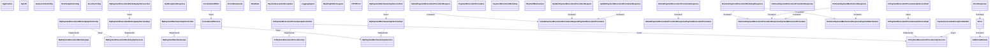
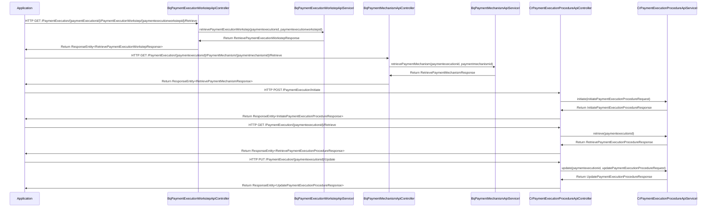

## Relationship Diagram

```mermaid
classDiagram
    class Application {
    }

    class ApiUtil {
    }

    class BqPaymentExecutionWorkstepApi {
    }

    class BqPaymentExecutionWorkstepApiController {
    }

    class BqPaymentMechanismApi {
    }

    class BqPaymentMechanismApiController {
    }

    class CrPaymentExecutionProcedureApi {
    }

    class CrPaymentExecutionProcedureApiController {
    }

    class JacksonJodaConfig {
    }

    class RestTemplateConfig {
    }

    class SecurityConfig {
    }

    class CorrelationIdFilter {
    }

    class CorrelationIdService {
    }

    class AdditionalDetails {
    }

    class ApiExceptionResponse {
    }

    class Error {
    }

    class ErrorResponse {
    }

    class ErrorStatusCode {
    }

    class MetaData {
    }

    class PaymentexecutionException {
    }

    class PaymentexecutionExceptionHandler {
    }

    class LoggingAspect {
    }

    class MaskingPatternLayout {
    }

    class HTTPError {
    }

    class InitiatePaymentExecutionProcedureRequest {
    }

    class InitiatePaymentExecutionProcedureRequestPaymentExecutionProcedure {
    }

    class InitiatePaymentExecutionProcedureResponse {
    }

    class InitiatePaymentExecutionProcedureResponsePaymentExecutionProcedure {
    }

    class PaymentExecutionProcedure {
    }

    class PaymentExecutionWorkstep {
    }

    class PaymentMechanism {
    }

    class RetrievePaymentExecutionProcedureResponse {
    }

    class RetrievePaymentExecutionProcedureResponsePaymentExecutionProcedure {
    }

    class RetrievePaymentExecutionWorkstepResponse {
    }

    class RetrievePaymentMechanismResponse {
    }

    class RetrievePaymentMechanismResponsePaymentMechanism {
    }

    class UpdatePaymentExecutionProcedureRequest {
    }

    class UpdatePaymentExecutionProcedureResponse {
    }

    class BqPaymentExecutionWorkstepApiServiceI {
    }

    class BqPaymentMechanismApiServiceI {
    }

    class CrPaymentExecutionProcedureApiServiceI {
    }

    class BqPaymentExecutionWorkstepApiServiceImpl {
    }

    class BqPaymentMechanismApiServiceImpl {
    }

    class CrPaymentExecutionProcedureApiServiceImpl {
    }

    class BqPaymentExecutionWorkstepApiServiceTest {
    }

    class BqPaymentMechanismApiServiceTest {
    }

    class CrPaymentExecutionProcedureApiServiceTest {
    }

    BqPaymentExecutionWorkstepApiController --|> BqPaymentExecutionWorkstepApi : "Implements"
    BqPaymentExecutionWorkstepApiController --> BqPaymentExecutionWorkstepApiServiceI : "Uses"
    BqPaymentMechanismApiController --|> BqPaymentMechanismApi : "Implements"
    BqPaymentMechanismApiController --> BqPaymentMechanismApiServiceI : "Uses"
    CrPaymentExecutionProcedureApiController --|> CrPaymentExecutionProcedureApi : "Implements"
    CrPaymentExecutionProcedureApiController --> CrPaymentExecutionProcedureApiServiceI : "Uses"
    BqPaymentExecutionWorkstepApiServiceImpl --|> BqPaymentExecutionWorkstepApiServiceI : "Implements"
    BqPaymentMechanismApiServiceImpl --|> BqPaymentMechanismApiServiceI : "Implements"
    CrPaymentExecutionProcedureApiServiceImpl --|> CrPaymentExecutionProcedureApiServiceI : "Implements"
    BqPaymentExecutionWorkstepApiServiceTest --> BqPaymentExecutionWorkstepApiServiceImpl : "Uses"
    BqPaymentMechanismApiServiceTest --> BqPaymentMechanismApiServiceImpl : "Uses"
    CrPaymentExecutionProcedureApiServiceTest --> CrPaymentExecutionProcedureApiServiceImpl : "Uses"
    PaymentexecutionExceptionHandler --> CrPaymentExecutionProcedureApiServiceI : "Uses"
    RetrievePaymentExecutionWorkstepResponse --> RetrievePaymentExecutionProcedureResponsePaymentExecutionProcedure : "Contains"
    RetrievePaymentExecutionWorkstepResponse --> RetrievePaymentMechanismResponsePaymentMechanism : "Contains"
    RetrievePaymentMechanismResponse --> RetrievePaymentExecutionProcedureResponsePaymentExecutionProcedure : "Contains"
    RetrievePaymentMechanismResponse --> RetrievePaymentMechanismResponsePaymentMechanism : "Contains"
    ErrorResponse --> Error : "Contains"
    Error --> AdditionalDetails : "Contains"
    InitiatePaymentExecutionProcedureRequest --> InitiatePaymentExecutionProcedureRequestPaymentExecutionProcedure : "Contains"
    InitiatePaymentExecutionProcedureResponse --> InitiatePaymentExecutionProcedureResponsePaymentExecutionProcedure : "Contains"
    RetrievePaymentExecutionProcedureResponse --> RetrievePaymentExecutionProcedureResponsePaymentExecutionProcedure : "Contains"
    UpdatePaymentExecutionProcedureRequest --> InitiatePaymentExecutionProcedureRequestPaymentExecutionProcedure : "Contains"
    UpdatePaymentExecutionProcedureResponse --> InitiatePaymentExecutionProcedureRequestPaymentExecutionProcedure : "Contains"
    CorrelationIdFilter --> CorrelationIdService : "Uses"
```

## Sequence Diagram

```mermaid
sequenceDiagram
    participant Application
    participant BqPaymentExecutionWorkstepApiController
    participant BqPaymentExecutionWorkstepApiServiceI
    participant BqPaymentMechanismApiController
    participant BqPaymentMechanismApiServiceI
    participant CrPaymentExecutionProcedureApiController
    participant CrPaymentExecutionProcedureApiServiceI

    Application->>BqPaymentExecutionWorkstepApiController: HTTP GET /PaymentExecution/{paymentExecutionid}/PaymentExecutionWorkstep/{paymentexecutionworkstepid}/Retrieve
    BqPaymentExecutionWorkstepApiController->>BqPaymentExecutionWorkstepApiServiceI: retrievePaymentExecutionWorkstep(paymentexecutionid, paymentexecutionworkstepid)
    BqPaymentExecutionWorkstepApiServiceI->>BqPaymentExecutionWorkstepApiController: Return RetrievePaymentExecutionWorkstepResponse
    BqPaymentExecutionWorkstepApiController->>Application: Return ResponseEntity<RetrievePaymentExecutionWorkstepResponse>

    Application->>BqPaymentMechanismApiController: HTTP GET /PaymentExecution/{paymentexecutionid}/PaymentMechanism/{paymentmechanismid}/Retrieve
    BqPaymentMechanismApiController->>BqPaymentMechanismApiServiceI: retrievePaymentMechanism(paymentexecutionid, paymentmechanismid)
    BqPaymentMechanismApiServiceI->>BqPaymentMechanismApiController: Return RetrievePaymentMechanismResponse
    BqPaymentMechanismApiController->>Application: Return ResponseEntity<RetrievePaymentMechanismResponse>

    Application->>CrPaymentExecutionProcedureApiController: HTTP POST /PaymentExecution/Initiate
    CrPaymentExecutionProcedureApiController->>CrPaymentExecutionProcedureApiServiceI: initiate(initiatePaymentExecutionProcedureRequest)
    CrPaymentExecutionProcedureApiServiceI->>CrPaymentExecutionProcedureApiController: Return InitiatePaymentExecutionProcedureResponse
    CrPaymentExecutionProcedureApiController->>Application: Return ResponseEntity<InitiatePaymentExecutionProcedureResponse>

    Application->>CrPaymentExecutionProcedureApiController: HTTP GET /PaymentExecution/{paymentexecutionid}/Retrieve
    CrPaymentExecutionProcedureApiController->>CrPaymentExecutionProcedureApiServiceI: retrieve(paymentexecutionid)
    CrPaymentExecutionProcedureApiServiceI->>CrPaymentExecutionProcedureApiController: Return RetrievePaymentExecutionProcedureResponse
    CrPaymentExecutionProcedureApiController->>Application: Return ResponseEntity<RetrievePaymentExecutionProcedureResponse>

    Application->>CrPaymentExecutionProcedureApiController: HTTP PUT /PaymentExecution/{paymentexecutionid}/Update
    CrPaymentExecutionProcedureApiController->>CrPaymentExecutionProcedureApiServiceI: update(paymentexecutionid, updatePaymentExecutionProcedureRequest)
    CrPaymentExecutionProcedureApiServiceI->>CrPaymentExecutionProcedureApiController: Return UpdatePaymentExecutionProcedureResponse
    CrPaymentExecutionProcedureApiController->>Application: Return ResponseEntity<UpdatePaymentExecutionProcedureResponse>
```