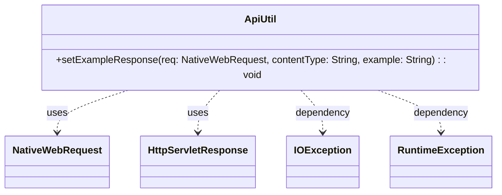

## Functional Requirements
### API Utility Functionality

* The `ApiUtil` class provides a utility method `setExampleResponse` to set an example response for a given request.
* The method accepts three parameters: 
  * `req` of type `NativeWebRequest`, representing the native web request.
  * `contentType` of type `String`, representing the content type of the response.
  * `example` of type `String`, representing the example response to be set.

### Response Configuration

* The method sets the character encoding of the response to "UTF-8".
* The method adds the "Content-Type" header to the response with the provided `contentType`.

### Response Writing

* The method writes the provided `example` to the response output stream.

### Error Handling

* If an `IOException` occurs while writing to the response output stream, the method throws a `RuntimeException` wrapping the original exception.

### Usage Context

* The `ApiUtil` class is used in a Spring-based web application, given its use of `NativeWebRequest` and `HttpServletResponse`.
* The class is part of the `com.ibm.api` package.

## Core Business Entities
### List of Entities
* ApiUtil

## Entity Descriptions and Relationships
The `ApiUtil` class provides a utility method `setExampleResponse` to set the response of a HTTP request. It takes in a `NativeWebRequest`, `contentType`, and `example` as parameters. The method sets the character encoding of the response to "UTF-8", adds a "Content-Type" header with the provided `contentType`, and prints the provided `example` to the response writer. If an `IOException` occurs during this process, it is caught and wrapped in a `RuntimeException`. There are no other business entities defined in the provided Java code, hence no relationships are established.

## Business Logic Documentation
### Input & Output Data Structures
The input to the `setExampleResponse` method consists of:
* `NativeWebRequest req`: an object representing the HTTP request
* `String contentType`: the content type of the response
* `String example`: the example response to be set

There is no explicit output data structure. The method modifies the `HttpServletResponse` object associated with the `NativeWebRequest`.

### Logical Flow
1. The `setExampleResponse` method is called with `NativeWebRequest`, `contentType`, and `example` as parameters.
2. It retrieves the `HttpServletResponse` object from the `NativeWebRequest` using `req.getNativeResponse(HttpServletResponse.class)`.
3. Sets the character encoding of the response to "UTF-8" using `res.setCharacterEncoding("UTF-8")`.
4. Adds a "Content-Type" header to the response with the provided `contentType` using `res.addHeader("Content-Type", contentType)`.
5. Prints the provided `example` to the response writer using `res.getWriter().print(example)`.
6. If an `IOException` occurs during steps 2-5, it is caught and wrapped in a `RuntimeException`.

### Data Validation
There is no explicit data validation logic in the provided Java code. The inputs `req`, `contentType`, and `example` are used directly without validation. It is assumed that `req` is not null and contains a valid `HttpServletResponse`.

### Business Rules
There are no specific business rules defined in the provided Java code. The method is primarily focused on setting the HTTP response.

### Error Handling Approach
The `setExampleResponse` method catches `IOException` and wraps it in a `RuntimeException`. This is the only error handling mechanism in the provided code.

### Use of LE(Logic Extraction) services
There is no explicit use of LE services in the provided Java code.

### External Program Dependencies
The provided Java code depends on the following external libraries:
* `org.springframework.web.context.request.NativeWebRequest`
* `jakarta.servlet.http.HttpServletResponse`

