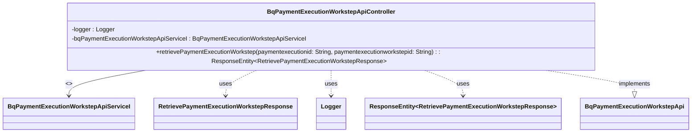

## Functional Requirements
### API Endpoint: Retrieve Payment Execution Workstep

* The `BqPaymentExecutionWorkstepApiController` class implements the `BqPaymentExecutionWorkstepApi` interface and defines an API endpoint to retrieve details about a gateway transaction.
* The endpoint is accessed via a GET request.

### Request Parameters

* The endpoint requires two path variables:
  * `paymentexecutionid`: a required `String` parameter representing the payment execution ID.
  * `paymentexecutionworkstepid`: a required `String` parameter representing the payment execution workstep ID.

### Response

* The endpoint returns a `ResponseEntity` containing a `RetrievePaymentExecutionWorkstepResponse` object with an HTTP status of 200 (OK).

### Logging

* The API endpoint logs the entry and exit of the `retrievePaymentExecutionWorkstep` method using the SLF4J logging framework.
* The log messages include the input parameters (`paymentexecutionid` and `paymentexecutionworkstepid`) and the response object.

### Service Delegation

* The `retrievePaymentExecutionWorkstep` method delegates the business logic to the `bqPaymentExecutionWorkstepApiServiceI` service interface, which is autowired into the controller.
* The service interface is responsible for retrieving the payment execution workstep details based on the provided `paymentexecutionid` and `paymentexecutionworkstepid`.

### Functional Flow

1. The client sends a GET request to the API endpoint with the required `paymentexecutionid` and `paymentexecutionworkstepid` path variables.
2. The `retrievePaymentExecutionWorkstep` method is invoked, logging the entry with the input parameters.
3. The method delegates the business logic to the `bqPaymentExecutionWorkstepApiServiceI` service interface to retrieve the payment execution workstep details.
4. The service interface returns a `RetrievePaymentExecutionWorkstepResponse` object, which is logged along with the exit of the method.
5. The `retrievePaymentExecutionWorkstep` method returns a `ResponseEntity` containing the `RetrievePaymentExecutionWorkstepResponse` object with an HTTP status of 200 (OK).

## Core Business Entities
### List of Entities
* Payment Execution Workstep
* Retrieve Payment Execution Workstep Response
* HTTP Error

### Entity Descriptions and Relationships
#### Payment Execution Workstep
The `Payment Execution Workstep` represents a specific step in the payment execution process. It is identified by a unique `paymentexecutionid` and `paymentexecutionworkstepid`. The details of a payment execution workstep can be retrieved through an API.

The `Payment Execution Workstep` is related to:
* `Retrieve Payment Execution Workstep Response`: The response object returned when retrieving details about a payment execution workstep.

#### Retrieve Payment Execution Workstep Response
The `Retrieve Payment Execution Workstep Response` represents the response to a request to retrieve details about a payment execution workstep. It contains the relevant information about the workstep.

The `Retrieve Payment Execution Workstep Response` is related to:
* `Payment Execution Workstep`: The entity whose details are being retrieved and returned in the response.

#### HTTP Error
The `HTTP Error` represents an HTTP error response that may be returned by the API in case of various error scenarios.

The `HTTP Error` is related to:
* `Payment Execution Workstep`: The entity whose retrieval may result in an HTTP error response if certain conditions are not met.

## Business Logic Documentation
### Input & Output Data Structures
The input to the `retrievePaymentExecutionWorkstep` method consists of:
* `paymentexecutionid`: a string representing the payment execution ID
* `paymentexecutionworkstepid`: a string representing the payment execution workstep ID

The output is a `ResponseEntity` containing:
* `RetrievePaymentExecutionWorkstepResponse`: the response object representing the retrieved payment execution workstep details for a successful response (200 status code)

### Logical Flow
1. The `retrievePaymentExecutionWorkstep` method is called with `paymentexecutionid` and `paymentexecutionworkstepid` as parameters.
2. The method logs the entry into the method with the provided parameters.
3. It then calls the `retrievePaymentExecutionWorkstep` method of the `bqPaymentExecutionWorkstepApiServiceI` service, passing `paymentexecutionid` and `paymentexecutionworkstepid` as parameters.
4. The response from the service is stored in the `res` variable.
5. The method logs the exit from the method with the response.
6. Finally, it returns a `ResponseEntity` containing the `res` object with a 200 status code.

### Data Validation
The inputs `paymentexecutionid` and `paymentexecutionworkstepid` are annotated with `@PathVariable` and are marked as `required = true`, indicating that they are mandatory.

### Business Rules
The business logic is centered around retrieving the details of a `Payment Execution Workstep` based on the provided `paymentexecutionid` and `paymentexecutionworkstepid`. The method relies on the `bqPaymentExecutionWorkstepApiServiceI` service to perform the actual retrieval.

### Error Handling Approach
Error handling is not explicitly managed within the `retrievePaymentExecutionWorkstep` method. It is implied that error handling is managed at a different layer, possibly within the `bqPaymentExecutionWorkstepApiServiceI` service or through a global error handling mechanism. The method returns a `ResponseEntity` which can potentially handle HTTP errors.

### Use of Services
The provided Java code uses the `bqPaymentExecutionWorkstepApiServiceI` service to retrieve the payment execution workstep details.

### External Program Dependencies
The provided Java code depends on the following external libraries and services:
* `org.springframework.http.ResponseEntity`
* `org.springframework.web.bind.annotation.PathVariable`
* `io.swagger.annotations.ApiOperation`
* `io.swagger.v3.oas.annotations.Parameter`
* `com.ibm.services.BqPaymentExecutionWorkstepApiServiceI` (service interface)
* `com.ibm.model.RetrievePaymentExecutionWorkstepResponse` (business entity)

