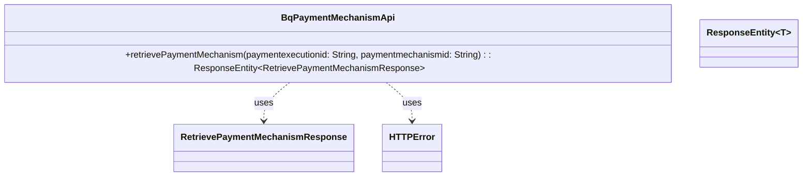

## Functional Requirements
### API Endpoint: Retrieve Payment Mechanism

* The `BqPaymentMechanismApi` interface defines an API endpoint to retrieve details about a payment mechanism selection.
* The endpoint is accessed via a GET request to the URI `/PaymentExecution/{paymentexecutionid}/PaymentMechanism/{paymentmechanismid}/Retrieve`.
* The endpoint produces a response in `application/json` format.

### Request Parameters

* The endpoint requires two path variables:
  * `paymentexecutionid`: a required `String` parameter representing the payment execution ID.
  * `paymentmechanismid`: a required `String` parameter representing the payment mechanism ID.

### Response

* The endpoint returns a `ResponseEntity` containing a `RetrievePaymentMechanismResponse` object with an HTTP status of 200 (OK).
* The API endpoint is capable of returning various HTTP error responses, including:
  * 400 Bad Request with `HTTPError` response body
  * 401 Unauthorized with `HTTPError` response body
  * 403 Forbidden with `HTTPError` response body
  * 404 Not Found with `HTTPError` response body
  * 429 Too Many Requests with `HTTPError` response body
  * 500 Internal Server Error with `HTTPError` response body

### Functional Flow

1. The client sends a GET request to the API endpoint with the required `paymentexecutionid` and `paymentmechanismid` path variables.
2. The API endpoint processes the request and retrieves the payment mechanism details based on the provided `paymentexecutionid` and `paymentmechanismid`.
3. The API endpoint returns a `ResponseEntity` containing the `RetrievePaymentMechanismResponse` object with an HTTP status of 200 (OK) if successful.
4. If any errors occur during processing, the API endpoint returns an appropriate HTTP error response with an `HTTPError` response body.

## Core Business Entities
### List of Entities
* Payment Mechanism
* Retrieve Payment Mechanism Response
* HTTP Error
* Payment Execution

### Entity Descriptions and Relationships
#### Payment Mechanism
The `Payment Mechanism` represents a specific payment mechanism associated with a `Payment Execution`. It is identified by a `paymentmechanismid`.

The `Payment Mechanism` is related to:
* `Retrieve Payment Mechanism Response`: The response object returned when retrieving details about a payment mechanism.
* `Payment Execution`: The entity with which the payment mechanism is associated.

#### Retrieve Payment Mechanism Response
The `Retrieve Payment Mechanism Response` represents the response to a request to retrieve details about a payment mechanism. It contains the relevant information about the payment mechanism.

The `Retrieve Payment Mechanism Response` is related to:
* `Payment Mechanism`: The entity whose details are being retrieved and returned in the response.

#### HTTP Error
The `HTTP Error` represents an HTTP error response that may be returned by the API in case of various error scenarios, such as BadRequest, Unauthorized, Forbidden, NotFound, TooManyRequests, or InternalServerError.

The `HTTP Error` is related to:
* API Operations: The entity whose operations may result in an HTTP error response if certain conditions are not met.

#### Payment Execution
The `Payment Execution` represents an execution of a payment. It is identified by a `paymentexecutionid` and is associated with one or more payment mechanisms.

The `Payment Execution` is related to:
* `Payment Mechanism`: The entity that is associated with a payment execution.

## Business Logic Documentation
### Input & Output Data Structures
The input to the `retrievePaymentMechanism` method consists of:
* `paymentexecutionid`: a string representing the payment execution ID
* `paymentmechanismid`: a string representing the payment mechanism ID

The output is a `ResponseEntity` containing:
* `RetrievePaymentMechanismResponse`: the response object representing the retrieved payment mechanism details for a successful response (200 status code)
* `HTTPError`: the error object representing the HTTP error response for various error scenarios (400, 401, 403, 404, 429, 500 status codes)

### Logical Flow
1. The `retrievePaymentMechanism` method is called with `paymentexecutionid` and `paymentmechanismid` as parameters.
2. The method is expected to retrieve details about the payment mechanism associated with the provided `paymentexecutionid` and `paymentmechanismid`.
3. The response from the retrieval operation is stored in a `ResponseEntity` object.
4. The method returns a `ResponseEntity` containing the response object with a corresponding HTTP status code.

### Data Validation
The inputs `paymentexecutionid` and `paymentmechanismid` are annotated with `@PathVariable` and are marked as `required = true`, indicating that they are mandatory.

### Business Rules
The business logic is centered around retrieving the details of a `Payment Mechanism` based on the provided `paymentexecutionid` and `paymentmechanismid`. The method is expected to return a `RetrievePaymentMechanismResponse` object containing the relevant information about the payment mechanism associated with the `Payment Execution`.

### Error Handling Approach
The method is annotated with `@ApiResponses` that define various HTTP error responses that may be returned in case of different error scenarios, such as:
* 400 BadRequest
* 401 Unauthorized
* 403 Forbidden
* 404 NotFound
* 429 TooManyRequests
* 500 InternalServerError

The error handling approach involves returning a `ResponseEntity` containing an `HTTPError` object with a corresponding HTTP status code.

### Use of Services
The provided Java code is an interface and does not explicitly use any services. However, it is expected that the implementation of this interface will use a service to retrieve the payment mechanism details associated with a `Payment Execution`.

### External Program Dependencies
The provided Java code depends on the following external libraries and entities:
* `org.springframework.http.ResponseEntity`
* `org.springframework.web.bind.annotation.PathVariable`
* `io.swagger.annotations.ApiOperation`
* `io.swagger.v3.oas.annotations.Parameter`
* `com.ibm.model.RetrievePaymentMechanismResponse` (business entity)
* `com.ibm.model.HTTPError` (business entity)

