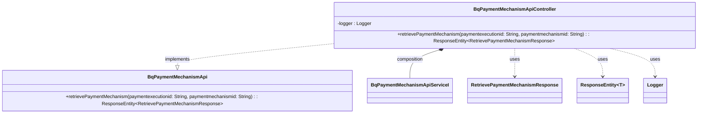

## Functional Requirements
### API Endpoint: Retrieve Payment Mechanism

* The `BqPaymentMechanismApiController` class implements the `BqPaymentMechanismApi` interface and defines an API endpoint to retrieve details about a payment mechanism selection.
* The endpoint is accessed via a GET request.
* The endpoint requires two path variables:
  * `paymentexecutionid`: a required `String` parameter representing the payment execution ID.
  * `paymentmechanismid`: a required `String` parameter representing the payment mechanism ID.

### Request Parameters

* The endpoint requires two path variables:
  * `paymentexecutionid`: a required `String` parameter representing the payment execution ID.
  * `paymentmechanismid`: a required `String` parameter representing the payment mechanism ID.

### Response

* The endpoint returns a `ResponseEntity` containing a `RetrievePaymentMechanismResponse` object with an HTTP status of 200 (OK).

### Functional Flow

1. The client sends a GET request to the API endpoint with the required `paymentexecutionid` and `paymentmechanismid` path variables.
2. The `BqPaymentMechanismApiController` class receives the request and invokes the `retrievePaymentMechanism` method.
3. The `retrievePaymentMechanism` method calls the `retrievePaymentMechanism` method of the `bqPaymentMechanismApiServiceI` service interface, passing the `paymentexecutionid` and `paymentmechanismid` as parameters.
4. The `bqPaymentMechanismApiServiceI` service interface retrieves the payment mechanism details based on the provided `paymentexecutionid` and `paymentmechanismid`.
5. The `retrievePaymentMechanism` method returns a `RetrievePaymentMechanismResponse` object containing the retrieved payment mechanism details.
6. The `BqPaymentMechanismApiController` class returns a `ResponseEntity` containing the `RetrievePaymentMechanismResponse` object with an HTTP status of 200 (OK).

### Error Handling

* The API endpoint assumes that the `bqPaymentMechanismApiServiceI` service interface handles any errors that occur during the retrieval of payment mechanism details.
* It is expected that the service interface or other layers of the application handle exceptions and return appropriate HTTP error responses.

### Logging

* The `BqPaymentMechanismApiController` class logs debug messages at the entry and exit points of the `retrievePaymentMechanism` method, including the input parameters and response.

## Core Business Entities
### List of Entities
* Payment Execution
* Payment Mechanism
* Retrieve Payment Mechanism Response

### Entity Descriptions and Relationships
#### Payment Execution
The `Payment Execution` represents an execution of a payment. It is identified by a `paymentexecutionid`.

The `Payment Execution` is related to:
* `Payment Mechanism`: The entity that is associated with a payment execution, as indicated by the `paymentexecutionid` parameter in the `retrievePaymentMechanism` method.

#### Payment Mechanism
The `Payment Mechanism` represents a specific payment mechanism. It is identified by a `paymentmechanismid`.

The `Payment Mechanism` is related to:
* `Payment Execution`: The entity with which the payment mechanism is associated, as indicated by the `paymentexecutionid` parameter in the `retrievePaymentMechanism` method.

#### Retrieve Payment Mechanism Response
The `Retrieve Payment Mechanism Response` represents the response to a request to retrieve details about a payment mechanism. It contains the relevant information about the payment mechanism.

The `Retrieve Payment Mechanism Response` is related to:
* `Payment Mechanism`: The entity whose details are being retrieved and returned in the response.

## Business Logic Documentation
### Input & Output Data Structures
The input to the `retrievePaymentMechanism` method consists of:
* `paymentexecutionid`: a string representing the payment execution ID
* `paymentmechanismid`: a string representing the payment mechanism ID

The output is a `ResponseEntity` containing:
* `RetrievePaymentMechanismResponse`: the response object representing the retrieved payment mechanism details for a successful response (200 status code)

### Logical Flow
1. The `retrievePaymentMechanism` method is called with `paymentexecutionid` and `paymentmechanismid` as parameters.
2. The method logs the entry into the `retrievePaymentMechanism` method with the provided `paymentexecutionid` and `paymentmechanismid`.
3. The method calls the `retrievePaymentMechanism` method of the `bqPaymentMechanismApiServiceI` service, passing `paymentexecutionid` and `paymentmechanismid` as parameters.
4. The response from the `bqPaymentMechanismApiServiceI` service is stored in the `res` variable.
5. The method logs the exit from the `retrievePaymentMechanism` method with the response.
6. The method returns a `ResponseEntity` containing the `RetrievePaymentMechanismResponse` object with an HTTP status code of 200 (OK).

### Data Validation
The inputs `paymentexecutionid` and `paymentmechanismid` are annotated with `@PathVariable` and are marked as `required = true`, indicating that they are mandatory.

### Business Rules
The business logic is centered around retrieving the details of a `Payment Mechanism` based on the provided `paymentexecutionid` and `paymentmechanismid`. The method is expected to return a `RetrievePaymentMechanismResponse` object containing the relevant information about the payment mechanism associated with the `Payment Execution`.

### Error Handling Approach
The provided Java code does not explicitly handle errors within the `retrievePaymentMechanism` method. However, it is expected that the `bqPaymentMechanismApiServiceI` service will handle errors and return a suitable response.

### Use of Services
The `retrievePaymentMechanism` method uses the `bqPaymentMechanismApiServiceI` service to retrieve the payment mechanism details.

### External Program Dependencies
The provided Java code depends on the following external libraries and entities:
* `org.springframework.http.ResponseEntity`
* `org.springframework.web.bind.annotation.PathVariable`
* `io.swagger.v3.oas.annotations.Parameter`
* `com.ibm.model.RetrievePaymentMechanismResponse` 
* `com.ibm.services.BqPaymentMechanismApiServiceI`

