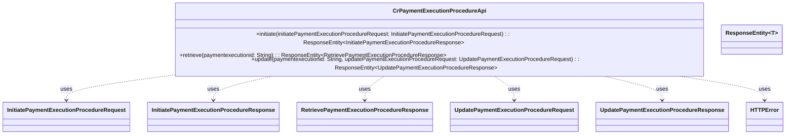

## Functional Requirements
### API Endpoints

The provided Java code defines an interface `CrPaymentExecutionProcedureApi` that includes three API endpoints for managing payment execution procedures.

#### 1. Initiate Payment Execution Procedure

* The endpoint is accessed via a POST request to `/PaymentExecution/Initiate`.
* The endpoint requires a request body containing an `InitiatePaymentExecutionProcedureRequest` object, which is validated using `@Valid`.
* The endpoint returns a `ResponseEntity` containing an `InitiatePaymentExecutionProcedureResponse` object with an HTTP status of 200 (OK).

#### 2. Retrieve Payment Execution Procedure

* The endpoint is accessed via a GET request to `/PaymentExecution/{paymentexecutionid}/Retrieve`.
* The endpoint requires a path variable `paymentexecutionid` of type `String`, which is marked as required.
* The endpoint returns a `ResponseEntity` containing a `RetrievePaymentExecutionProcedureResponse` object with an HTTP status of 200 (OK).

#### 3. Update Payment Execution Procedure

* The endpoint is accessed via a PUT request to `/PaymentExecution/{paymentexecutionid}/Update`.
* The endpoint requires a path variable `paymentexecutionid` of type `String`, which is marked as required, and a request body containing an `UpdatePaymentExecutionProcedureRequest` object, which is validated using `@Valid`.
* The endpoint returns a `ResponseEntity` containing an `UpdatePaymentExecutionProcedureResponse` object with an HTTP status of 200 (OK).

### Request and Response Parameters

* **Initiate Payment Execution Procedure**
  + Request Body: `InitiatePaymentExecutionProcedureRequest` (required, validated using `@Valid`)
  + Response: `InitiatePaymentExecutionProcedureResponse`
* **Retrieve Payment Execution Procedure**
  + Path Variable: `paymentexecutionid` (required, `String`)
  + Response: `RetrievePaymentExecutionProcedureResponse`
* **Update Payment Execution Procedure**
  + Path Variable: `paymentexecutionid` (required, `String`)
  + Request Body: `UpdatePaymentExecutionProcedureRequest` (required, validated using `@Valid`)
  + Response: `UpdatePaymentExecutionProcedureResponse`

### Error Handling

The API endpoints are designed to return various HTTP error responses, including:

* 400 Bad Request, associated with an `HTTPError` object
* 401 Unauthorized, associated with an `HTTPError` object
* 403 Forbidden, associated with an `HTTPError` object
* 404 Not Found, associated with an `HTTPError` object
* 429 Too Many Requests, associated with an `HTTPError` object
* 500 Internal Server Error, associated with an `HTTPError` object

### Functional Flow

1. The client sends a request to one of the API endpoints.
2. The corresponding method in the `CrPaymentExecutionProcedureApi` interface is invoked.
3. The method processes the request and returns a `ResponseEntity` containing the relevant response object.
4. The client receives the response and processes it accordingly.

### Logging

There is no explicit logging mentioned in the provided Java code. However, it is expected that the implementing class or other layers of the application handle logging as necessary.

### Implementation Notes

The provided Java code is an interface generated by OpenAPI Generator, and it is not intended to be edited manually. The actual implementation of the API endpoints will be in a separate class that implements this interface.

## Core Business Entities
### List of Entities
* Payment Execution Procedure
* Initiate Payment Execution Procedure Request
* Initiate Payment Execution Procedure Response
* Retrieve Payment Execution Procedure Response
* Update Payment Execution Procedure Request
* Update Payment Execution Procedure Response
* HTTP Error

### Entity Descriptions and Relationships
#### Payment Execution Procedure
The `Payment Execution Procedure` represents a payment execution procedure. It is referenced by the `paymentexecutionid` parameter in various methods.

The `Payment Execution Procedure` is related to:
* `Initiate Payment Execution Procedure Request`: The entity used to initiate a payment execution procedure.
* `Initiate Payment Execution Procedure Response`: The response received after initiating a payment execution procedure.
* `Retrieve Payment Execution Procedure Response`: The response received after retrieving details about a payment execution procedure.
* `Update Payment Execution Procedure Request`: The entity used to update details of a payment execution procedure.
* `Update Payment Execution Procedure Response`: The response received after updating details of a payment execution procedure.

#### Initiate Payment Execution Procedure Request
The `Initiate Payment Execution Procedure Request` represents a request to initiate a payment execution procedure.

#### Initiate Payment Execution Procedure Response
The `Initiate Payment Execution Procedure Response` represents the response to a request to initiate a payment execution procedure.

#### Retrieve Payment Execution Procedure Response
The `Retrieve Payment Execution Procedure Response` represents the response to a request to retrieve details about a payment execution procedure.

#### Update Payment Execution Procedure Request
The `Update Payment Execution Procedure Request` represents a request to update details of a payment execution procedure.

#### Update Payment Execution Procedure Response
The `Update Payment Execution Procedure Response` represents the response to a request to update details of a payment execution procedure.

#### HTTP Error
The `HTTP Error` represents an error response to various HTTP requests, including:
* `Initiate Payment Execution Procedure Request`
* `Retrieve Payment Execution Procedure Response`
* `Update Payment Execution Procedure Response` 
* Other requests as mentioned in API responses for different HTTP status codes (BadRequest, Unauthorized, Forbidden, NotFound, TooManyRequests, InternalServerError)

## Business Logic Documentation
### Input & Output Data Structures

The API provides three main methods: `initiate`, `retrieve`, and `update`. The input and output data structures for each method are as follows:

* `initiate` method:
	+ Input: `InitiatePaymentExecutionProcedureRequest` object
	+ Output: `ResponseEntity` containing `InitiatePaymentExecutionProcedureResponse` object
* `retrieve` method:
	+ Input: `paymentexecutionid` (a string representing the payment execution ID)
	+ Output: `ResponseEntity` containing `RetrievePaymentExecutionProcedureResponse` object
* `update` method:
	+ Input: `paymentexecutionid` (a string representing the payment execution ID) and `UpdatePaymentExecutionProcedureRequest` object
	+ Output: `ResponseEntity` containing `UpdatePaymentExecutionProcedureResponse` object

### Logical Flow

1. The API receives a request to one of the three methods: `initiate`, `retrieve`, or `update`.
2. For the `initiate` method:
	* The method receives an `InitiatePaymentExecutionProcedureRequest` object as input.
	* The method initiates a payment execution procedure based on the input request.
	* The method returns a `ResponseEntity` containing an `InitiatePaymentExecutionProcedureResponse` object.
3. For the `retrieve` method:
	* The method receives a `paymentexecutionid` as input.
	* The method retrieves details about the payment execution procedure associated with the provided `paymentexecutionid`.
	* The method returns a `ResponseEntity` containing a `RetrievePaymentExecutionProcedureResponse` object.
4. For the `update` method:
	* The method receives a `paymentexecutionid` and an `UpdatePaymentExecutionProcedureRequest` object as input.
	* The method updates the details of the payment execution procedure associated with the provided `paymentexecutionid` based on the input request.
	* The method returns a `ResponseEntity` containing an `UpdatePaymentExecutionProcedureResponse` object.

### Data Validation

The inputs to the API methods are validated as follows:

* `paymentexecutionid` is marked as `required = true` and is validated as a non-empty string.
* `InitiatePaymentExecutionProcedureRequest` and `UpdatePaymentExecutionProcedureRequest` objects are validated using `@Valid` annotation, ensuring that they conform to the expected structure and constraints.

### Business Rules

The business logic is centered around managing payment execution procedures. The API provides methods to initiate, retrieve, and update payment execution procedures. The business rules are implicit in the API methods and are as follows:

* A payment execution procedure can be initiated using the `initiate` method.
* Details about a payment execution procedure can be retrieved using the `retrieve` method.
* Details of a payment execution procedure can be updated using the `update` method.
* The API handles various error conditions, including BadRequest, Unauthorized, Forbidden, NotFound, TooManyRequests, and InternalServerError, by returning `HTTPError` objects.

### Error Handling Approach

The API uses a standardized error handling approach, returning `HTTPError` objects in response to various error conditions, including:

* BadRequest (400)
* Unauthorized (401)
* Forbidden (403)
* NotFound (404)
* TooManyRequests (429)
* InternalServerError (500)

### Use of Services and External Program Dependencies

The API depends on the following external libraries and entities:

* `org.springframework.http.ResponseEntity`
* `org.springframework.web.bind.annotation.PathVariable`
* `io.swagger.v3.oas.annotations.Parameter`
* `com.ibm.model.InitiatePaymentExecutionProcedureRequest`
* `com.ibm.model.InitiatePaymentExecutionProcedureResponse`
* `com.ibm.model.RetrievePaymentExecutionProcedureResponse`
* `com.ibm.model.UpdatePaymentExecutionProcedureRequest`
* `com.ibm.model.UpdatePaymentExecutionProcedureResponse`
* `com.ibm.model.HTTPError`

