## Functional Requirements
### API Endpoints

The provided Java code defines a controller `CrPaymentExecutionProcedureApiController` that implements the `CrPaymentExecutionProcedureApi` interface. It includes three API endpoints for managing payment execution procedures.

#### 1. Initiate Payment Execution Procedure

* The endpoint is accessed via a POST request.
* The endpoint requires a request body containing an `InitiatePaymentExecutionProcedureRequest` object, which is validated using `@Valid`.
* The endpoint returns a `ResponseEntity` containing an `InitiatePaymentExecutionProcedureResponse` object with an HTTP status of 200 (OK).

#### 2. Retrieve Payment Execution Procedure

* The endpoint is accessed via a GET request.
* The endpoint requires a path variable `paymentexecutionid` of type `String`, which is marked as required.
* The endpoint returns a `ResponseEntity` containing a `RetrievePaymentExecutionProcedureResponse` object with an HTTP status of 200 (OK).

#### 3. Update Payment Execution Procedure

* The endpoint is accessed via a PUT or PATCH request is not explicitly defined, however based on the method name `update` and the parameters `paymentexecutionid` and `updatePaymentExecutionProcedureRequest`, it can be inferred that the endpoint is accessed via a PUT or PATCH request.
* The endpoint requires a path variable `paymentexecutionid` of type `String`, which is marked as required, and a request body containing an `UpdatePaymentExecutionProcedureRequest` object, which is validated using `@Valid`.
* The endpoint returns a `ResponseEntity` containing an `UpdatePaymentExecutionProcedureResponse` object with an HTTP status of 200 (OK).

### Request and Response Parameters

* **Initiate Payment Execution Procedure**
  + Request Body: `InitiatePaymentExecutionProcedureRequest` (required, validated using `@Valid`)
  + Response: `InitiatePaymentExecutionProcedureResponse`
* **Retrieve Payment Execution Procedure**
  + Path Variable: `paymentexecutionid` (required, `String`)
  + Response: `RetrievePaymentExecutionProcedureResponse`
* **Update Payment Execution Procedure**
  + Path Variable: `paymentexecutionid` (required, `String`)
  + Request Body: `UpdatePaymentExecutionProcedureRequest` (required, validated using `@Valid`)
  + Response: `UpdatePaymentExecutionProcedureResponse`

### Error Handling

The API endpoints are designed to return an HTTP status of 200 (OK) for successful requests. However, the provided Java code does not explicitly handle errors. It is expected that the implementing class or other layers of the application handle error handling as necessary.

### Functional Flow

1. The client sends a request to one of the API endpoints.
2. The corresponding method in the `CrPaymentExecutionProcedureApiController` class is invoked.
3. The method logs the entry and parameters using a logger.
4. The method invokes the corresponding method in the `crPaymentExecutionProcedureApiServiceI` service interface.
5. The service interface method processes the request and returns a response object.
6. The controller method logs the exit and response using a logger.
7. The controller method returns a `ResponseEntity` containing the response object with an HTTP status of 200 (OK).
8. The client receives the response and processes it accordingly.

### Logging

The provided Java code includes logging statements using the SLF4J logging API. The logger logs the entry and exit of each method, along with the parameters and response.

### Implementation Notes

The provided Java code is a controller class that implements the `CrPaymentExecutionProcedureApi` interface. The actual implementation of the business logic is in a separate class that implements the `CrPaymentExecutionProcedureApiServiceI` service interface. The HTTP method for the API endpoints is not explicitly defined in the provided Java code for the `retrieve` and `update` methods. However, based on the method names and parameters, it can be inferred that the `retrieve` method is accessed via a GET request and the `update` method is accessed via a PUT or PATCH request. For `initiate` method, it is accessed via a POST request.

## Core Business Entities
### List of Entities
* Payment Execution Procedure
* Initiate Payment Execution Procedure Request
* Initiate Payment Execution Procedure Response
* Retrieve Payment Execution Procedure Response
* Update Payment Execution Procedure Request
* Update Payment Execution Procedure Response

### Entity Descriptions and Relationships
#### Payment Execution Procedure
The `Payment Execution Procedure` represents a payment execution procedure. It is referenced by the `paymentexecutionid` parameter in various methods.

The `Payment Execution Procedure` is related to:
* `Initiate Payment Execution Procedure Request`: The entity used to initiate a payment execution procedure.
* `Initiate Payment Execution Procedure Response`: The response received after initiating a payment execution procedure.
* `Retrieve Payment Execution Procedure Response`: The response received after retrieving details about a payment execution procedure.
* `Update Payment Execution Procedure Request`: The entity used to update details of a payment execution procedure.
* `Update Payment Execution Procedure Response`: The response received after updating details of a payment execution procedure.

#### Initiate Payment Execution Procedure Request
The `Initiate Payment Execution Procedure Request` represents a request to initiate a payment execution procedure.

#### Initiate Payment Execution Procedure Response
The `Initiate Payment Execution Procedure Response` represents the response to a request to initiate a payment execution procedure.

#### Retrieve Payment Execution Procedure Response
The `Retrieve Payment Execution Procedure Response` represents the response to a request to retrieve details about a payment execution procedure.

#### Update Payment Execution Procedure Request
The `Update Payment Execution Procedure Request` represents a request to update details of a payment execution procedure.

#### Update Payment Execution Procedure Response
The `Update Payment Execution Procedure Response` represents the response to a request to update details of a payment execution procedure.

## Business Logic Documentation
### Input & Output Data Structures

The API provides three main methods: `initiate`, `retrieve`, and `update`. The input and output data structures for each method are as follows:

* `initiate` method:
	+ Input: `InitiatePaymentExecutionProcedureRequest` object
	+ Output: `ResponseEntity` containing `InitiatePaymentExecutionProcedureResponse` object with HTTP status `OK` (200)
* `retrieve` method:
	+ Input: `paymentexecutionid` (a string representing the payment execution ID)
	+ Output: `ResponseEntity` containing `RetrievePaymentExecutionProcedureResponse` object with HTTP status `OK` (200)
* `update` method:
	+ Input: `paymentexecutionid` (a string representing the payment execution ID) and `UpdatePaymentExecutionProcedureRequest` object
	+ Output: `ResponseEntity` containing `UpdatePaymentExecutionProcedureResponse` object with HTTP status `OK` (200)

### Logical Flow

1. The API receives a request to one of the three methods: `initiate`, `retrieve`, or `update`.
2. For the `initiate` method:
	* The method receives an `InitiatePaymentExecutionProcedureRequest` object as input.
	* The method calls the `initiate` method of `crPaymentExecutionProcedureApiServiceI` service with the input request.
	* The method logs the input and output using a logger.
	* The method returns a `ResponseEntity` containing an `InitiatePaymentExecutionProcedureResponse` object with HTTP status `OK` (200).
3. For the `retrieve` method:
	* The method receives a `paymentexecutionid` as input.
	* The method calls the `retrieve` method of `crPaymentExecutionProcedureApiServiceI` service with the `paymentexecutionid`.
	* The method logs the input and output using a logger.
	* The method returns a `ResponseEntity` containing a `RetrievePaymentExecutionProcedureResponse` object with HTTP status `OK` (200).
4. For the `update` method:
	* The method receives a `paymentexecutionid` and an `UpdatePaymentExecutionProcedureRequest` object as input.
	* The method calls the `update` method of `crPaymentExecutionProcedureApiServiceI` service with the `paymentexecutionid` and input request.
	* The method logs the input and output using a logger.
	* The method returns a `ResponseEntity` containing an `UpdatePaymentExecutionProcedureResponse` object with HTTP status `OK` (200).

### Data Validation

The inputs to the API methods are validated as follows:

* `paymentexecutionid` is marked as `required = true` and is validated as a non-empty string.
* `InitiatePaymentExecutionProcedureRequest` and `UpdatePaymentExecutionProcedureRequest` objects are validated using `@Valid` annotation, ensuring that they conform to the expected structure and constraints.

### Business Rules

The business logic is centered around managing payment execution procedures. The API provides methods to initiate, retrieve, and update payment execution procedures. The business rules are implicit in the API methods and are as follows:

* A payment execution procedure can be initiated using the `initiate` method.
* Details about a payment execution procedure can be retrieved using the `retrieve` method.
* Details of a payment execution procedure can be updated using the `update` method.

### Error Handling Approach

The API does not explicitly handle errors in the provided code. However, it is assumed that the `crPaymentExecutionProcedureApiServiceI` service handles errors and returns appropriate responses.

### Use of LE(Logic Extraction) Services

The API uses the `crPaymentExecutionProcedureApiServiceI` service to perform the business logic operations.

### External Program Dependencies

The API depends on the following external libraries and entities:

* `org.springframework.http.ResponseEntity`
* `org.springframework.web.bind.annotation.PathVariable`
* `io.swagger.v3.oas.annotations.Parameter`
* `com.ibm.model.InitiatePaymentExecutionProcedureRequest`
* `com.ibm.model.InitiatePaymentExecutionProcedureResponse`
* `com.ibm.model.RetrievePaymentExecutionProcedureResponse`
* `com.ibm.model.UpdatePaymentExecutionProcedureRequest`
* `com.ibm.model.UpdatePaymentExecutionProcedureResponse`
* `com.ibm.services.CrPaymentExecutionProcedureApiServiceI`

```mermaid
classDiagram
class CrPaymentExecutionProcedureApiController {
  -logger : Logger
  -crPaymentExecutionProcedureApiServiceI : CrPaymentExecutionProcedureApiServiceI
  +initiate(initiatePaymentExecutionProcedureRequest: InitiatePaymentExecutionProcedureRequest): ResponseEntity~InitiatePaymentExecutionProcedureResponse~
  +retrieve(paymentexecutionid: String): ResponseEntity~RetrievePaymentExecutionProcedureResponse~
  +update(paymentexecutionid: String, updatePaymentExecutionProcedureRequest: UpdatePaymentExecutionProcedureRequest): ResponseEntity~UpdatePaymentExecutionProcedureResponse~
}
class CrPaymentExecutionProcedureApiServiceI {
  
}
class InitiatePaymentExecutionProcedureRequest {
  
}
class InitiatePaymentExecutionProcedureResponse {
  
}
class RetrievePaymentExecutionProcedureResponse {
  
}
class UpdatePaymentExecutionProcedureRequest {
  
}
class UpdatePaymentExecutionProcedureResponse {
  
}
class ResponseEntity~T~ {
  
}
class Logger {
  
}
class CrPaymentExecutionProcedureApi {
  
}
CrPaymentExecutionProcedureApiController ..> CrPaymentExecutionProcedureApiServiceI : uses
CrPaymentExecutionProcedureApiController ..> InitiatePaymentExecutionProcedureRequest : uses
CrPaymentExecutionProcedureApiController ..> InitiatePaymentExecutionProcedureResponse : uses
CrPaymentExecutionProcedureApiController ..> RetrievePaymentExecutionProcedureResponse : uses
CrPaymentExecutionProcedureApiController ..> UpdatePaymentExecutionProcedureRequest : uses
CrPaymentExecutionProcedureApiController ..> UpdatePaymentExecutionProcedureResponse : uses
CrPaymentExecutionProcedureApiController ..> Logger : uses
CrPaymentExecutionProcedureApiController --|> CrPaymentExecutionProcedureApi
```

