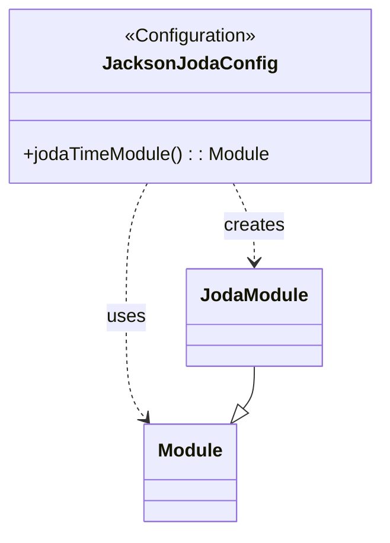

## Functional Requirements
### Configuration for Jackson Joda Module

The configuration class `JacksonJodaConfig` enables the JodaModule for Jackson serialization and deserialization.

#### 1. JodaModule Configuration

* The configuration class is annotated with `@Configuration`, indicating it's a source of bean definitions.
* The class defines a bean method `jodaTimeModule()` that returns an instance of `JodaModule`.
* The `JodaModule` is a Jackson module that provides support for serializing and deserializing Joda Time types.

### Bean Definition

* **JodaTimeModule Bean**
  + Bean Name: `jodaTimeModule`
  + Bean Type: `Module` (specifically, `JodaModule`)
  + The bean is created using the `new JodaModule()` constructor.

### Functional Flow

1. The Spring application context is initialized.
2. The `JacksonJodaConfig` class is processed as a configuration class.
3. The `jodaTimeModule()` method is invoked to create a `JodaModule` bean.
4. The application uses the `JodaModule` bean for serializing and deserializing Joda Time types.

### Implementation Notes

* The JodaModule provides support for serializing and deserializing Joda Time types, such as `DateTime`, `LocalDate`, and `LocalTime`.
* The configuration is typically used in applications that use Joda Time for date and time handling and Jackson for JSON serialization and deserialization.

### Usage

The configured `JodaModule` will be used for handling Joda Time types during serialization and deserialization.

## Core Business Entities
### List of Entities
* Jackson Joda Configuration
* Joda Time Module

### Entity Descriptions and Relationships
#### Jackson Joda Configuration
The `Jackson Joda Configuration` represents a configuration for Jackson Joda. It is annotated with `@Configuration`, indicating its role in configuring the application.

The `Jackson Joda Configuration` is related to:
* `Joda Time Module`: The entity used to configure Joda time module for Jackson.

#### Joda Time Module
The `Joda Time Module` represents a module for handling Joda time in Jackson. It is an instance of `JodaModule` returned as a `@Bean` named `jodaTimeModule`.

The `Joda Time Module` is related to:
* `Jackson Joda Configuration`: The configuration that provides the `Joda Time Module` as a bean.

## Business Logic Documentation
### Input & Output Data Structures

The configuration class provides a single bean: `jodaTimeModule`. 
* Input: None
* Output: `JodaModule` object as a Spring bean named `jodaTimeModule`

### Logical Flow

1. The application starts and the configuration class, annotated with `@Configuration`, is loaded by Spring.
2. The `jodaTimeModule` method, annotated with `@Bean`, is called to create a `JodaModule` bean.
3. The `JodaModule` bean is registered with the Spring application context.

### Data Validation

There is no explicit data validation in the provided configuration class.

### Business Rules

The business logic is centered around configuring Jackson to handle Joda time. The configuration class provides a `JodaModule` bean to enable this functionality.

### Error Handling Approach

The configuration class does not explicitly handle errors.

### Use of LE(Logic Extraction) Services

There are no LE services used in the provided configuration class.

### External Program Dependencies

The configuration class depends on the following external libraries and entities:

* `com.fasterxml.jackson.databind.Module`
* `com.fasterxml.jackson.datatype.joda.JodaModule`
* `org.springframework.context.annotation.Bean`
* `org.springframework.context.annotation.Configuration`

