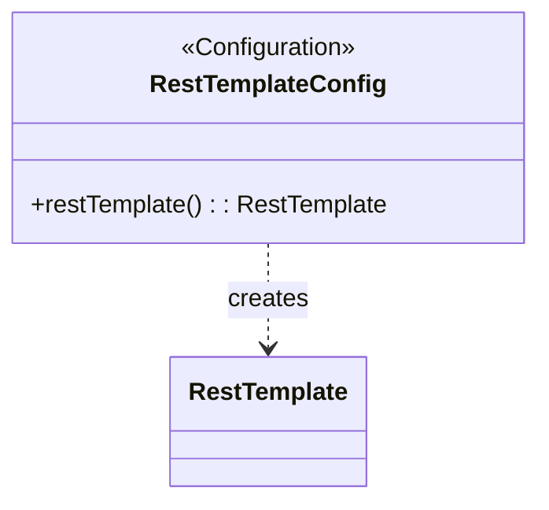

## Functional Requirements
### Configuration for RestTemplate Bean

The configuration class `RestTemplateConfig` enables the creation and management of a `RestTemplate` bean for making HTTP requests and interacting with RESTful web services.

#### 1. RestTemplate Bean Definition

* The configuration class is annotated with `@Configuration`, indicating it's a source of bean definitions.
* The class defines a bean method `restTemplate()` annotated with `@Bean`, indicating that it returns a bean to be managed by the Spring container.
* The `RestTemplate` is a synchronous client used to perform HTTP requests.

### Bean Details

* **RestTemplate Bean**
  + Bean Name: `restTemplate`
  + Bean Type: `RestTemplate`
  + The bean is created using the `new RestTemplate()` constructor.

### Functional Flow

1. The Spring application context is initialized.
2. The `RestTemplateConfig` class is processed as a configuration class.
3. The `restTemplate()` method is invoked to create a `RestTemplate` bean.
4. The application uses the `RestTemplate` bean for making HTTP requests and interacting with RESTful web services.

### Implementation Notes

* The `RestTemplate` provides a simple, template method API over underlying HTTP client libraries for performing HTTP requests.
* The configuration is typically used in applications that need to interact with RESTful web services.

### Usage

The configured `RestTemplate` will be used for making HTTP requests and interacting with RESTful web services within the application.

## Core Business Entities
### List of Entities
* Rest Template Configuration
* Rest Template

### Entity Descriptions and Relationships
#### Rest Template Configuration
The `Rest Template Configuration` represents a configuration class for creating a RestTemplate bean. It is annotated with `@Configuration`, indicating its role in configuring the application for Spring's dependency injection to create and manage a RestTemplate bean.

The `Rest Template Configuration` is related to:
* `Rest Template`: The entity created and configured as a bean by the `Rest Template Configuration`.

#### Rest Template
The `Rest Template` represents a synchronous client to perform HTTP requests and interact with RESTful web services. It is an instance of `RestTemplate` returned as a `@Bean` named `restTemplate`, exposing a simple, template method API over underlying HTTP client libraries.

The `Rest Template` is related to:
* `Rest Template Configuration`: The configuration that creates and configures the `Rest Template` as a bean.

## Business Logic Documentation
### Input & Output Data Structures

* Input: None
* Output: `RestTemplate` object as a Spring bean named `restTemplate`

### Logical Flow

1. The application starts and the configuration class, `RestTemplateConfig`, annotated with `@Configuration`, is loaded by Spring.
2. The `restTemplate` method, annotated with `@Bean`, is called to create a `RestTemplate` bean.
3. A new instance of `RestTemplate` is initialized and returned as a Spring bean.
4. The `RestTemplate` bean is registered with the Spring application context.

### Data Validation

There is no explicit data validation in the provided configuration class.

### Business Rules

The business logic is centered around creating and configuring a `RestTemplate` bean. This bean is used to make HTTP requests and interact with RESTful web services, exposing a simple template method API over underlying HTTP client libraries.

### Error Handling Approach

The configuration class does not explicitly handle errors. Any errors that occur during the creation or registration of the `RestTemplate` bean will be handled by the Spring framework.

### Use of LE(Logic Extraction) Services

There are no LE services used in the provided configuration class.

### External Program Dependencies

The configuration class depends on the following external libraries and entities:

* `org.springframework.context.annotation.Bean`
* `org.springframework.context.annotation.Configuration`
* `org.springframework.web.client.RestTemplate`

