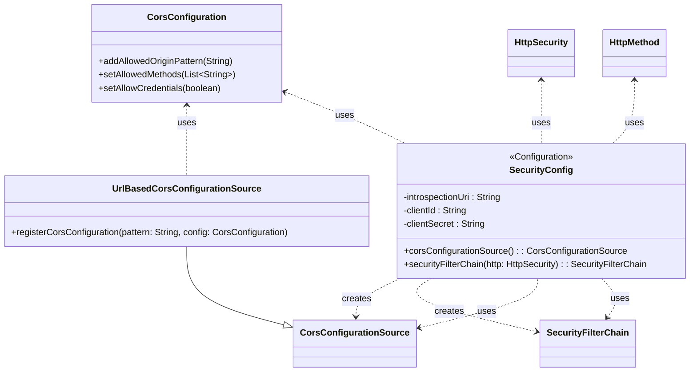

## Functional Requirements
### Security Configuration

The `SecurityConfig` class is responsible for configuring the security settings for the application, including CORS configuration and OAuth2 resource server settings.

#### 1. CORS Configuration

* The `corsConfigurationSource()` method creates a `CorsConfigurationSource` bean that defines the CORS configuration for the application.
* The CORS configuration allows requests from any origin (`*`) and supports the following HTTP methods:
  + GET
  + OPTIONS
  + POST
  + PUT
  + DELETE
* The configuration also allows credentials to be sent with requests.

#### 2. Security Filter Chain Configuration

* The `securityFilterChain()` method creates a `SecurityFilterChain` bean that defines the security filter chain for the application.
* The security filter chain is configured to:
  + Disable CSRF protection.
  + Use the CORS configuration defined by the `corsConfigurationSource()` method.
  + Authorize HTTP requests based on the following rules:
    - Permit all requests to the following endpoints without authentication:
      + `/v3/api-docs/swagger*/**`
      + `/v3/api-docs`
      + `/v2/api-docs`
      + `/configuration/**`
      + `/swagger*/**`
      + `/swagger-ui/**`
      + `/webjars/**`
      + `/actuator`
      + `/actuator/**`
      + `/health`
      + `/refreshResources`
      + `/ports`
      + `/run-websocket/**`
    - Require the "user" role for requests to the following endpoints:
      + `/Initiate`
      + `/Update`
      + `/Retrieve`
      + `/RetrievePaymentMechanism`
      + `/RetrievePaymentExecutionWorkstep`
  + Configure OAuth2 resource server settings using the opaque token introspection endpoint.

#### 3. OAuth2 Resource Server Configuration

* The OAuth2 resource server is configured to use the opaque token introspection endpoint.
* The introspection endpoint URL is injected using the property: `spring.security.oauth2.resource.token-info-uri`
* The client ID and client secret for the introspection endpoint are injected using the properties:
  + `spring.security.oauth2.client.clientId`
  + `spring.security.oauth2.client.clientSecret`

### Functional Flow

1. The Spring application context is initialized.
2. The `SecurityConfig` class is processed as a configuration class.
3. The `corsConfigurationSource()` method is invoked to create a `CorsConfigurationSource` bean.
4. The `securityFilterChain()` method is invoked to create a `SecurityFilterChain` bean.
5. The application uses the configured security filter chain to authorize incoming HTTP requests.

### Implementation Notes

* The `SecurityConfig` class uses Spring Security annotations and APIs to configure the security settings for the application.
* The CORS configuration is used to allow requests from different origins and support various HTTP methods.
* The OAuth2 resource server configuration is used to validate opaque tokens sent with requests.

### Usage

The configured security settings will be used to authorize incoming HTTP requests and validate OAuth2 tokens sent with requests.

## Core Business Entities
### List of Entities
* Security Configuration
* CORS Configuration Source
* Security Filter Chain
* HTTP Security
* Opaque Token Configuration

### Entity Descriptions and Relationships
#### Security Configuration
The `Security Configuration` represents a configuration class for setting up security for the application. It is annotated with `@Configuration` and `@EnableWebSecurity`, indicating its role in configuring the application's security.

The `Security Configuration` is related to:
* `CORS Configuration Source`: The entity created and configured as a bean by the `Security Configuration`.
* `Security Filter Chain`: The entity created and configured as a bean by the `Security Configuration`, which is used to define the security filter chain for the application.
* `HTTP Security`: The entity used to configure the security filter chain.
* `Opaque Token Configuration`: The entity used to configure the opaque token settings.

#### CORS Configuration Source
The `CORS Configuration Source` represents a configuration source for CORS (Cross-Origin Resource Sharing) settings. It is an instance of `CorsConfigurationSource` returned as a `@Bean`, which is used to configure CORS settings for the application.

The `CORS Configuration Source` is related to:
* `Security Configuration`: The configuration that creates and configures the `CORS Configuration Source` as a bean.
* `Security Filter Chain`: The security filter chain that uses the `CORS Configuration Source`.

#### Security Filter Chain
The `Security Filter Chain` represents a chain of security filters that are applied to incoming HTTP requests. It is an instance of `SecurityFilterChain` returned as a `@Bean`, which is used to define the security filter chain for the application.

The `Security Filter Chain` is related to:
* `Security Configuration`: The configuration that creates and configures the `Security Filter Chain` as a bean.
* `HTTP Security`: The entity used to configure the `Security Filter Chain`.
* `CORS Configuration Source`: The CORS configuration source used by the `Security Filter Chain`.

#### HTTP Security
The `HTTP Security` represents the HTTP security configuration for the application. It is used to configure the security filter chain and define the security settings for the application.

The `HTTP Security` is related to:
* `Security Configuration`: The configuration that uses the `HTTP Security` to configure the security filter chain.
* `Security Filter Chain`: The security filter chain that is configured using the `HTTP Security`.

#### Opaque Token Configuration
The `Opaque Token Configuration` represents the configuration for opaque token validation. It is used to configure the introspection URI and client credentials for token validation.

The `Opaque Token Configuration` is related to:
* `Security Configuration`: The configuration that uses the `Opaque Token Configuration` to configure the opaque token settings.
* `Security Filter Chain`: The security filter chain that uses the `Opaque Token Configuration` for token validation.

## Business Logic Documentation
### Input & Output Data Structures

* Input: 
  - `spring.security.oauth2.resource.token-info-uri` (configuration property)
  - `spring.security.oauth2.client.clientId` (configuration property)
  - `spring.security.oauth2.client.clientSecret` (configuration property)
* Output: 
  - `CorsConfigurationSource` bean named `corsConfigurationSource`
  - `SecurityFilterChain` bean named `securityFilterChain`

### Logical Flow

1. The application starts and the configuration class, `SecurityConfig`, annotated with `@Configuration` and `@EnableWebSecurity`, is loaded by Spring.
2. The `corsConfigurationSource` method, annotated with `@Bean`, is called to create a `CorsConfigurationSource` bean.
   - A new instance of `CorsConfiguration` is initialized.
   - Allowed origin patterns are set to "*" using `addAllowedOriginPattern`.
   - Allowed HTTP methods are set to GET, OPTIONS, POST, PUT, and DELETE using `setAllowedMethods`.
   - `allowCredentials` is set to `true`.
   - The `CorsConfiguration` is registered with `UrlBasedCorsConfigurationSource` for all URLs ("/**").
3. The `securityFilterChain` method, annotated with `@Bean`, is called to create a `SecurityFilterChain` bean.
   - `HttpSecurity` is configured to disable CSRF protection using `csrf.disable()`.
   - CORS configuration is enabled using `cors.configurationSource(corsConfigurationSource())`, referencing the `CorsConfigurationSource` bean created earlier.
   - Authorization is configured using `authorizeHttpRequests`.
     - Certain URLs are permitted without authentication (e.g., Swagger UI, Actuator endpoints, `/refreshResources`, `/ports`, `/run-websocket/**`).
     - Specific endpoints (e.g., "/Initiate", "/Update", "/Retrieve", "/RetrievePaymentMechanism", "/RetrievePaymentExecutionWorkstep") are restricted to users with the "user" role.
   - OAuth2 Resource Server is configured with opaque token validation.
     - The introspection URI is set to the value of `introspectionUri`.
     - Client credentials (client ID and client secret) are set to the values of `clientId` and `clientSecret`.
4. The `SecurityFilterChain` bean is built and returned.

### Data Validation

The following data validation logic is present:
- Allowed HTTP methods for CORS configuration: GET, OPTIONS, POST, PUT, DELETE.
- Allowed origin pattern for CORS configuration: "*".

### Business Rules

The business logic is centered around configuring security for the application, including:
- Enabling CORS with specific allowed methods and origins.
- Disabling CSRF protection.
- Restricting access to certain endpoints based on user roles.
- Configuring OAuth2 Resource Server with opaque token validation.

### Error Handling Approach

The configuration class does not explicitly handle errors. Any errors that occur during the creation or registration of the `CorsConfigurationSource` or `SecurityFilterChain` beans will be handled by the Spring framework.

### Use of LE(Logic Extraction) Services

There are no LE services used in the provided configuration class.

### External Program Dependencies

The configuration class depends on the following external libraries and entities:
* `org.springframework.context.annotation.Bean`
* `org.springframework.context.annotation.Configuration`
* `org.springframework.security.config.annotation.web.builders.HttpSecurity`
* `org.springframework.security.config.annotation.web.configuration.EnableWebSecurity`
* `org.springframework.security.web.SecurityFilterChain`
* `org.springframework.web.cors.CorsConfiguration`
* `org.springframework.web.cors.CorsConfigurationSource`
* `org.springframework.web.cors.UrlBasedCorsConfigurationSource`

