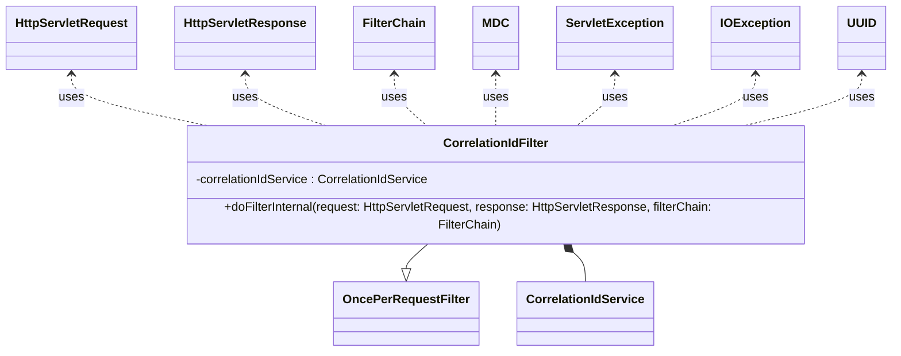

## Functional Requirements
### Correlation ID Filter

The `CorrelationIdFilter` class is responsible for handling correlation IDs in HTTP requests and responses.

#### 1. Correlation ID Extraction and Generation

* The filter extracts the correlation ID from the request headers, checking for the following headers in order:
  + `X-Correlation-ID`
  + `X-Request-ID`
* If the correlation ID is not present in the request headers, a new one is generated using a random UUID.

#### 2. Correlation ID Storage and Propagation

* The extracted or generated correlation ID is stored in the `CorrelationIdService` for further use.
* The correlation ID is stored in the Mapped Diagnostic Context (MDC) for logging purposes, using the key `correlationId`.
* The correlation ID is added to the response headers as `X-Correlation-ID`.

#### 3. Request Processing and Cleanup

* The filter continues the request processing chain by invoking `filterChain.doFilter(request, response)`.
* After the request processing is complete, the filter performs cleanup by:
  + Removing the correlation ID from the MDC.
  + Clearing the correlation ID from the `CorrelationIdService`, regardless of whether an exception occurred during request processing.

### Functional Flow

1. An HTTP request is received by the application.
2. The `CorrelationIdFilter` is invoked as part of the filter chain.
3. The filter extracts or generates a correlation ID based on the request headers.
4. The correlation ID is stored in the `CorrelationIdService` and MDC.
5. The correlation ID is added to the response headers.
6. The request processing continues with the next filter in the chain.
7. After the request processing is complete, the filter performs cleanup.

### Implementation Notes

* The `CorrelationIdFilter` class uses Spring's `OncePerRequestFilter` to ensure that it is executed once per request.
* The filter uses the `CorrelationIdService` to store and manage the correlation ID.
* The MDC is used to store the correlation ID for logging purposes.
* Cleanup is performed in a `finally` block to ensure it occurs even if exceptions are thrown during request processing.

### Usage

The `CorrelationIdFilter` is used to handle correlation IDs in HTTP requests and responses, enabling features such as:
* Logging with correlation IDs for tracing and debugging purposes.
* Propagating correlation IDs to downstream services or systems.

## Core Business Entities
### List of Entities
* Correlation ID Filter
* Correlation ID Service
* Http Servlet Request
* Http Servlet Response
* Filter Chain
* MDC (Mapped Diagnostic Context)

### Entity Descriptions and Relationships
#### Correlation ID Filter
The `Correlation ID Filter` represents a filter that intercepts HTTP requests and responses to manage correlation IDs. It is a component that extends `OncePerRequestFilter`, indicating its role in filtering incoming HTTP requests.

The `Correlation ID Filter` is related to:
* `Correlation ID Service`: The service used to set and clear the correlation ID.
* `Http Servlet Request`: The request object from which the correlation ID is retrieved.
* `Http Servlet Response`: The response object to which the correlation ID is added.
* `Filter Chain`: The chain of filters that the `Correlation ID Filter` is a part of.
* `MDC (Mapped Diagnostic Context)`: Used for logging purposes to store the correlation ID.

#### Correlation ID Service
The `Correlation ID Service` represents a service that manages the correlation ID. It is used to set and clear the correlation ID.

The `Correlation ID Service` is related to:
* `Correlation ID Filter`: The filter that uses the `Correlation ID Service` to set and clear the correlation ID.

#### Http Servlet Request
The `Http Servlet Request` represents an HTTP request object. It is used to retrieve the correlation ID from the request headers.

The `Http Servlet Request` is related to:
* `Correlation ID Filter`: The filter that retrieves the correlation ID from the `Http Servlet Request`.

#### Http Servlet Response
The `Http Servlet Response` represents an HTTP response object. It is used to add the correlation ID to the response headers.

The `Http Servlet Response` is related to:
* `Correlation ID Filter`: The filter that adds the correlation ID to the `Http Servlet Response`.

#### Filter Chain
The `Filter Chain` represents a chain of filters that are applied to incoming HTTP requests. It is used to continue the filtering process after the `Correlation ID Filter` has completed its task.

The `Filter Chain` is related to:
* `Correlation ID Filter`: The filter that is part of the `Filter Chain`.

#### MDC (Mapped Diagnostic Context)
The `MDC (Mapped Diagnostic Context)` is used for logging purposes. It stores the correlation ID.

The `MDC (Mapped Diagnostic Context)` is related to:
* `Correlation ID Filter`: The filter that stores and removes the correlation ID in the `MDC`.

## Business Logic Documentation
### Input & Output Data Structures

* Input: 
  - `HttpServletRequest` object containing the HTTP request headers.
* Output: 
  - `HttpServletResponse` object with the correlation ID added to its headers.

### Logical Flow

1. The `CorrelationIdFilter` intercepts an incoming HTTP request.
2. It attempts to retrieve the correlation ID from the request headers, checking for "X-Correlation-ID" and then "X-Request-ID".
3. If the correlation ID is not found in the request headers, a new one is generated using `UUID.randomUUID().toString()`.
4. The retrieved or generated correlation ID is then:
   - Set in the `CorrelationIdService` using `setCorrelationId`.
   - Stored in the Mapped Diagnostic Context (MDC) for logging purposes under the key "correlationId".
   - Added to the response headers under "X-Correlation-ID".
5. The filter chain continues with `filterChain.doFilter(request, response)`.
6. After the filter chain completes, the correlation ID is removed from the MDC and cleared from the `CorrelationIdService` in a `finally` block to ensure cleanup.

### Data Validation

The following data validation logic is present:
- The correlation ID is checked for presence in the request headers under "X-Correlation-ID" and "X-Request-ID".
- If not present, a new correlation ID is generated.

### Business Rules

The business logic is centered around managing correlation IDs for HTTP requests and responses, ensuring that:
- Each request has a unique correlation ID associated with it.
- The correlation ID is propagated to the response.
- The correlation ID is available for logging purposes.

### Error Handling Approach

The filter ensures that:
- Any exceptions during the filter chain execution are not caught by the filter, allowing them to propagate up the call stack.
- The correlation ID is cleaned up from the MDC and `CorrelationIdService` in a `finally` block, ensuring that resources are released regardless of whether an exception occurs.

### Use of Services

There are no specific LE services used; however, the `CorrelationIdService` is utilized for managing correlation IDs.

### External Program Dependencies

The `CorrelationIdFilter` depends on the following external libraries and entities:
* `org.slf4j.MDC`
* `org.springframework.beans.factory.annotation.Autowired`
* `org.springframework.stereotype.Component`
* `org.springframework.web.filter.OncePerRequestFilter`
* `jakarta.servlet.FilterChain`
* `jakarta.servlet.ServletException`
* `jakarta.servlet.http.HttpServletRequest`
* `jakarta.servlet.http.HttpServletResponse`
* `CorrelationIdService` (a custom service for managing correlation IDs)

