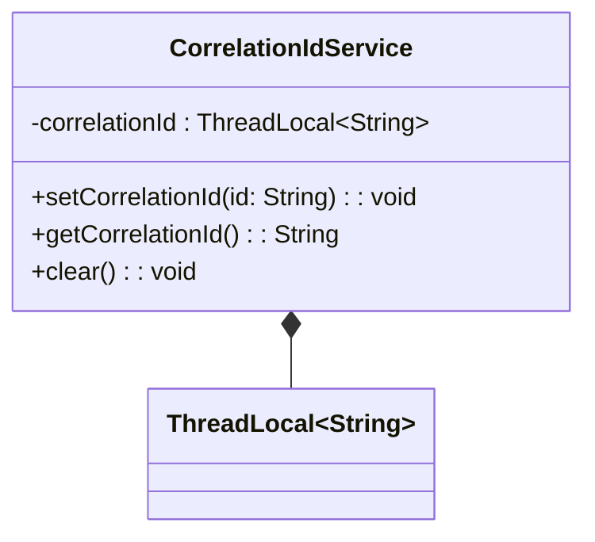

### CorrelationIdService

#### Overview
The `CorrelationIdService` is a Spring-managed service that provides a thread-safe way to manage correlation IDs.

#### Methods
* `setCorrelationId(String id)`: Sets the correlation ID for the current thread.
* `getCorrelationId()`: Retrieves the correlation ID for the current thread. If no correlation ID is set, it returns `null`.
* `clear()`: Clears the correlation ID for the current thread.

#### Usage
The `CorrelationIdService` can be autowired into other Spring-managed beans to manage correlation IDs in a thread-safe manner, enabling features such as storing and retrieving correlation IDs for logging and tracing purposes, propagating correlation IDs to downstream services or systems, and ensuring that correlation IDs are properly cleaned up after use to prevent data leakage.

## Core Business Entities
### List of Entities
* Correlation ID Service

### Entity Descriptions and Relationships
#### Correlation ID Service
The `Correlation ID Service` represents a service that manages a unique identifier known as the correlation ID. It provides methods to set, get, and clear the correlation ID, utilizing a `ThreadLocal` variable to store the correlation ID. This allows the correlation ID to be maintained across different parts of an application within the same thread.

The `Correlation ID Service` is related to no other entities within the provided Java code as there are no other classes or entities defined. The service is annotated with `@Service`, indicating it is a Spring-based service class. 

The key attributes of the `Correlation ID Service` include:
- A `ThreadLocal` variable to store the correlation ID.
- Methods to manipulate the correlation ID: `setCorrelationId`, `getCorrelationId`, and `clear`. 

Since there is only one class provided in the Java code, the `CorrelationIdService`, there are no other entities to describe or relate to.

## Business Logic Documentation
### Input & Output Data Structures

* Input: 
  - `String` id for setting the correlation ID.
* Output: 
  - `String` correlation ID when retrieved using `getCorrelationId`.

### Logical Flow

1. The `CorrelationIdService` is initialized as a Spring service.
2. The service uses a `ThreadLocal` variable to store the correlation ID, ensuring it is unique to each thread.
3. The `setCorrelationId` method sets the correlation ID for the current thread.
4. The `getCorrelationId` method retrieves the correlation ID for the current thread.
5. The `clear` method removes the correlation ID from the `ThreadLocal` variable for the current thread.

### Data Validation

The following data validation logic is present:
- No explicit validation is performed on the input `id` in `setCorrelationId`.
- The `getCorrelationId` method returns `null` if no correlation ID is set.

### Business Rules

The business logic is centered around managing a unique correlation ID for each thread, ensuring that:
- The correlation ID is stored in a thread-safe manner using `ThreadLocal`.
- The correlation ID can be set, retrieved, and cleared as needed.

### Error Handling Approach

The service does not explicitly handle errors; however, it ensures that:
- The `ThreadLocal` variable is properly cleaned up when `clear` is called, preventing memory leaks associated with `ThreadLocal` variables.

### Use of LE(Logic Extraction) Services

There are no specific LE services used; the `CorrelationIdService` is a standalone service.

### External Program Dependencies

The `CorrelationIdService` depends on the following external libraries and entities:
* `org.springframework.stereotype.Service` for Spring service annotation.

### Additional Context from Provided Business Entities

The `Correlation ID Service` is described as a service that manages a unique identifier known as the correlation ID. It utilizes a `ThreadLocal` variable to store the correlation ID and provides methods to set, get, and clear the correlation ID. This description aligns with the functionality observed in the `CorrelationIdService` Java code.

