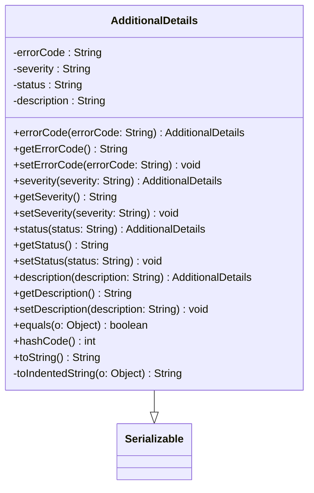

### Functional Requirements for `AdditionalDetails` Class
#### Overview
The `AdditionalDetails` class is a Java representation of additional details related to an error or exception. It is designed to be serialized and deserialized, likely for use in APIs or error handling mechanisms.

#### Key Features

*   The class implements `Serializable` to enable serialization and deserialization.
*   It contains four properties: `errorCode`, `severity`, `status`, and `description`, all of which are strings.
*   Each property has a corresponding getter and setter method, allowing for flexible data access and modification.
*   The class includes a fluent API (e.g., `errorCode(String errorCode)`) to facilitate method chaining and improve code readability.
*   It overrides the `equals`, `hashCode`, and `toString` methods from the `Object` class to provide a proper comparison and string representation.

#### Functional Requirements

1.  **Data Representation**:
    *   The class represents additional details related to an error or exception.
    *   It contains the following properties:
        *   `errorCode`: a unique code identifying the error.
        *   `severity`: the severity level of the error (e.g., critical, warning, info).
        *   `status`: the status related to the error (potentially an HTTP status code or a custom status).
        *   `description`: a human-readable description of the error.

2.  **Serialization and Deserialization**:
    *   The class is serializable to enable conversion to formats like JSON.
    *   The `@JsonProperty` annotations indicate that the properties are included in JSON serialization and deserialization.

3.  **Data Access and Modification**:
    *   The class provides getter methods for each property to allow data access.
    *   It provides setter methods for each property to enable data modification.
    *   The fluent API methods (e.g., `errorCode(String errorCode)`) return the instance itself to support method chaining.

4.  **Comparison and Hashing**:
    *   The class overrides the `equals` method to compare instances based on their properties (`errorCode`, `severity`, `status`, and `description`).
    *   It overrides the `hashCode` method to generate a hash code consistent with the `equals` method, using the same properties.

5.  **String Representation**:
    *   The class overrides the `toString` method to provide a meaningful string representation.
    *   The string representation includes the values of all properties (`errorCode`, `severity`, `status`, and `description`), formatted for readability.

6.  **Indentation for Nested Objects**:
    *   The `toIndentedString` method is used to format nested objects or values with proper indentation.

### Example Usage

```java
AdditionalDetails details = new AdditionalDetails()
    .errorCode("ERR123")
    .severity("CRITICAL")
    .status("500")
    .description("Internal Server Error");

System.out.println(details.toString());
```

This example demonstrates how to create an instance of `AdditionalDetails`, set its properties using the fluent API, and then print its string representation.


## Core Business Entities
### List of Entities
* Additional Details

### Entity Descriptions and Relationships
#### Additional Details
The `Additional Details` represents a business entity that encapsulates additional information related to an error or an event. It contains attributes that provide more context about the error or event, such as error code, severity, status, and description.

The key attributes of the `Additional Details` include:
- `errorCode`: a unique code identifying the error.
- `severity`: the severity level of the error or event.
- `status`: the status related to the error or event.
- `description`: a detailed description of the error or event.

The `Additional Details` is related to no other entities within the provided Java code as there are no other classes or entities defined. The class implements `Serializable` and is annotated with various Jackson annotations (`@JsonProperty`), indicating it is designed to be serialized and deserialized to and from JSON, likely for use in a RESTful API or similar context.

Since there is only one class provided in the Java code, the `AdditionalDetails`, there are no other entities to describe or relate to.


## Business Logic Documentation
### Input & Output Data Structures

* Input: 
  - `AdditionalDetails` object with attributes `errorCode`, `severity`, `status`, and `description`.
* Output: 
  - `AdditionalDetails` object with the same attributes, or a string representation of it, or a boolean result from comparison, or a hash code.

### Logical Flow

1. The `AdditionalDetails` class is initialized with default values for its attributes (`errorCode`, `severity`, `status`, and `description`) set to `null`.
2. The class provides setter and getter methods (including fluent setters) for each attribute, allowing for the modification and retrieval of these values.
3. The `equals` method is overridden to compare two `AdditionalDetails` objects based on their attributes.
4. The `hashCode` method is overridden to generate a hash code based on the attributes of the `AdditionalDetails` object.
5. The `toString` method is overridden to provide a string representation of the `AdditionalDetails` object, with each attribute value indented for readability.

### Data Validation

The following data validation logic is present:
- No explicit validation is performed on the input values for `errorCode`, `severity`, `status`, and `description` in their respective setter methods.
- The `equals` method checks for `null` before comparing objects, ensuring that `NullPointerException` is avoided.

### Business Rules

The business logic is centered around encapsulating additional information related to an error or event within the `AdditionalDetails` class, ensuring that:
- The class is serializable and can be converted to and from JSON.
- The attributes (`errorCode`, `severity`, `status`, and `description`) can be set and retrieved as needed.

### Error Handling Approach

The class does not explicitly handle errors; however, it ensures that:
- The `equals` and `hashCode` methods are implemented correctly to avoid potential issues when using instances of `AdditionalDetails` in collections or comparisons.

### Use of LE(Logic Extraction) Services

There are no specific LE services used; the `AdditionalDetails` class is a standalone entity.

### External Program Dependencies

The `AdditionalDetails` class depends on the following external libraries and entities:
* `com.fasterxml.jackson.annotation.JsonProperty` for JSON serialization and deserialization annotations.
* `java.io.Serializable` for making the class serializable.
* `java.util.Objects` for using utility methods like `equals` and `hash`.





