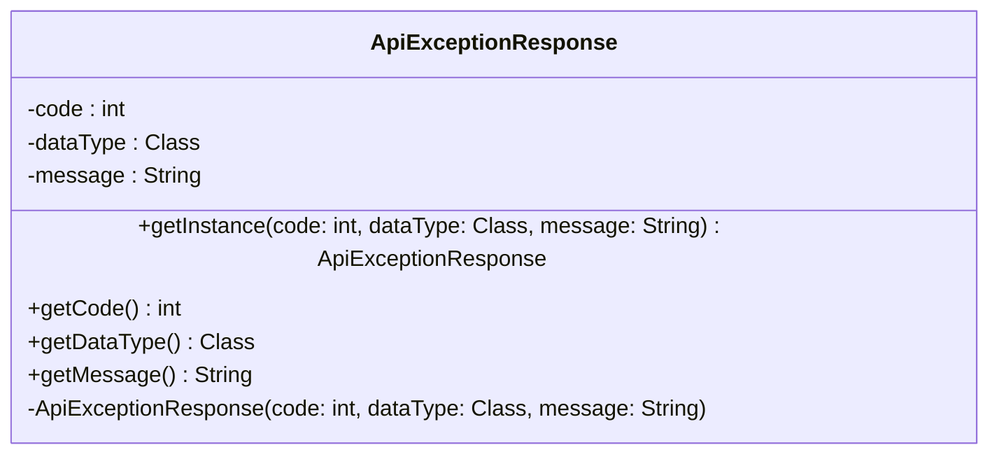

### Functional Requirements for `ApiExceptionResponse` Class
#### Overview

The `ApiExceptionResponse` class is a Java representation of a response to an API exception. It encapsulates the HTTP status code, data type associated with the exception, and a descriptive message.

#### Key Features

*   The class has a private constructor to prevent direct instantiation from outside the class.
*   It provides a static factory method `getInstance` to create instances of `ApiExceptionResponse`.
*   The class contains three properties: `code`, `dataType`, and `message`, representing the HTTP status code, data type, and exception message, respectively.
*   Each property has a corresponding getter method to allow data access.

#### Functional Requirements

1.  **Data Representation**:
    *   The class represents a response to an API exception.
    *   It contains the following properties:
        *   `code`: the HTTP status code associated with the exception.
        *   `dataType`: the data type related to the exception.
        *   `message`: a human-readable description of the exception.

2.  **Instance Creation**:
    *   The class provides a static factory method `getInstance` to create instances.
    *   The `getInstance` method takes three parameters: `code`, `dataType`, and `message`, and returns an instance of `ApiExceptionResponse`.

3.  **Data Access**:
    *   The class provides getter methods for each property to allow data access:
        *   `getCode`: returns the HTTP status code.
        *   `getDataType`: returns the data type associated with the exception.
        *   `getMessage`: returns the exception message.

4.  **Immutability**:
    *   The class is designed to be immutable since it does not provide any setter methods.
    *   The properties are set through the constructor and cannot be modified once an instance is created.

### Example Usage

```java
ApiExceptionResponse response = ApiExceptionResponse.getInstance(404, String.class, "Resource not found");
System.out.println("Code: " + response.getCode());
System.out.println("Data Type: " + response.getDataType().getName());
System.out.println("Message: " + response.getMessage());
```


## Core Business Entities
### List of Entities
* Api Exception Response

### Entity Descriptions and Relationships
#### Api Exception Response
The `Api Exception Response` represents a business entity that encapsulates the details of an exception or error response from an API. It contains attributes that provide information about the error, such as a code, data type, and a message.

The key attributes of the `Api Exception Response` include:
- `code`: an integer representing the error code.
- `dataType`: the class type of the data related to the exception.
- `message`: a string describing the error or exception.

The `Api Exception Response` is created using the static method `getInstance`, which follows a factory pattern for instantiation, indicating that the class is designed to manage its instances through this method. The class has a private constructor to restrict direct instantiation. 

Since there is only one class provided in the Java code, the `ApiExceptionResponse`, there are no other entities to describe or relate to.


## Business Logic Documentation
### Input & Output Data Structures

* Input: 
  - `code`: an integer representing the error code.
  - `dataType`: the class type of the data related to the exception.
  - `message`: a string describing the error or exception.
* Output: 
  - An instance of `ApiExceptionResponse` containing the provided `code`, `dataType`, and `message`.

### Logical Flow

1. The `ApiExceptionResponse` class is designed with a private constructor to restrict direct instantiation.
2. The class provides a static factory method `getInstance` to create instances of `ApiExceptionResponse`.
3. The `getInstance` method takes `code`, `dataType`, and `message` as parameters and returns a new instance of `ApiExceptionResponse`.
4. The class provides getter methods (`getCode`, `getDataType`, `getMessage`) to retrieve the values of `code`, `dataType`, and `message` respectively.

### Data Validation

The following data validation logic is present:
- No explicit validation is performed on the input values for `code`, `dataType`, and `message` in the `getInstance` method or their respective getter methods.
- The class does not check for `null` values for `dataType` and `message`.

### Business Rules

The business logic is centered around encapsulating the details of an exception or error response from an API within the `ApiExceptionResponse` class, ensuring that:
- The class follows a factory pattern for instantiation through the `getInstance` method.
- The attributes (`code`, `dataType`, and `message`) are encapsulated and can be retrieved as needed.

### Error Handling Approach

The class relies on the caller to provide valid and non-null values for `dataType` and `message` to avoid potential `NullPointerException`.

### Use of LE(Logic Extraction) Services

There are no specific LE services used; the `ApiExceptionResponse` class is a standalone entity.

### External Program Dependencies

The `ApiExceptionResponse` class does not have any explicit external dependencies beyond the standard Java library.





