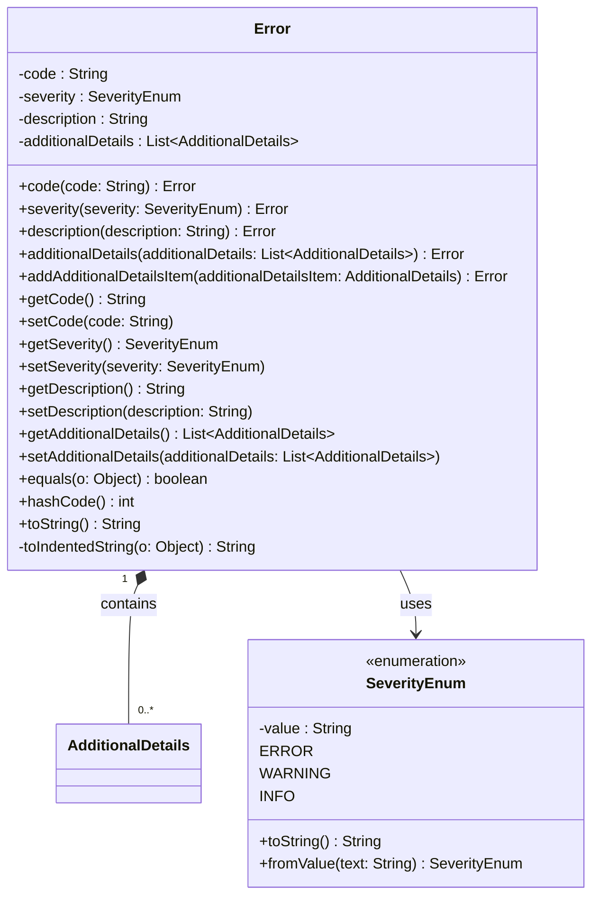

### Functional Requirements for `Error` Class
#### Overview

The `Error` class is a Java representation of an error response. It encapsulates the error code, severity, description, and additional details.

#### Key Features

*   The class implements `Serializable` to support serialization.
*   It contains four properties: `code`, `severity`, `description`, and `additionalDetails`, representing the error code, severity level, error description, and additional details, respectively.
*   Each property has corresponding getter and setter methods to allow data access and modification.
*   The class provides a fluent API through methods like `code`, `severity`, `description`, and `additionalDetails` to facilitate easy object creation and modification.
*   The `SeverityEnum` enum defines the possible severity levels: `ERROR`, `WARNING`, and `INFO`.

#### Functional Requirements

1.  **Data Representation**:
    *   The class represents an error response.
    *   It contains the following properties:
        *   `code`: the error code.
        *   `severity`: the severity level of the error, which can be `ERROR`, `WARNING`, or `INFO`.
        *   `description`: a human-readable description of the error.
        *   `additionalDetails`: a list of additional details related to the error.

2.  **Instance Creation and Modification**:
    *   The class provides a fluent API to create and modify instances:
        *   `code`: sets the error code.
        *   `severity`: sets the severity level.
        *   `description`: sets the error description.
        *   `additionalDetails`: sets the list of additional details.
        *   `addAdditionalDetailsItem`: adds a single additional detail to the list.

3.  **Data Access**:
    *   The class provides getter methods for each property to allow data access:
        *   `getCode`: returns the error code.
        *   `getSeverity`: returns the severity level.
        *   `getDescription`: returns the error description.
        *   `getAdditionalDetails`: returns the list of additional details.

4.  **Equality and Hash Code**:
    *   The class overrides the `equals` method to compare instances based on their properties.
    *   The class overrides the `hashCode` method to generate a hash code based on its properties.

5.  **String Representation**:
    *   The class overrides the `toString` method to provide a string representation of the instance, with each property value indented for readability.

### Example Usage

```java
Error error = new Error();
error.code("ERR001");
error.severity(Error.SeverityEnum.ERROR);
error.description("An error occurred");
AdditionalDetails details = new AdditionalDetails();
// Initialize details
error.addAdditionalDetailsItem(details);
System.out.println(error.toString());
```


## Core Business Entities
### List of Entities
* Error
* AdditionalDetails

### Entity Descriptions and Relationships
#### Error
The `Error` represents a business entity that encapsulates the details of an error. It contains attributes that provide information about the error, such as a code, severity, description, and additional details.

The key attributes of the `Error` include:
- `code`: a string representing the error code.
- `severity`: an enumeration representing the severity of the error, which can be "error", "warning", or "Info".
- `description`: a string describing the error.
- `additionalDetails`: a list of `AdditionalDetails` objects providing additional information about the error.

The `Error` entity is related to the `AdditionalDetails` entity, as it can contain multiple `AdditionalDetails` objects.

#### AdditionalDetails
The `AdditionalDetails` represents a business entity that provides supplementary information about an error. The exact attributes of `AdditionalDetails` are not defined in the provided context.

The `AdditionalDetails` entity is related to the `Error` entity, as an `Error` can have multiple `AdditionalDetails` associated with it.


## Business Logic Documentation
### Input & Output Data Structures

* Input: 
  - `code`: a string representing the error code.
  - `severity`: an enumeration representing the severity of the error.
  - `description`: a string describing the error.
  - `additionalDetails`: a list of `AdditionalDetails` objects providing additional information about the error.
* Output: 
  - An instance of `Error` containing the provided `code`, `severity`, `description`, and `additionalDetails`.

### Logical Flow

1. The `Error` class is designed to encapsulate the details of an error.
2. The class provides setter and getter methods, as well as fluent setter methods (e.g., `code(String code)`, `severity(SeverityEnum severity)`) for its attributes (`code`, `severity`, `description`, and `additionalDetails`).
3. The `severity` attribute is an enumeration (`SeverityEnum`) that can take values "error", "warning", or "Info".
4. The `additionalDetails` attribute is a list of `AdditionalDetails` objects, and the class provides methods (`additionalDetails(List<AdditionalDetails> additionalDetails)` and `addAdditionalDetailsItem(AdditionalDetails additionalDetailsItem)`) to set and add items to this list.
5. The class overrides `equals`, `hashCode`, and `toString` methods for proper comparison and representation.

### Data Validation

The following data validation logic is present:
- The `severity` attribute is validated through the `SeverityEnum` enumeration, ensuring it can only take the values "error", "warning", or "Info".
- The `additionalDetails` attribute is annotated with `@Valid`, indicating that the objects in the list should be validated according to their own validation rules.

### Business Rules

The business logic is centered around encapsulating the details of an error within the `Error` class, ensuring that:
- The attributes (`code`, `severity`, `description`, and `additionalDetails`) are properly encapsulated and can be retrieved or modified as needed.
- The `severity` attribute adheres to the defined enumeration values.

### Error Handling Approach

The class relies on the caller to provide valid values for its attributes. The use of `@Valid` annotation on `additionalDetails` suggests that validation is expected to be performed on the objects within the list, but the exact error handling mechanism is not defined within this class.

### Use of LE(Logic Extraction) Services

There are no specific LE services used; the `Error` class is a standalone entity.

### External Program Dependencies

The `Error` class has dependencies on:
- `com.fasterxml.jackson.annotation` for JSON serialization and deserialization annotations (`@JsonProperty`, `@JsonValue`, `@JsonCreator`).
- `jakarta.validation` for validation annotations (`@Valid`).





