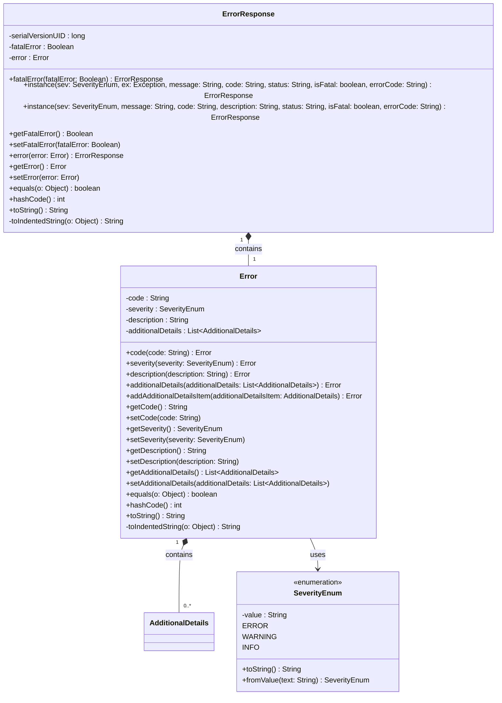

### Functional Requirements for `ErrorResponse` Class
#### Overview

The `ErrorResponse` class is a Java representation of an error response, encapsulating information about whether the error is fatal and the associated error details.

#### Key Features

*   The class implements `Serializable` to support serialization.
*   It contains two properties: `fatalError` and `error`, representing whether the error is fatal and the error details, respectively.
*   Each property has corresponding getter and setter methods to allow data access and modification.
*   The class provides a fluent API through methods like `fatalError` and `error` to facilitate easy object creation and modification.
*   The class includes static factory methods `instance` to create instances based on different input parameters.

#### Functional Requirements

1.  **Data Representation**:
    *   The class represents an error response.
    *   It contains the following properties:
        *   `fatalError`: a boolean indicating whether the error is fatal.
        *   `error`: an instance of the `Error` class representing the error details.

2.  **Instance Creation and Modification**:
    *   The class provides a fluent API to create and modify instances:
        *   `fatalError`: sets whether the error is fatal.
        *   `error`: sets the error details.
    *   The class includes two static factory methods `instance` to create instances based on different input parameters:
        *   One method takes `SeverityEnum`, `Exception`, `message`, `code`, `status`, `isFatal`, and `errorCode` as parameters. If an `Exception` is provided, its stack trace is captured and added as an `AdditionalDetails` item to the `Error` instance.
        *   The other method takes `SeverityEnum`, `message`, `code`, `description`, `status`, `isFatal`, and `errorCode` as parameters and adds an `AdditionalDetails` item to the `Error` instance with the provided `description`.

3.  **Data Access**:
    *   The class provides getter methods for each property to allow data access:
        *   `getFatalError`: returns whether the error is fatal.
        *   `getError`: returns the error details.

4.  **Equality and Hash Code**:
    *   The class overrides the `equals` method to compare instances based on their properties.
    *   The class overrides the `hashCode` method to generate a hash code based on its properties.

5.  **String Representation**:
    *   The class overrides the `toString` method to provide a string representation of the instance, with each property value indented for readability.

### Example Usage

```java
ErrorResponse errorResponse = ErrorResponse.instance(Error.SeverityEnum.ERROR, new Exception("Test Exception"), "An error occurred", "ERR001", "Failed", true, "EC001");
System.out.println(errorResponse.toString());
```

### Additional Details

*   The `instance` methods create an `ErrorResponse` instance and populate its properties based on the input parameters.
*   The `toIndentedString` method is a utility method used to format the string representation of the instance with indentation.


## Core Business Entities
### List of Entities
* ErrorResponse
* Error
* AdditionalDetails

### Entity Descriptions and Relationships
#### ErrorResponse
The `ErrorResponse` represents a business entity that encapsulates the details of an error response. It contains attributes that provide information about whether the error is fatal and the associated error details.

The key attributes of the `ErrorResponse` include:
- `fatalError`: a boolean indicating whether the error is fatal.
- `error`: an `Error` object representing the error.

The `ErrorResponse` entity is related to the `Error` entity, as it contains an `Error` object.

#### Error
The `Error` represents a business entity that encapsulates the details of an error. It contains attributes that provide information about the error, such as a code, severity, description, and additional details.

The key attributes of the `Error` include:
- `code`: a string representing the error code.
- `severity`: an enumeration representing the severity of the error.
- `description`: a string describing the error.
- `additionalDetails`: a list of `AdditionalDetails` objects providing additional information about the error.

The `Error` entity is related to the `AdditionalDetails` entity, as it can contain multiple `AdditionalDetails` objects. It is also related to the `ErrorResponse` entity, as an `ErrorResponse` contains an `Error`.

#### AdditionalDetails
The `AdditionalDetails` represents a business entity that provides supplementary information about an error.

The key attributes of the `AdditionalDetails` include:
- `description`: a string describing the additional details.
- `errorCode`: a string representing the error code.
- `severity`: a string representing the severity of the error.
- `status`: a string representing the status.

The `AdditionalDetails` entity is related to the `Error` entity, as an `Error` can have multiple `AdditionalDetails` associated with it.


## Business Logic Documentation
### Input & Output Data Structures

* Input: 
  - Various parameters depending on the instance method used:
    - `sev`: an enumeration representing the severity of the error (`SeverityEnum`).
    - `ex`: an `Exception` object (optional).
    - `message`: a string describing the error.
    - `code`: a string representing the error code.
    - `status`: a string representing the status.
    - `isFatal`: a boolean indicating whether the error is fatal.
    - `errorCode`: a string representing the error code for additional details.
    - `description`: a string describing the additional details (for the second `instance` method).
  - Alternatively, an `ErrorResponse` object can be constructed using its setter methods:
    - `fatalError`: a boolean indicating whether the error is fatal.
    - `error`: an `Error` object.
* Output: 
  - An instance of `ErrorResponse` containing the provided error details.

### Logical Flow

1. The `ErrorResponse` class provides two static `instance` methods to create an `ErrorResponse` object with pre-populated values based on the input parameters.
2. The first `instance` method takes an `Exception` object, populates the `additionalDetails` of the `Error` object with the stack trace of the exception, and sets the `errorCode`, `severity`, and `status` accordingly.
3. The second `instance` method creates an `AdditionalDetails` object with the provided `description`, `errorCode`, `severity`, and `status`.
4. Both methods set the `fatalError` attribute of the `ErrorResponse` object based on the `isFatal` parameter and populate the `error` attribute with the relevant error details.
5. The class provides setter and getter methods for its attributes (`fatalError` and `error`), as well as fluent setter methods.
6. The `error` attribute is an `Error` object, which encapsulates the details of an error, including its code, severity, description, and additional details.

### Data Validation

The following data validation logic is present:
- The `error` attribute is annotated with `@Valid`, indicating that the `Error` object should be validated according to its own validation rules.
- The `severity` attribute within the `Error` object is an enumeration (`SeverityEnum`), ensuring it can only take specific values.

### Business Rules

The business logic is centered around creating an `ErrorResponse` object that encapsulates the details of an error response, ensuring that:
- The `fatalError` attribute is properly set based on the input parameter `isFatal`.
- The `error` attribute is populated with relevant error details, including code, severity, description, and additional details.

### Error Handling Approach

The class handles exceptions by capturing their stack trace and including it in the `additionalDetails` of the `Error` object when an `Exception` object is provided.

### Use of LE(Logic Extraction) Services

There are no specific LE services used; the `ErrorResponse` class is a standalone entity that utilizes other business entities (`Error` and `AdditionalDetails`).

### External Program Dependencies

The `ErrorResponse` class has dependencies on:
- `com.fasterxml.jackson.annotation` for JSON serialization and deserialization annotations (`@JsonProperty`).
- `jakarta.validation` for validation annotations (`@Valid`).





