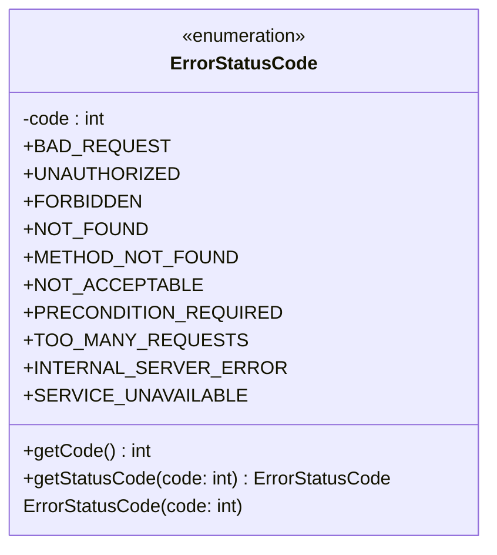

### Functional Requirements for `ErrorStatusCode` Enum
#### Overview

The `ErrorStatusCode` enum represents a set of HTTP status codes used to indicate the outcome of a request. It provides a way to map integer status codes to their corresponding enum values and vice versa.

#### Key Features

*   The enum defines a set of HTTP status codes as its values.
*   Each enum value is associated with an integer code.
*   The enum provides a method to retrieve the integer code for a given enum value.
*   The enum includes a static method to retrieve the enum value corresponding to a given integer code.

#### Functional Requirements

1.  **HTTP Status Code Representation**:
    *   The enum represents a set of HTTP status codes.
    *   The defined HTTP status codes are:
        *   `BAD_REQUEST` (400)
        *   `UNAUTHORIZED` (401)
        *   `FORBIDDEN` (403)
        *   `NOT_FOUND` (404)
        *   `METHOD_NOT_FOUND` (405)
        *   `NOT_ACCEPTABLE` (406)
        *   `PRECONDITION_REQUIRED` (428)
        *   `TOO_MANY_REQUESTS` (429)
        *   `INTERNAL_SERVER_ERROR` (500)
        *   `SERVICE_UNAVAILABLE` (503)

2.  **Code Retrieval**:
    *   The enum provides a method `getCode` to retrieve the integer code associated with an enum value.

3.  **Enum Value Retrieval**:
    *   The enum includes a static method `getStatusCode` to retrieve the enum value corresponding to a given integer code.
    *   If the provided integer code does not match any defined enum value, the method returns `null`.

4.  **Usage**:
    *   The enum can be used to map integer status codes to their corresponding enum values, making the code more readable and maintainable.

### Example Usage

```java
ErrorStatusCode statusCode = ErrorStatusCode.getStatusCode(404);
System.out.println(statusCode); // Output: NOT_FOUND

int code = ErrorStatusCode.NOT_FOUND.getCode();
System.out.println(code); // Output: 404
```


## Core Business Entities
### List of Entities
* ErrorStatusCode

### Entity Descriptions and Relationships
#### ErrorStatusCode
The `ErrorStatusCode` represents a business entity that encapsulates the HTTP status codes for errors. It contains an enumeration of standard HTTP status codes and their corresponding integer values.

The key attributes of the `ErrorStatusCode` include:
- `code`: an integer representing the HTTP status code.

The `ErrorStatusCode` entity provides methods to:
- Retrieve the integer value of the HTTP status code using `getCode()`.
- Retrieve the corresponding `ErrorStatusCode` enumeration value based on a given HTTP status code using `getStatusCode(int code)`.

There are no direct relationships between `ErrorStatusCode` and other entities in the provided Java code, as it is an enumeration and does not contain any other business entities. However, it can be used in other classes to represent error status codes.

Since there is only one entity in the provided Java code, there are no relationships to describe with other entities.


## Business Logic Documentation
### Input & Output Data Structures

* Input: 
  - An integer representing the HTTP status code.
* Output: 
  - The corresponding `ErrorStatusCode` enumeration value.
  - The integer value of the HTTP status code.

### Logical Flow

1. The `ErrorStatusCode` enumeration represents a set of standard HTTP status codes and their corresponding integer values.
2. The `getCode()` method retrieves the integer value associated with a specific `ErrorStatusCode` enumeration value.
3. The `getStatusCode(int code)` method takes an integer HTTP status code as input and returns the corresponding `ErrorStatusCode` enumeration value.
4. The `getStatusCode(int code)` method uses a switch statement to map the input integer code to the corresponding `ErrorStatusCode` enumeration value. If the input code does not match any of the defined cases, it returns `null`.

### Data Validation

The following data validation logic is present:
- The `getStatusCode(int code)` method checks if the input integer code matches any of the defined HTTP status codes. If not, it returns `null`.

### Business Rules

The business logic is centered around representing HTTP status codes as an enumeration, ensuring that:
- The `ErrorStatusCode` enumeration values are associated with standard HTTP status codes.
- The `getStatusCode(int code)` method correctly maps input integer codes to their corresponding `ErrorStatusCode` enumeration values.

### Error Handling Approach

The `getStatusCode(int code)` method handles unknown HTTP status codes by returning `null`.

### Use of LE(Logic Extraction) Services

There are no specific LE services used; the `ErrorStatusCode` enumeration is a standalone entity.

### External Program Dependencies

The `ErrorStatusCode` enumeration has no external dependencies.





