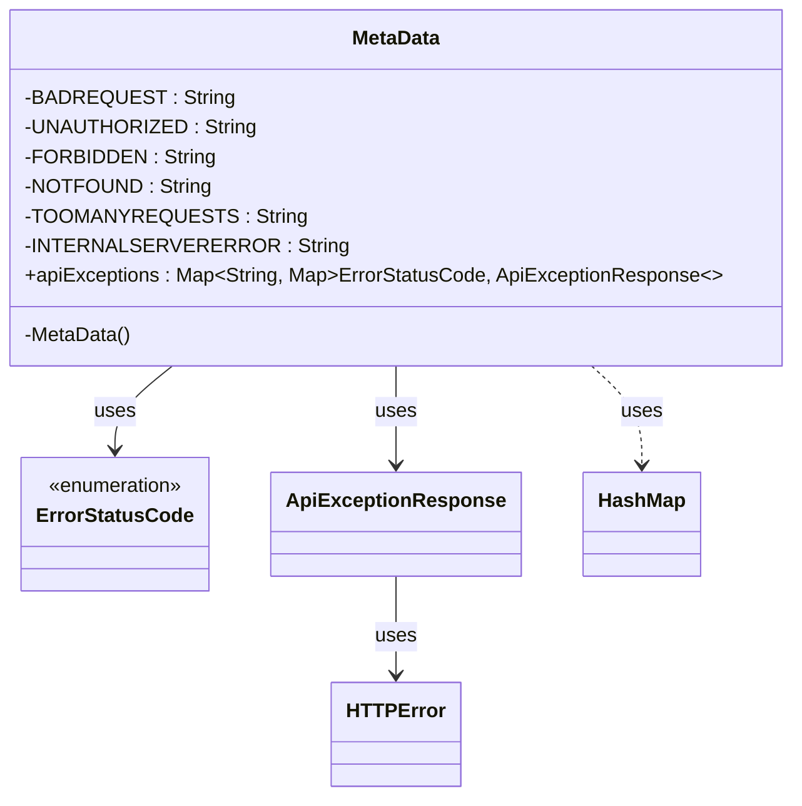

### Functional Requirements for `MetaData` Class
#### Overview

The `MetaData` class is a utility class that provides a mapping of API operations to their corresponding exception responses. It contains a static map `apiExceptions` that stores the exception responses for different API operations.

#### Key Features

*   The class contains a static map `apiExceptions` that maps API operation names to their corresponding exception responses.
*   The exception responses are stored in a nested map structure, where the outer map key is the API operation name, and the inner map key is the `ErrorStatusCode`.
*   The inner map value is an instance of `ApiExceptionResponse`, which represents the exception response for a specific `ErrorStatusCode`.

#### Functional Requirements

1.  **API Operation Exception Mapping**:
    *   The class provides a static map `apiExceptions` that maps API operation names to their corresponding exception responses.
    *   The API operation names are:
        *   `initiate`
        *   `update`
        *   `retrieve`
        *   `retrievePaymentMechanism`
        *   `retrievePaymentExecutionWorkstep`
    *   For each API operation, the corresponding exception responses are stored in a nested map structure.

2.  **Exception Response Configuration**:
    *   For each API operation, the exception responses are configured for the following `ErrorStatusCode` values:
        *   400 (`BADREQUEST`)
        *   401 (`UNAUTHORIZED`)
        *   403 (`FORBIDDEN`)
        *   404 (`NOTFOUND`)
        *   429 (`TOOMANYREQUESTS`)
        *   500 (`INTERNALSERVERERROR`)
    *   For each `ErrorStatusCode`, an instance of `ApiExceptionResponse` is created using the `ApiExceptionResponse.getInstance` method with `HTTPError.class`.

3.  **Initialization**:
    *   The `apiExceptions` map is initialized in a static block.
    *   The initialization process involves creating a nested map structure for each API operation and populating it with exception responses.

4.  **Usage**:
    *   The `apiExceptions` map can be used to retrieve the exception responses for a specific API operation and `ErrorStatusCode`.

### Example Usage

```java
Map<ErrorStatusCode, ApiExceptionResponse> responses = MetaData.apiExceptions.get("initiate");
ApiExceptionResponse exceptionResponse = responses.get(ErrorStatusCode.getStatusCode(404));
```

### Notes

*   The `MetaData` class has a private constructor that throws an `AssertionError` to prevent instantiation.
*   The class uses a static block to initialize the `apiExceptions` map. Any exceptions during initialization are caught and printed to the console.


## Core Business Entities
### List of Entities
* MetaData
* ErrorStatusCode
* ApiExceptionResponse
* HTTPError

### Entity Descriptions and Relationships
#### MetaData
The `MetaData` represents a business entity that stores API exception metadata. It contains a static map `apiExceptions` that maps API operation names to a map of error status codes and their corresponding API exception responses.

The key attributes of the `MetaData` include:
- `apiExceptions`: a map of API operation names to a map of error status codes and their corresponding API exception responses.

The `MetaData` entity is related to:
- `ErrorStatusCode`: used as a key in the `apiExceptions` map to represent error status codes.
- `ApiExceptionResponse`: used as a value in the `apiExceptions` map to represent API exception responses.

The API operation names used in `apiExceptions` include:
- "initiate"
- "update"
- "retrieve"
- "retrievePaymentMechanism"
- "retrievePaymentExecutionWorkstep"

#### ErrorStatusCode
The `ErrorStatusCode` represents a business entity that encapsulates HTTP status codes for errors. It contains an enumeration of standard HTTP status codes and their corresponding integer values.

The key attributes of the `ErrorStatusCode` include:
- `code`: an integer representing the HTTP status code.

The `ErrorStatusCode` entity provides methods to:
- Retrieve the integer value of the HTTP status code using `getCode()`.
- Retrieve the corresponding `ErrorStatusCode` enumeration value based on a given HTTP status code using `getStatusCode(int code)`.

The `ErrorStatusCode` entity is related to:
- `MetaData`: used as a key in the `apiExceptions` map to represent error status codes.
- `ApiExceptionResponse`: used in conjunction with `ErrorStatusCode` to represent API exception responses.

#### ApiExceptionResponse
The `ApiExceptionResponse` represents a business entity that encapsulates API exception responses. It contains information about the HTTP status code, error class, and error message.

The key attributes of the `ApiExceptionResponse` include:
- `statusCode`: an integer representing the HTTP status code.
- `errorClass`: a class representing the type of error.
- `errorMessage`: a string representing the error message.

The `ApiExceptionResponse` entity provides a method to:
- Retrieve an instance of `ApiExceptionResponse` using `getInstance(int statusCode, Class<?> errorClass, String errorMessage)`.

The `ApiExceptionResponse` entity is related to:
- `MetaData`: used as a value in the `apiExceptions` map to represent API exception responses.
- `ErrorStatusCode`: used in conjunction with `ApiExceptionResponse` to represent API exception responses.
- `HTTPError`: used as the error class in the `ApiExceptionResponse`.

#### HTTPError
The `HTTPError` represents a business entity that encapsulates HTTP errors.

The `HTTPError` entity is related to:
- `ApiExceptionResponse`: used as the error class in the `ApiExceptionResponse`. 

The error messages used in `ApiExceptionResponse` include:
- "BadRequest"
- "Unauthorized"
- "Forbidden"
- "NotFound"
- "TooManyRequests"
- "InternalServerError"


## Business Logic Documentation

### Input & Output Data Structures

* Input: 
  - API operation name (e.g., "initiate", "update", "retrieve", "retrievePaymentMechanism", "retrievePaymentExecutionWorkstep")
  - HTTP status code
* Output: 
  - `ApiExceptionResponse` object corresponding to the input HTTP status code and API operation name

### Logical Flow

1. The `MetaData` class initializes a static map `apiExceptions` that stores API exception metadata.
2. The `apiExceptions` map is populated with API operation names as keys and a map of `ErrorStatusCode` to `ApiExceptionResponse` as values.
3. For each API operation ("initiate", "update", "retrieve", "retrievePaymentMechanism", "retrievePaymentExecutionWorkstep"), a map of `ErrorStatusCode` to `ApiExceptionResponse` is created and populated with standard HTTP status codes (400, 401, 403, 404, 429, 500) and their corresponding `ApiExceptionResponse` objects.
4. The `ApiExceptionResponse` objects are created using the `getInstance` method, which takes the HTTP status code, error class (`HTTPError`), and error message as input.
5. The `ErrorStatusCode` enumeration is used to represent standard HTTP status codes and their corresponding integer values.

### Data Validation

The following data validation logic is present:
- The `ErrorStatusCode` enumeration ensures that only standard HTTP status codes are used.
- The `apiExceptions` map is populated with predefined API operation names and HTTP status codes.

### Business Rules

The business logic is centered around representing API exception metadata, ensuring that:
- API operation names are mapped to their corresponding exception responses.
- Standard HTTP status codes are used to represent error conditions.
- `ApiExceptionResponse` objects are created with the correct HTTP status code, error class, and error message.

### Error Handling Approach

The `MetaData` class catches any exceptions that occur during the initialization of the `apiExceptions` map and prints the stack trace.

### External Program Dependencies

The `MetaData` class depends on the following external entities:
- `ErrorStatusCode` enumeration
- `ApiExceptionResponse` class
- `HTTPError` class





