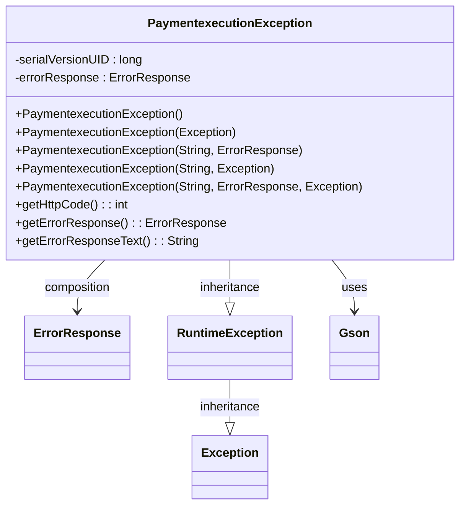

### Functional Requirements for `PaymentexecutionException` Class
#### Overview

The `PaymentexecutionException` class is a custom exception class that extends the `RuntimeException` class. It is designed to handle exceptions related to payment execution and provides a structured way to represent error responses.

#### Key Features

*   The class has multiple constructors to create instances with varying levels of detail, including error messages, underlying exceptions, and custom error responses.
*   It includes a method to retrieve the HTTP status code associated with the exception, derived from the error response.
*   The class provides methods to access the error response object and its JSON representation.

#### Functional Requirements

1.  **Exception Construction**:
    *   The class provides multiple constructors to create `PaymentexecutionException` instances:
        *   A no-argument constructor.
        *   A constructor that takes an underlying `Exception`.
        *   Constructors that take an error message, with optional parameters for an `ErrorResponse` object and/or an underlying `Exception`.
    *   Each constructor initializes the `errorResponse` field, either with a default `ErrorResponse` object or with the provided `ErrorResponse` object.

2.  **HTTP Status Code Retrieval**:
    *   The `getHttpCode` method retrieves the HTTP status code associated with the exception.
    *   The HTTP status code is derived from the `code` field within the `Error` object contained in the `errorResponse`.
    *   If the `code` is not a valid integer or if `errorResponse`, `errorResponse.getError()`, or `errorResponse.getError().getCode()` is `null`, the method returns a default HTTP status code of 400.

3.  **Error Response Access**:
    *   The `getErrorResponse` method returns the `ErrorResponse` object associated with the exception.
    *   The `getErrorResponseText` method returns the JSON representation of the `ErrorResponse` object using `Gson`.

4.  **Usage**:
    *   The `PaymentexecutionException` class can be used to throw exceptions with structured error information in payment execution-related code.
    *   The exception can be caught and handled to retrieve the error response and HTTP status code.

### Example Usage

```java
try {
    // Code that may throw PaymentexecutionException
} catch (PaymentexecutionException e) {
    int httpCode = e.getHttpCode();
    ErrorResponse errorResponse = e.getErrorResponse();
    String errorResponseJson = e.getErrorResponseText();
    // Handle the exception using the retrieved information
}
```

### Notes

*   The `PaymentexecutionException` class is designed to be used as a `RuntimeException`, allowing it to be thrown without being explicitly declared in method signatures.
*   The class relies on the `ErrorResponse` class to represent the error information.


## Core Business Entities
### List of Entities
* PaymentexecutionException
* ErrorResponse

### Entity Descriptions and Relationships
#### PaymentexecutionException
The `PaymentexecutionException` represents a business entity that defines a custom exception for payment execution. It extends the `RuntimeException` class and contains an `ErrorResponse` object.

The key attributes of the `PaymentexecutionException` include:
- `errorResponse`: an object of type `ErrorResponse` that contains error information.
- `serialVersionUID`: a unique identifier for the exception.

The `PaymentexecutionException` entity provides methods to:
- Retrieve the HTTP code associated with the exception using `getHttpCode()`.
- Retrieve the `ErrorResponse` object using `getErrorResponse()`.
- Retrieve the `ErrorResponse` as a JSON string using `getErrorResponseText()`.

The `PaymentexecutionException` entity is related to:
- `ErrorResponse`: used to store error information within the exception.

#### ErrorResponse
The `ErrorResponse` represents a business entity that encapsulates error response information. 

The key attributes of the `ErrorResponse` likely include:
- `error`: an object that contains error details, including a `code`.

The `ErrorResponse` entity is related to:
- `PaymentexecutionException`: used within the exception to store error information.


## Business Logic Documentation

### Input & Output Data Structures

* Input: 
  - Exception details (message, ErrorResponse, cause)
* Output: 
  - `PaymentexecutionException` object with associated `ErrorResponse`
  - HTTP code associated with the exception
  - `ErrorResponse` as a JSON string

### Logical Flow

1. The `PaymentexecutionException` class is instantiated with various constructors that accept different combinations of input parameters (message, ErrorResponse, cause).
2. The constructors initialize the `errorResponse` attribute and the superclass (`RuntimeException`) with the provided input parameters.
3. The `getHttpCode()` method retrieves the HTTP code from the `ErrorResponse` object. If the code is not a valid integer, it defaults to 400.
4. The `getErrorResponse()` method returns the `ErrorResponse` object associated with the exception.
5. The `getErrorResponseText()` method converts the `ErrorResponse` object to a JSON string using `Gson`.

### Data Validation

The following data validation logic is present:
- The `getHttpCode()` method checks if the error code in `ErrorResponse` is a valid integer. If not, it defaults to 400.

### Business Rules

The business logic is centered around representing a custom exception for payment execution, ensuring that:
- The exception contains an `ErrorResponse` object with error information.
- The HTTP code associated with the exception is retrieved from the `ErrorResponse` object.

### Error Handling Approach

The `PaymentexecutionException` class catches and handles exceptions by:
- Providing constructors that accept a cause (`Exception e`) to wrap the original exception.
- Returning a default HTTP code (400) if the error code in `ErrorResponse` is not a valid integer.

### Use of External Libraries

The `PaymentexecutionException` class depends on the following external entities:
- `ErrorResponse` class
- `Gson` class from the Google Gson library 

### Core Business Entities
#### PaymentexecutionException
The `PaymentexecutionException` represents a business entity that defines a custom exception for payment execution. It extends the `RuntimeException` class and contains an `ErrorResponse` object.

The key attributes of the `PaymentexecutionException` include:
- `errorResponse`: an object of type `ErrorResponse` that contains error information.
- `serialVersionUID`: a unique identifier for the exception.

The `PaymentexecutionException` entity provides methods to:
- Retrieve the HTTP code associated with the exception using `getHttpCode()`.
- Retrieve the `ErrorResponse` object using `getErrorResponse()`.
- Retrieve the `ErrorResponse` as a JSON string using `getErrorResponseText()`.

The `PaymentexecutionException` entity is related to:
- `ErrorResponse`: used to store error information within the exception.

#### ErrorResponse
The `ErrorResponse` represents a business entity that encapsulates error response information. 

The key attributes of the `ErrorResponse` likely include:
- `error`: an object that contains error details, including a `code`.

The `ErrorResponse` entity is related to:
- `PaymentexecutionException`: used within the exception to store error information.





