```mermaid
classDiagram
class PaymentexecutionExceptionHandler {
  -log : Logger
  -FAILED : String
  -ERROR : String
  +getResponseHeaders(WebRequest) : HttpHeaders
  +buildResponseMap() : MultiValueMap~String, String~
  +handleRequestException(Exception, WebRequest) : ResponseEntity~Object~
  +handleRequestException(PaymentexecutionException, WebRequest) : ResponseEntity~Object~
  +handleGeneralException(Exception, WebRequest) : ResponseEntity~Object~
  +handleHTTPException(HttpStatusCodeException, WebRequest) : ResponseEntity~Object~
  +handleHttpRequestMethodNotSupported(HttpRequestMethodNotSupportedException, HttpHeaders, HttpStatus, WebRequest) : ResponseEntity~Object~
  +handleMethodArgumentNotValid(MethodArgumentNotValidException, HttpHeaders, HttpStatus, WebRequest) : ResponseEntity~Object~
}
class ResponseEntityExceptionHandler {
}
class PaymentexecutionException {
}
class ErrorResponse {
}
class ErrorStatusCode {
}
class WebRequest {
}
class HttpStatusCodeException {
}
class HttpRequestMethodNotSupportedException {
}
class MethodArgumentNotValidException {
}
class HttpHeaders {
}
class HttpStatus {
}
class MediaType {
}
class ObjectMapper {
}
class IOException {
}
class Exception {
}
class Logger {
}
class MultiValueMap~String, String~ {
}
class LinkedMultiValueMap~String, String~ {
}
class SeverityEnum {
}

PaymentexecutionExceptionHandler --|> ResponseEntityExceptionHandler : inheritance
PaymentexecutionExceptionHandler --> ErrorResponse : uses
PaymentexecutionExceptionHandler --> PaymentexecutionException : uses
PaymentexecutionExceptionHandler --> WebRequest : uses
PaymentexecutionExceptionHandler --> HttpStatusCodeException : uses
PaymentexecutionExceptionHandler --> HttpRequestMethodNotSupportedException : uses
PaymentexecutionExceptionHandler --> MethodArgumentNotValidException : uses
PaymentexecutionExceptionHandler --> HttpHeaders : uses
PaymentexecutionExceptionHandler --> HttpStatus : uses
PaymentexecutionExceptionHandler --> ObjectMapper : uses
PaymentexecutionExceptionHandler --> IOException : uses
PaymentexecutionExceptionHandler --> Logger : uses
PaymentexecutionExceptionHandler --> MultiValueMap~String, String~ : uses
PaymentexecutionExceptionHandler --> LinkedMultiValueMap~String, String~ : uses
PaymentexecutionExceptionHandler --> SeverityEnum : uses
PaymentexecutionExceptionHandler --> Exception : uses
PaymentexecutionExceptionHandler --> ErrorStatusCode : uses
PaymentexecutionExceptionHandler --> MediaType : uses
LinkedMultiValueMap~String, String~ --|> MultiValueMap~String, String~ : inheritance
```

### Functional Requirements for `PaymentexecutionExceptionHandler` Class
#### Overview

The `PaymentexecutionExceptionHandler` class is a custom exception handler that captures and handles various exceptions during API execution. It is annotated with `@ControllerAdvice` to enable global exception handling.

#### Key Features

*   Handles multiple exception types, including `PaymentexecutionException`, `ConstraintViolationException`, `IllegalArgumentException`, `HttpClientErrorException`, `HttpServerErrorException`, and general `Exception`.
*   Provides a structured error response using `ErrorResponse`.
*   Logs exceptions and returns a `ResponseEntity` with an appropriate HTTP status code and error response body.

#### Functional Requirements

1.  **Exception Handling**:
    *   Handles the following exceptions:
        *   `ConstraintViolationException` and `IllegalArgumentException`: Returns a `ResponseEntity` with an HTTP status code of 400 (Bad Request) and a default error response.
        *   `PaymentexecutionException`: Returns a `ResponseEntity` with the HTTP status code and error response associated with the exception.
        *   General `Exception`: Returns a `ResponseEntity` with an HTTP status code of 500 (Internal Server Error) and a default error response.
        *   `HttpClientErrorException` and `HttpServerErrorException`: Returns a `ResponseEntity` with the HTTP status code from the exception and an error response parsed from the exception's response body.
    *   Handles `HttpRequestMethodNotSupportedException` and returns a `ResponseEntity` with an HTTP status code of 405 (Method Not Allowed) and a corresponding error response.
    *   Handles `MethodArgumentNotValidException` and returns a `ResponseEntity` with an HTTP status code of 400 (Bad Request) and a corresponding error response.

2.  **Error Response Construction**:
    *   Constructs an `ErrorResponse` object using the `ErrorResponse.instance` method for most exceptions.
    *   For `HttpClientErrorException` and `HttpServerErrorException`, attempts to parse the error response from the exception's response body using an `ObjectMapper`.

3.  **Logging**:
    *   Logs exceptions using a logger.

4.  **ResponseEntity Construction**:
    *   Builds a `ResponseEntity` with the appropriate HTTP status code, headers, and error response body for each handled exception.

5.  **Header Construction**:
    *   The `getResponseHeaders` method constructs HTTP headers for the response.

#### Example Usage

The `PaymentexecutionExceptionHandler` class is used implicitly by Spring when exceptions occur during API execution.

```java
// API endpoint that may throw an exception
@GetMapping("/example")
public String example() {
    // Code that may throw PaymentexecutionException or other handled exceptions
    throw new PaymentexecutionException("Error message");
}
```

In this case, the `PaymentexecutionExceptionHandler` will catch the `PaymentexecutionException` and return a `ResponseEntity` with the associated HTTP status code and error response.

### Notes

*   Relies on the `ErrorResponse` class to represent error information.
*   Uses an `ObjectMapper` to parse error responses from `HttpClientErrorException` and `HttpServerErrorException` instances.


## Core Business Entities
### List of Entities
* PaymentexecutionException
* ErrorResponse
* Error

### Entity Descriptions and Relationships
#### PaymentexecutionException
The `PaymentexecutionException` represents a business entity that defines a custom exception for payment execution.

The key attributes and methods of the `PaymentexecutionException` include:
- Methods to retrieve the HTTP code associated with the exception and the `ErrorResponse` object.

The `PaymentexecutionException` entity is related to:
- `ErrorResponse`: used to store error information within the exception.

#### ErrorResponse
The `ErrorResponse` represents a business entity that encapsulates error response information.

The key attributes of the `ErrorResponse` include:
- Severity
- Exception details
- Message
- Code
- Status
- Retryable
- HttpStatusCode

The `ErrorResponse` entity is related to:
- `PaymentexecutionException`: used within the exception to store error information.
- Various exceptions handled by `PaymentexecutionExceptionHandler`, such as `ConstraintViolationException`, `IllegalArgumentException`, `Exception`, `HttpClientErrorException`, `HttpServerErrorException`, `HttpRequestMethodNotSupportedException`, and `MethodArgumentNotValidException`, where it is used to build and return error responses.

#### Error
The `Error` represents a business entity that encapsulates error information.

The key attributes of the `Error` include:
- SeverityEnum

The `Error` entity is related to:
- `ErrorResponse`: likely used within `ErrorResponse` to define the severity of the error.


## Business Logic Documentation

### Input & Output Data Structures

* Input: 
  - Various exceptions (e.g., `ConstraintViolationException`, `IllegalArgumentException`, `PaymentexecutionException`, `Exception`, `HttpClientErrorException`, `HttpServerErrorException`, `HttpRequestMethodNotSupportedException`, `MethodArgumentNotValidException`)
  - `WebRequest` object
* Output: 
  - `ResponseEntity` object containing an `ErrorResponse` object and HTTP headers
  - HTTP status code associated with the exception

### Logical Flow

1. The `PaymentexecutionExceptionHandler` class is a controller advice that captures various exceptions during API execution.
2. The class contains multiple exception handlers (`@ExceptionHandler`) for different types of exceptions.
3. Each exception handler builds an `ErrorResponse` object based on the exception and returns a `ResponseEntity` object with the `ErrorResponse` and HTTP headers.
4. The `getResponseHeaders` method creates HTTP headers for the response.
5. The `handleRequestException`, `handleGeneralException`, `handleHTTPException`, `handleHttpRequestMethodNotSupported`, and `handleMethodArgumentNotValid` methods handle specific exceptions and return a `ResponseEntity` object.
6. For `PaymentexecutionException`, the HTTP status code is retrieved from the exception object.

### Data Validation

The following data validation logic is present:
- The `ErrorStatusCode` enum is used to validate HTTP status codes.
- The `SeverityEnum` is used to define the severity of the error.

### Business Rules

The business logic is centered around handling exceptions and returning a standardized error response, ensuring that:
- The error response contains relevant information (e.g., severity, exception details, message, code, status, retryable, HTTP status code).
- The HTTP status code is correctly set based on the exception.

### Error Handling Approach

The `PaymentexecutionExceptionHandler` class handles exceptions by:
- Catching specific exceptions and returning a `ResponseEntity` object with an `ErrorResponse` and HTTP headers.
- Logging error messages using SLF4J.

### Use of External Libraries/Services

The `PaymentexecutionExceptionHandler` class depends on the following external entities:
- `ErrorResponse` class
- `Error` class
- `ObjectMapper` class from the Jackson library
- `HttpHeaders` and `ResponseEntity` classes from the Spring framework
- SLF4J logging API

### External Program Dependencies

The `PaymentexecutionExceptionHandler` class depends on the following external programs/libraries:
- Spring framework
- Jackson library for JSON serialization/deserialization
- SLF4J logging API





