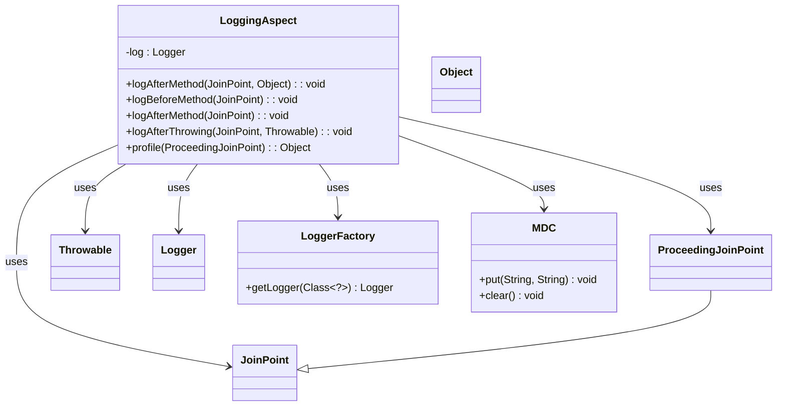

### Functional Requirements for `LoggingAspect` Class
#### Overview

The `LoggingAspect` class is an Aspect-Oriented Programming (AOP) aspect that provides logging functionality for methods within the `com.ibm` package. It is annotated with `@Aspect` and `@Component` to enable aspect functionality in a Spring-based application.

#### Key Features

*   Logs method entry and exit.
*   Logs method return values.
*   Logs exceptions thrown by methods.
*   Profiles method execution time.

#### Functional Requirements

1.  **Method Entry Logging**:
    *   Logs the entry into a method with the method name and the class name of the target object at the INFO level.
    *   Triggered by the `@Before` advice.

2.  **Method Exit Logging**:
    *   Logs the exit from a method with the method name and the class name of the target object at the INFO level.
    *   Triggered by the `@After` advice.

3.  **Return Value Logging**:
    *   Logs the return value of a method if it is not null.
    *   Logs the class of the return value at the INFO level.
    *   Logs the return value itself at the DEBUG level.
    *   Triggered by the `@AfterReturning` advice.

4.  **Exception Logging**:
    *   Logs when a method throws an exception at the ERROR level.
    *   Logs the method name where the exception was thrown.
    *   Logs the cause of the exception.
    *   Triggered by the `@AfterThrowing` advice.

5.  **Method Execution Time Profiling**:
    *   Profiles the execution time of methods.
    *   Logs the execution time of a method in milliseconds at the INFO level.
    *   Stores the API name and execution time in the Mapped Diagnostic Context (MDC) for logging purposes.
    *   Triggered by the `@Around` advice.

6.  **Logging Exclusions**:
    *   Excludes classes within the `com.ibm.correlation` package from logging.

7.  **MDC Management**:
    *   Clears the MDC after method execution to prevent data leakage.

#### Example Usage

The `LoggingAspect` class is used implicitly by Spring AOP when methods within the `com.ibm` package are executed.

```java
// Example service class within the com.ibm package
@Service
public class ExampleService {
    public Object exampleMethod() {
        // Method implementation
        return new Object();
    }
}
```

In this case, the `LoggingAspect` will log the entry into and exit from `exampleMethod()`, log any return value or exception, and profile the execution time of `exampleMethod()`. 

### Notes

*   Relies on the SLF4J logging facade for logging.
*   Uses the `@Aspect` annotation to define the aspect.
*   Uses various advice annotations (`@Before`, `@After`, `@AfterReturning`, `@AfterThrowing`, `@Around`) to define the logging behavior.
*   Excludes classes within the `com.ibm.correlation` package from logging.


## Core Business Entities
### List of Entities
* LoggingAspect
* JoinPoint
* ProceedingJoinPoint
* Logger
* MDC

### Entity Descriptions and Relationships
#### LoggingAspect
The `LoggingAspect` represents a business entity that defines an aspect for logging execution of service and repository components.

The key attributes and methods of the `LoggingAspect` include:
- Methods to log method entry, exit, exceptions, and execution time.
- Methods annotated with `@Before`, `@After`, `@AfterReturning`, `@AfterThrowing`, and `@Around` to provide logging at different stages of method execution.

The `LoggingAspect` entity is related to:
- `JoinPoint`: used to provide the context of the method call.
- `ProceedingJoinPoint`: used to continue the execution of the method.
- `Logger`: used to log information, errors, and debug messages.
- `MDC`: used to put and clear diagnostic context.

#### JoinPoint
The `JoinPoint` represents a business entity that provides the context of a method call.

The key attributes and methods of the `JoinPoint` include:
- Methods to retrieve the signature of the method and the target object.

The `JoinPoint` entity is related to:
- `LoggingAspect`: used within the aspect to log method entry, exit, and exceptions.

#### ProceedingJoinPoint
The `ProceedingJoinPoint` represents a business entity that allows the continuation of method execution.

The key attributes and methods of the `ProceedingJoinPoint` include:
- Method to proceed with the execution of the method.

The `ProceedingJoinPoint` entity is related to:
- `LoggingAspect`: used within the aspect to profile method execution time.

#### Logger
The `Logger` represents a business entity that provides logging functionality.

The key attributes and methods of the `Logger` include:
- Methods to log information, errors, and debug messages.

The `Logger` entity is related to:
- `LoggingAspect`: used within the aspect to log method entry, exit, exceptions, and execution time.

#### MDC
The `MDC` represents a business entity that provides a diagnostic context for logging.

The key attributes and methods of the `MDC` include:
- Methods to put and clear diagnostic context.

The `MDC` entity is related to:
- `LoggingAspect`: used within the aspect to put API and execution time, and clear the context.


## Business Logic Documentation

### Input & Output Data Structures

* Input: 
  - `JoinPoint` object providing the context of the method call
  - `ProceedingJoinPoint` object to continue the execution of the method
  - `Throwable` object representing the thrown exception
  - Return value of the method (`retVal`)
* Output: 
  - Log messages containing information about method entry, exit, exceptions, and execution time
  - Diagnostic context (API and execution time) stored in `MDC`

### Logical Flow

1. The `LoggingAspect` class is an aspect that provides logging for method execution within the `com.ibm` package, excluding the `com.ibm.correlation` package.
2. The aspect contains multiple advice methods (`@Before`, `@After`, `@AfterReturning`, `@AfterThrowing`, and `@Around`) to log different stages of method execution.
3. The `logBeforeMethod` method logs before a method executes, including the method name and target class name.
4. The `logAfterMethod` methods log after a method executes, with one method logging the return value (`logAfterMethod` with `retVal`) and its class if it's not `null`, and another logging the method exit.
5. The `logAfterThrowing` method logs when a method throws an exception, including the method name and the cause of the exception.
6. The `profile` method profiles the execution time of a method using `@Around` advice, logging the execution time and storing it in `MDC` along with the API name.
7. The `MDC` is used to store diagnostic context (API and execution time) during method execution and is cleared after the method execution is complete.

### Data Validation

The following data validation logic is present:
- The `retVal` is checked for `null` before logging its class and value.

### Business Rules

The business logic is centered around logging method execution, ensuring that:
- Method entry, exit, exceptions, and execution time are logged.
- Diagnostic context (API and execution time) is stored in `MDC`.

### Error Handling Approach

The `LoggingAspect` class handles exceptions by:
- Logging error messages when a method throws an exception using `@AfterThrowing` advice, including the method name and the cause of the exception.

### Use of LE(Logic Extraction) Services

The `LoggingAspect` class uses the following LE services:
- Aspect-Oriented Programming (AOP) to provide logging at different stages of method execution.

### External Program Dependencies

The `LoggingAspect` class depends on the following external programs/libraries:
- AspectJ for AOP functionality
- SLF4J logging API for logging functionality
- Spring framework for dependency injection and aspect management





