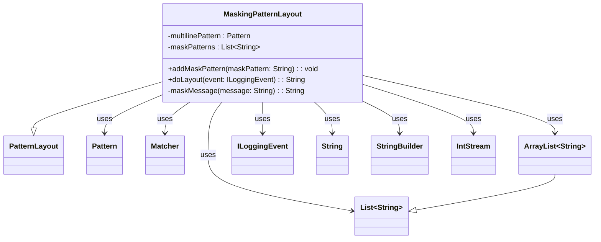

### Functional Requirements for `MaskingPatternLayout` Class
#### Overview

The `MaskingPatternLayout` class is a custom log layout that extends the `PatternLayout` class from Logback. It is designed to mask sensitive information in log messages based on predefined patterns.

#### Key Features

*   Allows configuration of multiple mask patterns.
*   Masks sensitive information in log messages using the configured patterns.
*   Supports multiline log messages.

#### Functional Requirements

1.  **Mask Pattern Configuration**:
    *   Allows adding multiple mask patterns using the `addMaskPattern` method.
    *   Stores the added mask patterns in a list.

2.  **Mask Pattern Compilation**:
    *   Compiles the added mask patterns into a single regular expression pattern with the `Pattern.MULTILINE` flag.
    *   Updates the compiled pattern whenever a new mask pattern is added.

3.  **Log Message Masking**:
    *   Masks sensitive information in log messages by replacing matched patterns with asterisks (\*).
    *   Uses the compiled mask pattern to match sensitive information in log messages.
    *   Handles cases where the log message does not match any mask pattern by returning the original log message.

4.  **Log Layout**:
    *   Extends the `PatternLayout` class to inherit its log formatting capabilities.
    *   Overrides the `doLayout` method to mask log messages before returning the formatted log string.

5.  **Multiline Log Support**:
    *   Handles multiline log messages by using the `Pattern.MULTILINE` flag when compiling the mask pattern.

#### Example Usage

To use the `MaskingPatternLayout` class, you would typically configure it in a Logback configuration file (e.g., `logback.xml`) as follows:

```xml
<configuration>
    <appender name="STDOUT" class="ch.qos.logback.core.ConsoleAppender">
        <layout class="com.ibm.logging.MaskingPatternLayout">
            <maskPattern>password=.*</maskPattern>
            <maskPattern>secret=.*</maskPattern>
            <pattern>%d{yyyy-MM-dd HH:mm:ss} [%thread] %-5level %logger{36} - %msg%n</pattern>
        </layout>
    </appender>
    <root level="INFO">
        <appender-ref ref="STDOUT" />
    </root>
</configuration>
```

In this example, the `MaskingPatternLayout` is used to mask log messages that contain "password=" or "secret=" followed by any characters.

### Notes

*   Relies on the Logback logging framework for logging.
*   Uses Java regular expressions to match and mask sensitive information in log messages.
*   Supports configuration of multiple mask patterns to handle different types of sensitive information.


## Core Business Entities
### List of Entities
* MaskingPatternLayout
* PatternLayout
* ILoggingEvent
* Pattern
* Matcher
* List<String>

### Entity Descriptions and Relationships
#### MaskingPatternLayout
The `MaskingPatternLayout` represents a business entity that extends the functionality of a logging layout to mask sensitive information in log messages.

The key attributes and methods of the `MaskingPatternLayout` include:
- `multilinePattern`: a compiled pattern to match sensitive information.
- `maskPatterns`: a list of patterns to be masked in log messages.
- `addMaskPattern(String maskPattern)`: a method to add a pattern to be masked.
- `doLayout(ILoggingEvent event)`: a method to layout the logging event and mask sensitive information.
- `maskMessage(String message)`: a method to mask sensitive information in a given message.

The `MaskingPatternLayout` entity is related to:
- `PatternLayout`: it extends the `PatternLayout` to inherit its functionality.
- `ILoggingEvent`: used as an input to the `doLayout` method to layout the logging event.
- `Pattern`: used to compile the mask patterns into a regular expression.
- `Matcher`: used to find matches of the compiled pattern in the log message.
- `List<String>`: used to store the mask patterns.

#### PatternLayout
The `PatternLayout` represents a business entity that provides a basic layout functionality for logging events.

The key attributes and methods of the `PatternLayout` are not explicitly shown in the provided code, but it is assumed to have methods to layout logging events.

The `PatternLayout` entity is related to:
- `MaskingPatternLayout`: it is extended by `MaskingPatternLayout` to add masking functionality.

#### ILoggingEvent
The `ILoggingEvent` represents a business entity that provides information about a logging event.

The key attributes and methods of the `ILoggingEvent` are not explicitly shown in the provided code, but it is assumed to have methods to provide information about the logging event.

The `ILoggingEvent` entity is related to:
- `MaskingPatternLayout`: used as an input to the `doLayout` method to layout the logging event.

#### Pattern
The `Pattern` represents a business entity that provides a compiled regular expression.

The key attributes and methods of the `Pattern` include:
- Methods to compile a regular expression and match it against a string.

The `Pattern` entity is related to:
- `MaskingPatternLayout`: used to compile the mask patterns into a regular expression.

#### Matcher
The `Matcher` represents a business entity that provides a way to match a compiled regular expression against a string.

The key attributes and methods of the `Matcher` include:
- Methods to find matches of the compiled pattern in a string.

The `Matcher` entity is related to:
- `MaskingPatternLayout`: used to find matches of the compiled pattern in the log message.

#### List<String>
The `List<String>` represents a business entity that stores a collection of strings.

The key attributes and methods of the `List<String>` include:
- Methods to add and store elements.

The `List<String>` entity is related to:
- `MaskingPatternLayout`: used to store the mask patterns.


## Business Logic Documentation

### Input & Output Data Structures

* Input: 
  - `ILoggingEvent` object representing the logging event
  - `String` representing the mask pattern to be added
* Output: 
  - `String` representing the formatted log message with sensitive information masked

### Logical Flow

1. The `MaskingPatternLayout` class extends the `PatternLayout` to add masking functionality to log messages.
2. The `addMaskPattern` method is used to add a pattern to be masked in log messages. The added patterns are stored in the `maskPatterns` list.
3. When a new mask pattern is added, the `multilinePattern` is recompiled using the updated list of mask patterns joined with a logical OR operator (`|`).
4. The `doLayout` method is overridden to layout the logging event and mask sensitive information in the log message by calling the `maskMessage` method.
5. The `maskMessage` method is used to mask sensitive information in the log message based on the compiled `multilinePattern`.
6. If `multilinePattern` is `null`, the original log message is returned without masking.
7. The `maskMessage` method iterates through the matches of the `multilinePattern` in the log message and replaces the matched sensitive information with asterisks (\*). It checks for capturing groups in the pattern and masks the corresponding matched text.

### Data Validation

The following data validation logic is present:
- The `multilinePattern` is checked for `null` before attempting to mask the log message.

### Business Rules

The business logic is centered around masking sensitive information in log messages, ensuring that:
- Log messages are formatted according to the layout defined in the `PatternLayout`.
- Sensitive information in log messages is masked based on the patterns added using the `addMaskPattern` method.

### Error Handling Approach

The `MaskingPatternLayout` class does not explicitly handle errors. However, it is assumed that any exceptions that occur during the execution of the `doLayout` or `maskMessage` methods will be handled by the logging framework.

### Use of LE(Logic Extraction) Services

The `MaskingPatternLayout` class uses the following LE services:
- Regular expression compilation and matching using `Pattern` and `Matcher` classes.

### External Program Dependencies

The `MaskingPatternLayout` class depends on the following external programs/libraries:
- Logback logging framework (`ch.qos.logback.classic.PatternLayout` and `ch.qos.logback.classic.spi.ILoggingEvent`)
- Java Standard Library (`java.util.ArrayList`, `java.util.List`, `java.util.regex.Pattern`, `java.util.regex.Matcher`, `java.util.stream.Collectors`, and `java.util.stream.IntStream`)





