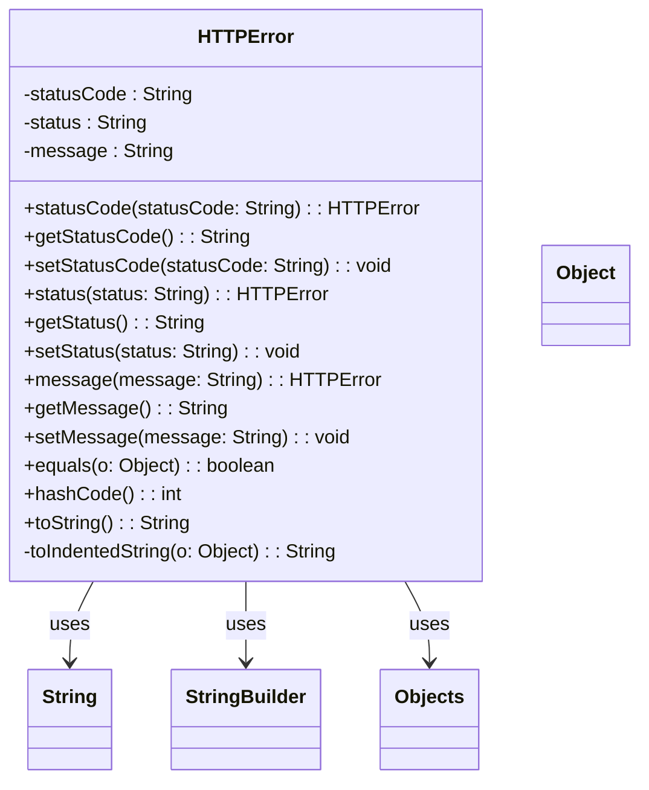

### Functional Requirements for `HTTPError` Class
#### Overview

The `HTTPError` class is a Java representation of an HTTP error response. It encapsulates the status code, status, and message associated with an HTTP error.

#### Key Features

*   Represents an HTTP error with attributes: status code, status, and message.
*   Provides getter and setter methods for its attributes.
*   Supports serialization and deserialization using Jackson's `@JsonProperty` annotations.
*   Includes validation and documentation using Swagger/OpenAPI annotations.

#### Functional Requirements

1.  **Attribute Representation**:
    *   Represents three attributes: `statusCode`, `status`, and `message`, all of type `String`.
    *   These attributes are used to convey information about an HTTP error.

2.  **Getter and Setter Methods**:
    *   Provides getter methods (`getStatusCode`, `getStatus`, `getMessage`) to access the attribute values.
    *   Provides setter methods (`setStatusCode`, `setStatus`, `setMessage`) to modify the attribute values.
    *   Includes fluent setter methods (`statusCode`, `status`, `message`) that return the `HTTPError` instance for method chaining.

3.  **Serialization and Deserialization**:
    *   Uses Jackson's `@JsonProperty` annotations to specify the JSON property names for serialization and deserialization.
    *   The attribute names in JSON are `status_code`, `status`, and `message`.

4.  **Validation and Documentation**:
    *   Utilizes Swagger/OpenAPI `@Schema` annotations to document the class and its attributes.
    *   Specifies the required mode for each attribute using `@Schema(requiredMode = Schema.RequiredMode.NOT_REQUIRED)`, indicating that all attributes are optional.

5.  **Equality and Hash Code**:
    *   Overrides the `equals` method to compare `HTTPError` instances based on their attribute values.
    *   Overrides the `hashCode` method to generate a hash code based on the attribute values.

6.  **String Representation**:
    *   Overrides the `toString` method to provide a string representation of the `HTTPError` instance.
    *   Uses a `StringBuilder` to construct the string representation, including indented attribute values using the `toIndentedString` method.

#### Example Usage

```java
HTTPError error = new HTTPError();
error.statusCode("404");
error.status("Not Found");
error.message("Resource not found");

System.out.println(error.toString());
```

This example creates an `HTTPError` instance, sets its attributes, and prints the string representation.

### Notes

*   The `HTTPError` class is generated using OpenAPI code generation tools, as indicated by the `@Generated` annotation.
*   It is designed to work with Spring-based applications and Swagger/OpenAPI documentation.
*   The class is part of a larger API or web application framework, likely used for handling and representing HTTP error responses.


## Core Business Entities
### List of Entities
* HTTPError

### Entity Descriptions and Relationships
#### HTTPError
The `HTTPError` represents a business entity that encapsulates the attributes related to an HTTP error.

The key attributes of the `HTTPError` include:
- `statusCode`: a string representing the HTTP status code, annotated as `status_code` in JSON representation.
- `status`: a string representing the status of the HTTP error.
- `message`: a string representing the error message.

The `HTTPError` entity has methods to:
- Set and get the `statusCode`, `status`, and `message` attributes.
- Compare two `HTTPError` objects for equality based on their attributes.
- Generate a hash code for the `HTTPError` object.
- Convert the `HTTPError` object to a string representation.

There are no explicit relationships between `HTTPError` and other entities, as it is a standalone class.


## Business Logic Documentation

### Input & Output Data Structures

* Input: 
  - `HTTPError` object representing the HTTP error
* Output: 
  - `String` representation of the `HTTPError` object
  - Comparison result (boolean) when checking equality between two `HTTPError` objects
  - Hash code (integer) for the `HTTPError` object

### Logical Flow

1. The `HTTPError` class represents an HTTP error with attributes `statusCode`, `status`, and `message`.
2. The class provides methods to set and get these attributes.
3. The `equals` method is used to compare two `HTTPError` objects for equality based on their attributes (`statusCode`, `status`, and `message`).
4. The `hashCode` method generates a hash code for the `HTTPError` object based on its attributes.
5. The `toString` method converts the `HTTPError` object to a string representation, including its attributes.

### Data Validation

The following data validation logic is present:
- The attributes (`statusCode`, `status`, and `message`) are not explicitly validated in the provided Java code, but are annotated with `@Schema` and `@JsonProperty` for documentation and serialization purposes.

### Business Rules

The business logic is centered around representing an HTTP error and providing methods to:
- Set and get the attributes (`statusCode`, `status`, and `message`) of the `HTTPError` object.
- Compare two `HTTPError` objects for equality.
- Generate a hash code for the `HTTPError` object.
- Convert the `HTTPError` object to a string representation.

### Error Handling Approach

The `HTTPError` class does not explicitly handle errors. However, it is assumed that any exceptions that occur during the execution of the methods will be handled by the calling code.

### Use of LE(Logic Extraction) Services

The `HTTPError` class uses the following LE services:
- `Objects.equals` and `Objects.hash` methods from the Java Standard Library for equality comparison and hash code generation.

### External Program Dependencies

The `HTTPError` class depends on the following external programs/libraries:
- Jackson library (`com.fasterxml.jackson.annotation.JsonProperty`) for JSON serialization/deserialization.
- Jakarta Validation API (`jakarta.validation.constraints`) is imported but not used in this class.
- Swagger/OpenAPI (`io.swagger.v3.oas.annotations.media.Schema`) for API documentation.
- Java Standard Library (`java.util.Objects`) for utility methods.





