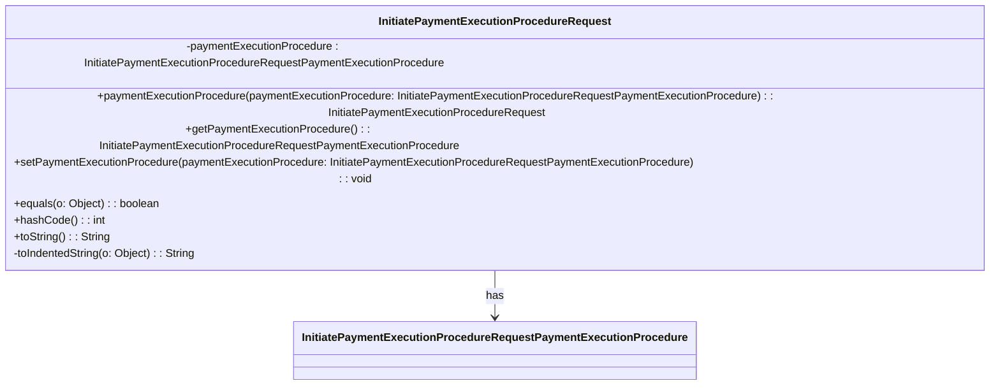

### Functional Requirements for `InitiatePaymentExecutionProcedureRequest` Class
#### Overview

The `InitiatePaymentExecutionProcedureRequest` class is a Java representation of a request to initiate a payment execution procedure. It encapsulates the payment execution procedure details.

#### Key Features

*   Represents a request to initiate a payment execution procedure with an attribute: `paymentExecutionProcedure`.
*   Provides getter and setter methods for its attribute.
*   Supports serialization and deserialization using Jackson's `@JsonProperty` annotations.
*   Includes validation and documentation using Swagger/OpenAPI annotations.

#### Functional Requirements

1.  **Attribute Representation**:
    *   Represents one attribute: `paymentExecutionProcedure`, of type `InitiatePaymentExecutionProcedureRequestPaymentExecutionProcedure`.
    *   This attribute is used to convey information about the payment execution procedure.

2.  **Getter and Setter Methods**:
    *   Provides a getter method (`getPaymentExecutionProcedure`) to access the attribute value.
    *   Provides a setter method (`setPaymentExecutionProcedure`) to modify the attribute value.
    *   Includes a fluent setter method (`paymentExecutionProcedure`) that returns the `InitiatePaymentExecutionProcedureRequest` instance for method chaining.

3.  **Serialization and Deserialization**:
    *   Uses Jackson's `@JsonProperty` annotations to specify the JSON property name for serialization and deserialization.
    *   The attribute name in JSON is `PaymentExecutionProcedure`.

4.  **Validation and Documentation**:
    *   Utilizes Swagger/OpenAPI `@Schema` annotations to document the class and its attribute.
    *   Specifies the required mode for the attribute using `@Schema(requiredMode = Schema.RequiredMode.NOT_REQUIRED)`, indicating that the attribute is optional.
    *   Uses `@Valid` annotation to enable validation for the `paymentExecutionProcedure` attribute.

5.  **Equality and Hash Code**:
    *   Overrides the `equals` method to compare `InitiatePaymentExecutionProcedureRequest` instances based on their attribute values.
    *   Overrides the `hashCode` method to generate a hash code based on the attribute value.

6.  **String Representation**:
    *   Overrides the `toString` method to provide a string representation of the `InitiatePaymentExecutionProcedureRequest` instance.
    *   Uses a `StringBuilder` to construct the string representation, including indented attribute values using the `toIndentedString` method.

#### Example Usage

```java
InitiatePaymentExecutionProcedureRequest request = new InitiatePaymentExecutionProcedureRequest();
InitiatePaymentExecutionProcedureRequestPaymentExecutionProcedure procedure = new InitiatePaymentExecutionProcedureRequestPaymentExecutionProcedure();
// Initialize procedure details
request.paymentExecutionProcedure(procedure);

System.out.println(request.toString());
```

### Notes

*   The `InitiatePaymentExecutionProcedureRequest` class is generated using OpenAPI code generation tools, as indicated by the `@Generated` annotation.
*   It is designed to work with Spring-based applications and Swagger/OpenAPI documentation.
*   The class is part of a larger API or web application framework, likely used for handling payment execution procedure requests.


## Core Business Entities
### List of Entities
* Initiate Payment Execution Procedure Request
* Payment Execution Procedure

### Entity Descriptions and Relationships
#### Initiate Payment Execution Procedure Request
The `Initiate Payment Execution Procedure Request` represents a business entity that encapsulates the input required to initiate a payment execution procedure.

The key attributes of the `Initiate Payment Execution Procedure Request` include:
- `paymentExecutionProcedure`: an object of type `Payment Execution Procedure` representing the payment execution procedure.

The `Initiate Payment Execution Procedure Request` entity has methods to:
- Set and get the `paymentExecutionProcedure` attribute.
- Compare two `Initiate Payment Execution Procedure Request` objects for equality based on their attributes.
- Generate a hash code for the `Initiate Payment Execution Procedure Request` object.
- Convert the `Initiate Payment Execution Procedure Request` object to a string representation.

The `Initiate Payment Execution Procedure Request` entity has a relationship with the `Payment Execution Procedure` entity, as it contains an object of this type.

#### Payment Execution Procedure
The `Payment Execution Procedure` is represented by the class `InitiatePaymentExecutionProcedureRequestPaymentExecutionProcedure`. 
The `Payment Execution Procedure` entity is related to the `Initiate Payment Execution Procedure Request` entity, as it is contained within it. 
Further details about its attributes and methods can be determined by examining the `InitiatePaymentExecutionProcedureRequestPaymentExecutionProcedure` class.


## Business Logic Documentation

### Input & Output Data Structures

* Input: 
  - `InitiatePaymentExecutionProcedureRequest` object representing the input to initiate a payment execution procedure.
  - The `InitiatePaymentExecutionProcedureRequest` object contains a `paymentExecutionProcedure` attribute of type `InitiatePaymentExecutionProcedureRequestPaymentExecutionProcedure`.
* Output: 
  - `String` representation of the `InitiatePaymentExecutionProcedureRequest` object.
  - Comparison result (boolean) when checking equality between two `InitiatePaymentExecutionProcedureRequest` objects.
  - Hash code (integer) for the `InitiatePaymentExecutionProcedureRequest` object.

### Logical Flow

1. The `InitiatePaymentExecutionProcedureRequest` class represents the input required to initiate a payment execution procedure.
2. The class provides methods to set and get the `paymentExecutionProcedure` attribute.
3. The `equals` method is used to compare two `InitiatePaymentExecutionProcedureRequest` objects for equality based on their `paymentExecutionProcedure` attribute.
4. The `hashCode` method generates a hash code for the `InitiatePaymentExecutionProcedureRequest` object based on its `paymentExecutionProcedure` attribute.
5. The `toString` method converts the `InitiatePaymentExecutionProcedureRequest` object to a string representation, including its `paymentExecutionProcedure` attribute.

### Data Validation

The following data validation logic is present:
- The `paymentExecutionProcedure` attribute is annotated with `@Valid`, indicating that it should be validated according to the constraints defined in the `InitiatePaymentExecutionProcedureRequestPaymentExecutionProcedure` class.

### Business Rules

The business logic is centered around representing the input required to initiate a payment execution procedure and providing methods to:
- Set and get the `paymentExecutionProcedure` attribute of the `InitiatePaymentExecutionProcedureRequest` object.
- Compare two `InitiatePaymentExecutionProcedureRequest` objects for equality.
- Generate a hash code for the `InitiatePaymentExecutionProcedureRequest` object.
- Convert the `InitiatePaymentExecutionProcedureRequest` object to a string representation.

### Error Handling Approach

The `InitiatePaymentExecutionProcedureRequest` class does not explicitly handle errors. However, it is assumed that any exceptions that occur during the execution of the methods will be handled by the calling code.

### Use of LE(Logic Extraction) Services

The `InitiatePaymentExecutionProcedureRequest` class uses the following LE services:
- `Objects.equals` and `Objects.hash` methods from the Java Standard Library for equality comparison and hash code generation.

### External Program Dependencies

The `InitiatePaymentExecutionProcedureRequest` class depends on the following external programs/libraries:
- Jackson library (`com.fasterxml.jackson.annotation.JsonProperty`) for JSON serialization/deserialization.
- Jakarta Validation API (`jakarta.validation.Valid`, `jakarta.validation.constraints`) for validation.
- Swagger/OpenAPI (`io.swagger.v3.oas.annotations.media.Schema`) for API documentation.
- Java Standard Library (`java.util.Objects`) for utility methods.





