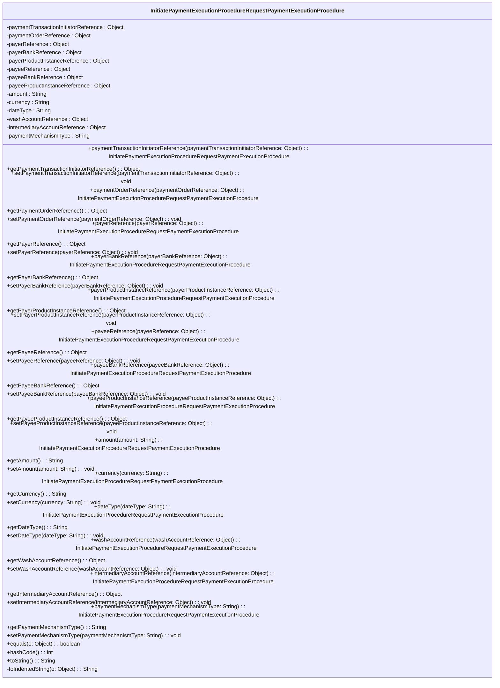

### Functional Requirements for `InitiatePaymentExecutionProcedureRequestPaymentExecutionProcedure` Class
#### Overview

The `InitiatePaymentExecutionProcedureRequestPaymentExecutionProcedure` class is a Java representation of the payment execution procedure details. It encapsulates various attributes related to a payment transaction.

#### Key Features

*   Represents payment execution procedure details with multiple attributes.
*   Provides getter and setter methods for its attributes.
*   Supports serialization and deserialization using Jackson's `@JsonProperty` annotations.
*   Includes validation and documentation using Swagger/OpenAPI annotations.

#### Functional Requirements

1.  **Attribute Representation**:
    *   Represents 14 attributes:
        *   `paymentTransactionInitiatorReference` of type `Object`
        *   `paymentOrderReference` of type `Object`
        *   `payerReference` of type `Object`
        *   `payerBankReference` of type `Object`
        *   `payerProductInstanceReference` of type `Object`
        *   `payeeReference` of type `Object`
        *   `payeeBankReference` of type `Object`
        *   `payeeProductInstanceReference` of type `Object`
        *   `amount` of type `String`
        *   `currency` of type `String`
        *   `dateType` of type `String`
        *   `washAccountReference` of type `Object`
        *   `intermediaryAccountReference` of type `Object`
        *   `paymentMechanismType` of type `String`
    *   These attributes are used to convey detailed information about the payment execution procedure.

2.  **Getter and Setter Methods**:
    *   Provides getter methods to access the attribute values.
    *   Provides setter methods to modify the attribute values.
    *   Includes fluent setter methods that return the `InitiatePaymentExecutionProcedureRequestPaymentExecutionProcedure` instance for method chaining.

3.  **Serialization and Deserialization**:
    *   Uses Jackson's `@JsonProperty` annotations to specify the JSON property names for serialization and deserialization.

4.  **Validation and Documentation**:
    *   Utilizes Swagger/OpenAPI `@Schema` annotations to document the class and its attributes.
    *   Specifies the required mode for the attributes using `@Schema(requiredMode = Schema.RequiredMode.NOT_REQUIRED)`, indicating that all attributes are optional.

5.  **Equality and Hash Code**:
    *   Overrides the `equals` method to compare `InitiatePaymentExecutionProcedureRequestPaymentExecutionProcedure` instances based on their attribute values.
    *   Overrides the `hashCode` method to generate a hash code based on the attribute values.

6.  **String Representation**:
    *   Overrides the `toString` method to provide a string representation of the `InitiatePaymentExecutionProcedureRequestPaymentExecutionProcedure` instance.
    *   Uses a `StringBuilder` to construct the string representation, including indented attribute values using the `toIndentedString` method.

#### Example Usage

```java
InitiatePaymentExecutionProcedureRequestPaymentExecutionProcedure procedure = new InitiatePaymentExecutionProcedureRequestPaymentExecutionProcedure();
procedure.paymentTransactionInitiatorReference("initiator-ref")
         .paymentOrderReference("order-ref")
         .amount("100.00")
         .currency("USD");

System.out.println(procedure.toString());
```

### Notes

*   The `InitiatePaymentExecutionProcedureRequestPaymentExecutionProcedure` class is generated using OpenAPI code generation tools, as indicated by the `@Generated` annotation.
*   It is designed to work with Spring-based applications and Swagger/OpenAPI documentation.
*   The class is part of a larger API or web application framework, likely used for handling payment execution procedure requests.


## Core Business Entities
### List of Entities
* Payment Execution Procedure

### Entity Descriptions and Relationships
#### Payment Execution Procedure
The `Payment Execution Procedure` represents a business entity that encapsulates the details required for executing a payment.

The key attributes of the `Payment Execution Procedure` include:
- `paymentTransactionInitiatorReference`: an object representing the reference of the payment transaction initiator.
- `paymentOrderReference`: an object representing the reference of the payment order.
- `payerReference`: an object representing the reference of the payer.
- `payerBankReference`: an object representing the reference of the payer's bank.
- `payerProductInstanceReference`: an object representing the reference of the payer's product instance.
- `payeeReference`: an object representing the reference of the payee.
- `payeeBankReference`: an object representing the reference of the payee's bank.
- `payeeProductInstanceReference`: an object representing the reference of the payee's product instance.
- `amount`: a string representing the amount of the payment.
- `currency`: a string representing the currency of the payment.
- `dateType`: a string representing the type of date.
- `washAccountReference`: an object representing the reference of the wash account.
- `intermediaryAccountReference`: an object representing the reference of the intermediary account.
- `paymentMechanismType`: a string representing the type of payment mechanism.

The `Payment Execution Procedure` entity has methods to:
- Set and get the attributes listed above.
- Compare two `Payment Execution Procedure` objects for equality based on their attributes.
- Generate a hash code for the `Payment Execution Procedure` object.
- Convert the `Payment Execution Procedure` object to a string representation.

Since there is only one Java class provided, there are no relationships between different business entities to describe. The `Payment Execution Procedure` is a standalone entity based on the provided Java code.


## Business Logic Documentation

### Input & Output Data Structures

* Input: 
  - `InitiatePaymentExecutionProcedureRequestPaymentExecutionProcedure` object representing the payment execution procedure.
  - The object contains various attributes such as `paymentTransactionInitiatorReference`, `paymentOrderReference`, `payerReference`, `payerBankReference`, `payerProductInstanceReference`, `payeeReference`, `payeeBankReference`, `payeeProductInstanceReference`, `amount`, `currency`, `dateType`, `washAccountReference`, `intermediaryAccountReference`, and `paymentMechanismType`.
* Output: 
  - `String` representation of the `InitiatePaymentExecutionProcedureRequestPaymentExecutionProcedure` object.
  - Comparison result (boolean) when checking equality between two `InitiatePaymentExecutionProcedureRequestPaymentExecutionProcedure` objects.
  - Hash code (integer) for the `InitiatePaymentExecutionProcedureRequestPaymentExecutionProcedure` object.

### Logical Flow

1. The `InitiatePaymentExecutionProcedureRequestPaymentExecutionProcedure` class represents the payment execution procedure.
2. The class provides methods to set and get various attributes related to the payment execution procedure.
3. The `equals` method is used to compare two `InitiatePaymentExecutionProcedureRequestPaymentExecutionProcedure` objects for equality based on their attributes.
4. The `hashCode` method generates a hash code for the `InitiatePaymentExecutionProcedureRequestPaymentExecutionProcedure` object based on its attributes.
5. The `toString` method converts the `InitiatePaymentExecutionProcedureRequestPaymentExecutionProcedure` object to a string representation, including its attributes.

### Data Validation

The following data validation logic is present:
- The attributes are annotated with `@Schema` and `@JsonProperty`, indicating their usage in JSON serialization/deserialization and API documentation.
- The class uses Jakarta validation constraints (`jakarta.validation.constraints`) although no explicit constraints are visible in the provided code snippet.

### Business Rules

The business logic is centered around representing the payment execution procedure and providing methods to:
- Set and get various attributes related to the payment execution procedure.
- Compare two `InitiatePaymentExecutionProcedureRequestPaymentExecutionProcedure` objects for equality.
- Generate a hash code for the `InitiatePaymentExecutionProcedureRequestPaymentExecutionProcedure` object.
- Convert the `InitiatePaymentExecutionProcedureRequestPaymentExecutionProcedure` object to a string representation.

### Error Handling Approach

The `InitiatePaymentExecutionProcedureRequestPaymentExecutionProcedure` class does not explicitly handle errors. However, it is assumed that any exceptions that occur during the execution of the methods will be handled by the calling code.

### Use of LE(Logic Extraction) Services

The `InitiatePaymentExecutionProcedureRequestPaymentExecutionProcedure` class uses the following LE services:
- `Objects.equals` and `Objects.hash` methods from the Java Standard Library for equality comparison and hash code generation.

### External Program Dependencies

The `InitiatePaymentExecutionProcedureRequestPaymentExecutionProcedure` class depends on the following external programs/libraries:
- Jackson library (`com.fasterxml.jackson.annotation.JsonProperty`) for JSON serialization/deserialization.
- Swagger/OpenAPI (`io.swagger.v3.oas.annotations.media.Schema`) for API documentation.
- Java Standard Library (`java.util.Objects`) for utility methods.
- Jakarta validation (`jakarta.validation.constraints`) for validation constraints.





