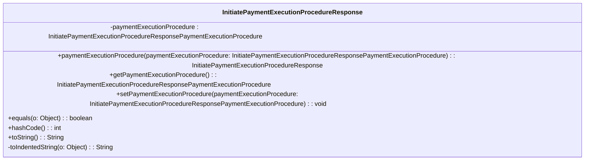

### Functional Requirements for `InitiatePaymentExecutionProcedureResponse` Class
#### Overview

The `InitiatePaymentExecutionProcedureResponse` class represents the response for initiating a payment execution procedure. It encapsulates a single attribute related to the payment execution procedure.

#### Key Features

*   Represents the response for initiating a payment execution procedure with a single attribute.
*   Provides getter and setter methods for its attribute.
*   Supports serialization and deserialization using Jackson's `@JsonProperty` annotations.
*   Includes validation and documentation using Swagger/OpenAPI annotations.

#### Functional Requirements

1.  **Attribute Representation**:
    *   Represents 1 attribute:
        *   `paymentExecutionProcedure` of type `InitiatePaymentExecutionProcedureResponsePaymentExecutionProcedure`
    *   This attribute conveys detailed information about the payment execution procedure.

2.  **Getter and Setter Methods**:
    *   Provides a getter method `getPaymentExecutionProcedure` to access the `paymentExecutionProcedure` attribute value.
    *   Provides a setter method `setPaymentExecutionProcedure` to modify the `paymentExecutionProcedure` attribute value.
    *   Includes a fluent setter method `paymentExecutionProcedure` that returns the `InitiatePaymentExecutionProcedureResponse` instance for method chaining.

3.  **Serialization and Deserialization**:
    *   Uses Jackson's `@JsonProperty` annotation to specify the JSON property name `"PaymentExecutionProcedure"` for serialization and deserialization of the `paymentExecutionProcedure` attribute.

4.  **Validation and Documentation**:
    *   Utilizes Swagger/OpenAPI `@Schema` annotations to document the class and its attribute.
    *   Specifies the required mode for the `paymentExecutionProcedure` attribute using `@Schema(requiredMode = Schema.RequiredMode.NOT_REQUIRED)`, indicating that it is an optional attribute.
    *   Uses `@Valid` annotation to enable validation for the `paymentExecutionProcedure` attribute.

5.  **Equality and Hash Code**:
    *   Overrides the `equals` method to compare `InitiatePaymentExecutionProcedureResponse` instances based on their `paymentExecutionProcedure` attribute values.
    *   Overrides the `hashCode` method to generate a hash code based on the `paymentExecutionProcedure` attribute value.

6.  **String Representation**:
    *   Overrides the `toString` method to provide a string representation of the `InitiatePaymentExecutionProcedureResponse` instance.
    *   Uses a `StringBuilder` to construct the string representation, including an indented representation of the `paymentExecutionProcedure` attribute value using the `toIndentedString` method.

#### Example Usage

```java
InitiatePaymentExecutionProcedureResponse response = new InitiatePaymentExecutionProcedureResponse();
InitiatePaymentExecutionProcedureResponsePaymentExecutionProcedure procedure = new InitiatePaymentExecutionProcedureResponsePaymentExecutionProcedure();
// Initialize procedure details
response.paymentExecutionProcedure(procedure);

System.out.println(response.toString());
```

### Notes

*   The `InitiatePaymentExecutionProcedureResponse` class is generated using OpenAPI code generation tools, as indicated by the `@Generated` annotation.
*   It is designed to work with Spring-based applications and Swagger/OpenAPI documentation.
*   The class is part of a larger API or web application framework, likely used for handling payment execution procedure responses.


## Core Business Entities
### List of Entities
* Payment Execution Procedure Response
* Payment Execution Procedure

### Entity Descriptions and Relationships
#### Payment Execution Procedure Response
The `Payment Execution Procedure Response` represents a business entity that encapsulates the response for initiating a payment execution procedure.

The key attributes of the `Payment Execution Procedure Response` include:
- `paymentExecutionProcedure`: an object representing the payment execution procedure.

The `Payment Execution Procedure Response` entity has methods to:
- Set and get the `paymentExecutionProcedure` attribute.
- Compare two `Payment Execution Procedure Response` objects for equality based on their attributes.
- Generate a hash code for the `Payment Execution Procedure Response` object.
- Convert the `Payment Execution Procedure Response` object to a string representation.

The `Payment Execution Procedure Response` entity is related to the `Payment Execution Procedure` entity, as it contains an instance of `Payment Execution Procedure`.

#### Payment Execution Procedure
The `Payment Execution Procedure` is another business entity. The details of this entity are not provided in the given Java code for `InitiatePaymentExecutionProcedureResponse`. However, its relationship with `Payment Execution Procedure Response` is established through the `paymentExecutionProcedure` attribute in `Payment Execution Procedure Response`.


## Business Logic Documentation

### Input & Output Data Structures

* Input: 
  - An object to be compared with the `InitiatePaymentExecutionProcedureResponse` object for equality.
  - An object to be set as the `paymentExecutionProcedure` attribute.
* Output: 
  - `InitiatePaymentExecutionProcedureResponsePaymentExecutionProcedure` object representing the payment execution procedure.
  - `String` representation of the `InitiatePaymentExecutionProcedureResponse` object.
  - Comparison result (boolean) when checking equality between two `InitiatePaymentExecutionProcedureResponse` objects.
  - Hash code (integer) for the `InitiatePaymentExecutionProcedureResponse` object.

### Logical Flow

1. The `InitiatePaymentExecutionProcedureResponse` class represents the response for initiating a payment execution procedure.
2. The class provides methods to set and get the `paymentExecutionProcedure` attribute.
3. The `equals` method is used to compare two `InitiatePaymentExecutionProcedureResponse` objects for equality based on their `paymentExecutionProcedure` attribute.
4. The `hashCode` method generates a hash code for the `InitiatePaymentExecutionProcedureResponse` object based on its `paymentExecutionProcedure` attribute.
5. The `toString` method converts the `InitiatePaymentExecutionProcedureResponse` object to a string representation, including its `paymentExecutionProcedure` attribute.

### Data Validation

The following data validation logic is present:
- The `paymentExecutionProcedure` attribute is annotated with `@Valid`, indicating that it should be validated according to its own validation constraints.

### Business Rules

The business logic is centered around representing the response for initiating a payment execution procedure and providing methods to:
- Set and get the `paymentExecutionProcedure` attribute.
- Compare two `InitiatePaymentExecutionProcedureResponse` objects for equality.
- Generate a hash code for the `InitiatePaymentExecutionProcedureResponse` object.
- Convert the `InitiatePaymentExecutionProcedureResponse` object to a string representation.

### Error Handling Approach

The `InitiatePaymentExecutionProcedureResponse` class does not explicitly handle errors. However, it is assumed that any exceptions that occur during the execution of the methods will be handled by the calling code.

### Use of LE(Logic Extraction) Services

The `InitiatePaymentExecutionProcedureResponse` class uses the following LE services:
- `Objects.equals` and `Objects.hash` methods from the Java Standard Library for equality comparison and hash code generation.

### External Program Dependencies

The `InitiatePaymentExecutionProcedureResponse` class depends on the following external programs/libraries:
- Jackson library (`com.fasterxml.jackson.annotation.JsonProperty`) for JSON serialization/deserialization.
- Swagger/OpenAPI (`io.swagger.v3.oas.annotations.media.Schema`) for API documentation.
- Java Standard Library (`java.util.Objects`) for utility methods.
- Jakarta validation (`jakarta.validation.Valid`) for validation constraints.





