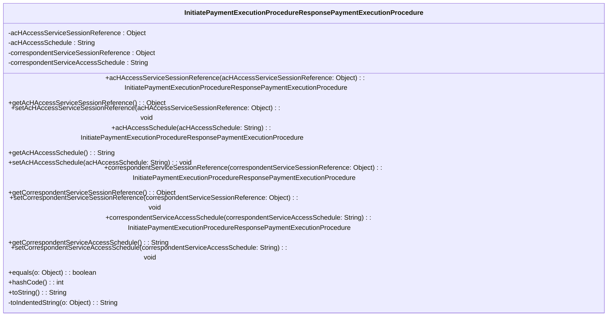

### Functional Requirements for `InitiatePaymentExecutionProcedureResponsePaymentExecutionProcedure` Class
#### Overview

The `InitiatePaymentExecutionProcedureResponsePaymentExecutionProcedure` class represents a payment execution procedure within the response for initiating a payment execution procedure. It encapsulates four attributes related to the payment execution procedure.

#### Key Features

*   Represents a payment execution procedure with four attributes.
*   Provides getter and setter methods for its attributes.
*   Supports serialization and deserialization using Jackson's `@JsonProperty` annotations.
*   Includes validation and documentation using Swagger/OpenAPI annotations.

#### Functional Requirements

1.  **Attribute Representation**:
    *   Represents 4 attributes:
        *   `acHAccessServiceSessionReference` of type `Object`
        *   `acHAccessSchedule` of type `String`
        *   `correspondentServiceSessionReference` of type `Object`
        *   `correspondentServiceAccessSchedule` of type `String`
    *   These attributes convey detailed information about the payment execution procedure, including access service session references and schedules.

2.  **Getter and Setter Methods**:
    *   Provides getter methods to access the attribute values:
        *   `getAcHAccessServiceSessionReference`
        *   `getAcHAccessSchedule`
        *   `getCorrespondentServiceSessionReference`
        *   `getCorrespondentServiceAccessSchedule`
    *   Provides setter methods to modify the attribute values:
        *   `setAcHAccessServiceSessionReference`
        *   `setAcHAccessSchedule`
        *   `setCorrespondentServiceSessionReference`
        *   `setCorrespondentServiceAccessSchedule`
    *   Includes fluent setter methods that return the `InitiatePaymentExecutionProcedureResponsePaymentExecutionProcedure` instance for method chaining:
        *   `acHAccessServiceSessionReference`
        *   `acHAccessSchedule`
        *   `correspondentServiceSessionReference`
        *   `correspondentServiceAccessSchedule`

3.  **Serialization and Deserialization**:
    *   Uses Jackson's `@JsonProperty` annotation to specify the JSON property names for serialization and deserialization of the attributes:
        *   `"ACHAccessServiceSessionReference"`
        *   `"ACHAccessSchedule"`
        *   `"CorrespondentServiceSessionReference"`
        *   `"CorrespondentServiceAccessSchedule"`

4.  **Validation and Documentation**:
    *   Utilizes Swagger/OpenAPI `@Schema` annotations to document the class and its attributes.
    *   Specifies the required mode for the attributes using `@Schema(requiredMode = Schema.RequiredMode.NOT_REQUIRED)`, indicating that they are optional attributes.

5.  **Equality and Hash Code**:
    *   Overrides the `equals` method to compare `InitiatePaymentExecutionProcedureResponsePaymentExecutionProcedure` instances based on their attribute values.
    *   Overrides the `hashCode` method to generate a hash code based on the attribute values.

6.  **String Representation**:
    *   Overrides the `toString` method to provide a string representation of the `InitiatePaymentExecutionProcedureResponsePaymentExecutionProcedure` instance.
    *   Uses a `StringBuilder` to construct the string representation, including indented representations of the attribute values using the `toIndentedString` method.

#### Example Usage

```java
InitiatePaymentExecutionProcedureResponsePaymentExecutionProcedure procedure = new InitiatePaymentExecutionProcedureResponsePaymentExecutionProcedure();
procedure.acHAccessServiceSessionReference("sessionReference");
procedure.acHAccessSchedule("schedule");
procedure.correspondentServiceSessionReference("correspondentSessionReference");
procedure.correspondentServiceAccessSchedule("correspondentSchedule");

System.out.println(procedure.toString());
```

### Notes

*   The `InitiatePaymentExecutionProcedureResponsePaymentExecutionProcedure` class is generated using OpenAPI code generation tools, as indicated by the `@Generated` annotation.
*   It is designed to work with Spring-based applications and Swagger/OpenAPI documentation.
*   The class is part of a larger API or web application framework, likely used for handling payment execution procedure responses.


## Core Business Entities
### List of Entities
* Payment Execution Procedure
* Initiate Payment Execution Procedure Response

### Entity Descriptions and Relationships
#### Payment Execution Procedure
The `Payment Execution Procedure` represents a business entity that encapsulates the details related to the execution of a payment procedure.

The key attributes of the `Payment Execution Procedure` include:
- `acHAccessServiceSessionReference`: an object representing the ACH access service session reference.
- `acHAccessSchedule`: a string representing the ACH access schedule.
- `correspondentServiceSessionReference`: an object representing the correspondent service session reference.
- `correspondentServiceAccessSchedule`: a string representing the correspondent service access schedule.

The `Payment Execution Procedure` entity has methods to:
- Set and get the `acHAccessServiceSessionReference`, `acHAccessSchedule`, `correspondentServiceSessionReference`, and `correspondentServiceAccessSchedule` attributes.
- Compare two `Payment Execution Procedure` objects for equality based on their attributes.
- Generate a hash code for the `Payment Execution Procedure` object.
- Convert the `Payment Execution Procedure` object to a string representation.

#### Initiate Payment Execution Procedure Response
The `Initiate Payment Execution Procedure Response` is inferred to be related to the `Payment Execution Procedure` as it contains an instance of `Payment Execution Procedure`. The exact details and attributes of this entity are not available in the given Java code, but based on the class name `InitiatePaymentExecutionProcedureResponsePaymentExecutionProcedure`, it can be inferred that it is a part of the response for initiating a payment execution procedure.

The relationship between `Payment Execution Procedure` and `Initiate Payment Execution Procedure Response` is that `Payment Execution Procedure` is a component of `Initiate Payment Execution Procedure Response`.


## Business Logic Documentation

### Input & Output Data Structures

* Input: 
  - Values to be set for the attributes `acHAccessServiceSessionReference`, `acHAccessSchedule`, `correspondentServiceSessionReference`, and `correspondentServiceAccessSchedule`.
  - An object to be compared with the `InitiatePaymentExecutionProcedureResponsePaymentExecutionProcedure` object for equality.
* Output: 
  - `InitiatePaymentExecutionProcedureResponsePaymentExecutionProcedure` object representing the payment execution procedure.
  - `String` representation of the `InitiatePaymentExecutionProcedureResponsePaymentExecutionProcedure` object.
  - Comparison result (boolean) when checking equality between two `InitiatePaymentExecutionProcedureResponsePaymentExecutionProcedure` objects.
  - Hash code (integer) for the `InitiatePaymentExecutionProcedureResponsePaymentExecutionProcedure` object.

### Logical Flow

1. The `InitiatePaymentExecutionProcedureResponsePaymentExecutionProcedure` class represents the payment execution procedure.
2. The class provides methods to set and get the attributes `acHAccessServiceSessionReference`, `acHAccessSchedule`, `correspondentServiceSessionReference`, and `correspondentServiceAccessSchedule`.
3. The `equals` method is used to compare two `InitiatePaymentExecutionProcedureResponsePaymentExecutionProcedure` objects for equality based on their attributes.
4. The `hashCode` method generates a hash code for the `InitiatePaymentExecutionProcedureResponsePaymentExecutionProcedure` object based on its attributes.
5. The `toString` method converts the `InitiatePaymentExecutionProcedureResponsePaymentExecutionProcedure` object to a string representation, including its attributes.

### Data Validation

The following data validation logic is present:
- The attributes are annotated with `@Schema` indicating their relevance in the API documentation. 
- The class utilizes Jakarta validation constraints, although none are explicitly applied to the attributes in the provided Java code.

### Business Rules

The business logic is centered around representing the payment execution procedure and providing methods to:
- Set and get the attributes `acHAccessServiceSessionReference`, `acHAccessSchedule`, `correspondentServiceSessionReference`, and `correspondentServiceAccessSchedule`.
- Compare two `InitiatePaymentExecutionProcedureResponsePaymentExecutionProcedure` objects for equality.
- Generate a hash code for the `InitiatePaymentExecutionProcedureResponsePaymentExecutionProcedure` object.
- Convert the `InitiatePaymentExecutionProcedureResponsePaymentExecutionProcedure` object to a string representation.

### Error Handling Approach

The `InitiatePaymentExecutionProcedureResponsePaymentExecutionProcedure` class does not explicitly handle errors. However, it is assumed that any exceptions that occur during the execution of the methods will be handled by the calling code.

### Use of LE(Logic Extraction) Services

The `InitiatePaymentExecutionProcedureResponsePaymentExecutionProcedure` class uses the following LE services:
- `Objects.equals` and `Objects.hash` methods from the Java Standard Library for equality comparison and hash code generation.

### External Program Dependencies

The `InitiatePaymentExecutionProcedureResponsePaymentExecutionProcedure` class depends on the following external programs/libraries:
- Jackson library (`com.fasterxml.jackson.annotation.JsonProperty`) for JSON serialization/deserialization.
- Swagger/OpenAPI (`io.swagger.v3.oas.annotations.media.Schema`) for API documentation.
- Jakarta validation (`jakarta.validation.constraints`) for validation constraints.
- Java Standard Library (`java.util.Objects`) for utility methods.





