### Functional Requirements for `PaymentExecutionProcedure` Class
#### Overview

The `PaymentExecutionProcedure` class represents a payment execution procedure within the context of a payment processing system. It encapsulates various attributes related to the payment execution procedure, including references to services, schedules, transaction parties, and payment details.

#### Key Features

*   Represents a payment execution procedure with multiple attributes.
*   Provides getter and setter methods for its attributes.
*   Supports serialization and deserialization using Jackson's `@JsonProperty` annotations.
*   Includes validation and documentation using Swagger/OpenAPI annotations.

#### Functional Requirements

1.  **Attribute Representation**:
    *   Represents 19 attributes:
        *   `acHAccessServiceSessionReference` of type `Object`
        *   `acHAccessSchedule` of type `String`
        *   `correspondentServiceSessionReference` of type `Object`
        *   `correspondentServiceAccessSchedule` of type `String`
        *   `paymentTransactionInitiatorReference` of type `Object`
        *   `paymentOrderReference` of type `Object`
        *   `payerReference` of type `Object`
        *   `payerBankReference` of type `Object`
        *   `payerProductInstanceReference` of type `Object`
        *   `payeeReference` of type `Object`
        *   `payeeBankReference` of type `Object`
        *   `payeeProductInstanceReference` of type `Object`
        *   `amount` of type `String`
        *   `currency` of type `String`
        *   `dateType` of type `String`
        *   `date` of type `String`
        *   `washAccountReference` of type `Object`
        *   `intermediaryAccountReference` of type `Object`
        *   `paymentMechanismType` of type `String`
    *   These attributes convey detailed information about the payment execution procedure, including service references, schedules, transaction parties, and payment details.

2.  **Getter and Setter Methods**:
    *   Provides getter methods to access the attribute values.
    *   Provides setter methods to modify the attribute values.
    *   Includes fluent setter methods that return the `PaymentExecutionProcedure` instance for method chaining.

3.  **Serialization and Deserialization**:
    *   Uses Jackson's `@JsonProperty` annotation to specify the JSON property names for serialization and deserialization of the attributes.

4.  **Validation and Documentation**:
    *   Utilizes Swagger/OpenAPI `@Schema` annotations to document the class and its attributes.
    *   Specifies the required mode for the attributes using `@Schema(requiredMode = Schema.RequiredMode.NOT_REQUIRED)`, indicating that they are optional attributes.

5.  **Equality and Hash Code**:
    *   Overrides the `equals` method to compare `PaymentExecutionProcedure` instances based on their attribute values.
    *   Overrides the `hashCode` method to generate a hash code based on the attribute values.

6.  **String Representation**:
    *   Overrides the `toString` method to provide a string representation of the `PaymentExecutionProcedure` instance.
    *   Uses a `StringBuilder` to construct the string representation, including indented representations of the attribute values using the `toIndentedString` method.

#### Example Usage

```java
PaymentExecutionProcedure procedure = new PaymentExecutionProcedure();
procedure.acHAccessServiceSessionReference("sessionReference");
procedure.acHAccessSchedule("schedule");
// Set other attributes as needed

System.out.println(procedure.toString());
```

### Notes

*   The `PaymentExecutionProcedure` class is generated using OpenAPI code generation tools, as indicated by the `@Generated` annotation.
*   It is designed to work with Spring-based applications and Swagger/OpenAPI documentation.
*   The class is part of a larger API or web application framework, likely used for handling payment execution procedure responses.


## Core Business Entities
### List of Entities
* Payment Execution Procedure

### Entity Descriptions and Relationships
#### Payment Execution Procedure
The `Payment Execution Procedure` represents a business entity that encapsulates the details related to the execution of a payment procedure.

The key attributes of the `Payment Execution Procedure` include:
- `acHAccessServiceSessionReference`: an object representing the reference to the ACH financial gateway service used to execute payments.
- `acHAccessSchedule`: a string representing the published gateway service availability for ACH.
- `correspondentServiceSessionReference`: an object representing the reference to the SWIFT gateway service used to execute correspondent payments.
- `correspondentServiceAccessSchedule`: a string representing the published gateway service availability for correspondent service.
- `paymentTransactionInitiatorReference`: an object representing the reference to the initiator of the transaction.
- `paymentOrderReference`: an object representing the reference to the payment order leading to the execution request.
- `payerReference`: an object representing the reference to the payer.
- `payerBankReference`: an object representing the reference to the payer's bank.
- `payerProductInstanceReference`: an object representing the reference to the payer's account (the source of funds).
- `payeeReference`: an object representing the target for the payment.
- `payeeBankReference`: an object representing the reference to the payee's bank.
- `payeeProductInstanceReference`: an object representing the reference to the payee's account (the target for the funds).
- `amount`: a string representing the key amounts included in the transaction.
- `currency`: a string representing the currency for the amounts.
- `dateType`: a string representing the key dates associated with the transaction.
- `date`: a string representing the date.
- `washAccountReference`: an object representing the reference to any internal accounts used in processing.
- `intermediaryAccountReference`: an object representing the reference to any external accounts used in processing.
- `paymentMechanismType`: a string representing the requested and actual payment mechanism used.

The `Payment Execution Procedure` entity has methods to:
- Set and get the attributes listed above.
- Compare two `Payment Execution Procedure` objects for equality based on their attributes.
- Generate a hash code for the `Payment Execution Procedure` object.
- Convert the `Payment Execution Procedure` object to a string representation.

Since there is only one class provided in the Java code, there are no relationships between different business entities to describe. The `Payment Execution Procedure` is a standalone entity based on the provided code.


## Business Logic Documentation

### Input & Output Data Structures

* Input: 
  - Values to be set for the attributes of the `PaymentExecutionProcedure` object.
  - An object to be compared with the `PaymentExecutionProcedure` object for equality.
* Output: 
  - `PaymentExecutionProcedure` object.
  - `String` representation of the `PaymentExecutionProcedure` object.
  - Comparison result (boolean).
  - Hash code (integer).

### Logical Flow

1. The `PaymentExecutionProcedure` class represents a payment execution procedure.
2. It provides methods to set and get its attributes.
3. The `equals` method compares two `PaymentExecutionProcedure` objects based on their attributes.
4. The `hashCode` method generates a hash code based on its attributes.
5. The `toString` method converts the object to a string representation.

### Data Validation

- The class utilizes Jakarta validation constraints.

### Business Rules

The business logic is centered around representing a payment execution procedure and providing methods to:
- Set and get its attributes.
- Compare two objects for equality.
- Generate a hash code.
- Convert the object to a string representation.

### Error Handling Approach

The class does not explicitly handle errors; it is assumed that exceptions will be handled by the calling code.

### Use of LE Services

- `Objects.equals` and `Objects.hash` methods for equality comparison and hash code generation.

### External Program Dependencies

- Jackson library for JSON serialization/deserialization.
- Swagger/OpenAPI for API documentation.
- Jakarta validation for validation constraints.
- Java Standard Library for utility methods.

```mermaid
classDiagram
class PaymentExecutionProcedure {
  -acHAccessServiceSessionReference : Object
  -acHAccessSchedule : String
  -correspondentServiceSessionReference : Object
  -correspondentServiceAccessSchedule : String
  -paymentTransactionInitiatorReference : Object
  -paymentOrderReference : Object
  -payerReference : Object
  -payerBankReference : Object
  -payerProductInstanceReference : Object
  -payeeReference : Object
  -payeeBankReference : Object
  -payeeProductInstanceReference : Object
  -amount : String
  -currency : String
  -dateType : String
  -date : String
  -washAccountReference : Object
  -intermediaryAccountReference : Object
  -paymentMechanismType : String
  +acHAccessServiceSessionReference(acHAccessServiceSessionReference: Object) : PaymentExecutionProcedure
  +getAcHAccessServiceSessionReference() : Object
  +setAcHAccessServiceSessionReference(acHAccessServiceSessionReference: Object) : void
  +acHAccessSchedule(acHAccessSchedule: String) : PaymentExecutionProcedure
  +getAcHAccessSchedule() : String
  +setAcHAccessSchedule(acHAccessSchedule: String) : void
  +correspondentServiceSessionReference(correspondentServiceSessionReference: Object) : PaymentExecutionProcedure
  +getCorrespondentServiceSessionReference() : Object
  +setCorrespondentServiceSessionReference(correspondentServiceSessionReference: Object) : void
  +correspondentServiceAccessSchedule(correspondentServiceAccessSchedule: String) : PaymentExecutionProcedure
  +getCorrespondentServiceAccessSchedule() : String
  +setCorrespondentServiceAccessSchedule(correspondentServiceAccessSchedule: String) : void
  +paymentTransactionInitiatorReference(paymentTransactionInitiatorReference: Object) : PaymentExecutionProcedure
  +getPaymentTransactionInitiatorReference() : Object
  +setPaymentTransactionInitiatorReference(paymentTransactionInitiatorReference: Object) : void
  +paymentOrderReference(paymentOrderReference: Object) : PaymentExecutionProcedure
  +getPaymentOrderReference() : Object
  +setPaymentOrderReference(paymentOrderReference: Object) : void
  +payerReference(payerReference: Object) : PaymentExecutionProcedure
  +getPayerReference() : Object
  +setPayerReference(payerReference: Object) : void
  +payerBankReference(payerBankReference: Object) : PaymentExecutionProcedure
  +getPayerBankReference() : Object
  +setPayerBankReference(payerBankReference: Object) : void
  +payerProductInstanceReference(payerProductInstanceReference: Object) : PaymentExecutionProcedure
  +getPayerProductInstanceReference() : Object
  +setPayerProductInstanceReference(payerProductInstanceReference: Object) : void
  +payeeReference(payeeReference: Object) : PaymentExecutionProcedure
  +getPayeeReference() : Object
  +setPayeeReference(payeeReference: Object) : void
  +payeeBankReference(payeeBankReference: Object) : PaymentExecutionProcedure
  +getPayeeBankReference() : Object
  +setPayeeBankReference(payeeBankReference: Object) : void
  +payeeProductInstanceReference(payeeProductInstanceReference: Object) : PaymentExecutionProcedure
  +getPayeeProductInstanceReference() : Object
  +setPayeeProductInstanceReference(payeeProductInstanceReference: Object) : void
  +amount(amount: String) : PaymentExecutionProcedure
  +getAmount() : String
  +setAmount(amount: String) : void
  +currency(currency: String) : PaymentExecutionProcedure
  +getCurrency() : String
  +setCurrency(currency: String) : void
  +dateType(dateType: String) : PaymentExecutionProcedure
  +getDateType() : String
  +setDateType(dateType: String) : void
  +date(date: String) : PaymentExecutionProcedure
  +getDate() : String
  +setDate(date: String) : void
  +washAccountReference(washAccountReference: Object) : PaymentExecutionProcedure
  +getWashAccountReference() : Object
  +setWashAccountReference(washAccountReference: Object) : void
  +intermediaryAccountReference(intermediaryAccountReference: Object) : PaymentExecutionProcedure
  +getIntermediaryAccountReference() : Object
  +setIntermediaryAccountReference(intermediaryAccountReference: Object) : void
  +paymentMechanismType(paymentMechanismType: String) : PaymentExecutionProcedure
  +getPaymentMechanismType() : String
  +setPaymentMechanismType(paymentMechanismType: String) : void
  +equals(o: Object) : boolean
  +hashCode() : int
  +toString() : String
  -toIndentedString(o: Object) : String
}
```





