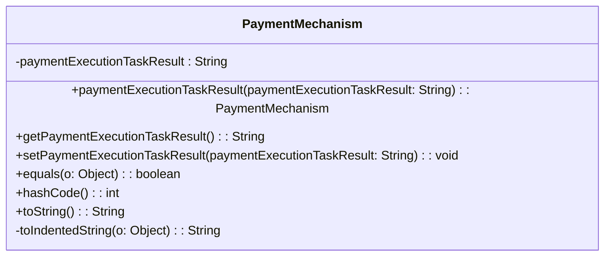

### Functional Requirements for `PaymentMechanism` Class
#### Overview

The `PaymentMechanism` class represents a payment mechanism within the context of a payment processing system. It encapsulates a single attribute related to the payment execution task result.

#### Key Features

*   Represents a payment mechanism with a single attribute.
*   Provides getter and setter methods for its attribute.
*   Supports serialization and deserialization using Jackson's `@JsonProperty` annotations.
*   Includes validation and documentation using Swagger/OpenAPI annotations.

#### Functional Requirements

1.  **Attribute Representation**:
    *   Represents 1 attribute:
        *   `paymentExecutionTaskResult` of type `String`
    *   This attribute conveys detailed information about the payment execution task result, specifically "Details of the mechanism selection".

2.  **Getter and Setter Methods**:
    *   Provides a getter method `getPaymentExecutionTaskResult()` to access the `paymentExecutionTaskResult` attribute value.
    *   Provides a setter method `setPaymentExecutionTaskResult(String)` to modify the `paymentExecutionTaskResult` attribute value.
    *   Includes a fluent setter method `paymentExecutionTaskResult(String)` that returns the `PaymentMechanism` instance for method chaining.

3.  **Serialization and Deserialization**:
    *   Uses Jackson's `@JsonProperty` annotation to specify the JSON property name (`"PaymentExecutionTaskResult"`) for serialization and deserialization of the `paymentExecutionTaskResult` attribute.

4.  **Validation and Documentation**:
    *   Utilizes Swagger/OpenAPI `@Schema` annotations to document the class and its attribute.
    *   Specifies the required mode for the attribute using `@Schema(requiredMode = Schema.RequiredMode.NOT_REQUIRED)`, indicating that it is an optional attribute.

5.  **Equality and Hash Code**:
    *   Overrides the `equals` method to compare `PaymentMechanism` instances based on their `paymentExecutionTaskResult` attribute value.
    *   Overrides the `hashCode` method to generate a hash code based on the `paymentExecutionTaskResult` attribute value.

6.  **String Representation**:
    *   Overrides the `toString` method to provide a string representation of the `PaymentMechanism` instance.
    *   Uses a `StringBuilder` to construct the string representation, including an indented representation of the `paymentExecutionTaskResult` attribute value using the `toIndentedString` method.

#### Example Usage

```java
PaymentMechanism mechanism = new PaymentMechanism();
mechanism.paymentExecutionTaskResult("taskResult");
// Set other attributes as needed (though there are no other attributes in this case)

System.out.println(mechanism.toString());
```

### Notes

*   The `PaymentMechanism` class is generated using OpenAPI code generation tools, as indicated by the `@Generated` annotation.
*   It is designed to work with Spring-based applications and Swagger/OpenAPI documentation.
*   The class is part of a larger API or web application framework, likely used for handling payment mechanism responses.


## Core Business Entities
### List of Entities
* Payment Mechanism

### Entity Descriptions and Relationships
#### Payment Mechanism
The `Payment Mechanism` represents a business entity that encapsulates the details related to the main worksteps to be followed in the execution of a procedure. Examples include invoice generation.

The key attributes of the `Payment Mechanism` include:
- `paymentExecutionTaskResult`: a string representing the details of the mechanism selection.

The `Payment Mechanism` entity has methods to:
- Set and get the `paymentExecutionTaskResult` attribute.
- Compare two `Payment Mechanism` objects for equality based on their attributes.
- Generate a hash code for the `Payment Mechanism` object.
- Convert the `Payment Mechanism` object to a string representation.

Since there is only one class provided, there are no relationships between different business entities to describe. The `Payment Mechanism` is a standalone entity.


## Business Logic Documentation

### Input & Output Data Structures

* Input: 
  - Value to be set for the `paymentExecutionTaskResult` attribute of the `PaymentMechanism` object.
  - An object to be compared with the `PaymentMechanism` object for equality.
* Output: 
  - `PaymentMechanism` object.
  - `String` representation of the `PaymentMechanism` object.
  - Comparison result (boolean).
  - Hash code (integer).

### Logical Flow

1. The `PaymentMechanism` class represents a payment mechanism with a description that includes examples such as invoice generation.
2. It provides methods to set and get its attribute `paymentExecutionTaskResult`, which represents the details of the mechanism selection.
3. The `equals` method compares two `PaymentMechanism` objects based on their `paymentExecutionTaskResult` attribute.
4. The `hashCode` method generates a hash code based on the `paymentExecutionTaskResult` attribute.
5. The `toString` method converts the object to a string representation.

### Data Validation

- The class utilizes Jakarta validation constraints; however, no specific constraints are applied to the `paymentExecutionTaskResult` attribute.

### Business Rules

The business logic is centered around representing a payment mechanism and providing methods to:
- Set and get the `paymentExecutionTaskResult` attribute.
- Compare two objects for equality based on the `paymentExecutionTaskResult` attribute.
- Generate a hash code based on the `paymentExecutionTaskResult` attribute.
- Convert the object to a string representation.

### Error Handling Approach

The class does not explicitly handle errors; it is assumed that exceptions will be handled by the calling code.

### Use of LE Services

- `Objects.equals` and `Objects.hash` methods for equality comparison and hash code generation.

### External Program Dependencies

- Jackson library for JSON serialization/deserialization (via `@JsonProperty` annotation).
- Swagger/OpenAPI for API documentation (via `@Schema` annotation).
- Jakarta validation for validation constraints.
- Java Standard Library for utility methods (e.g., `Objects.equals`, `Objects.hash`).





