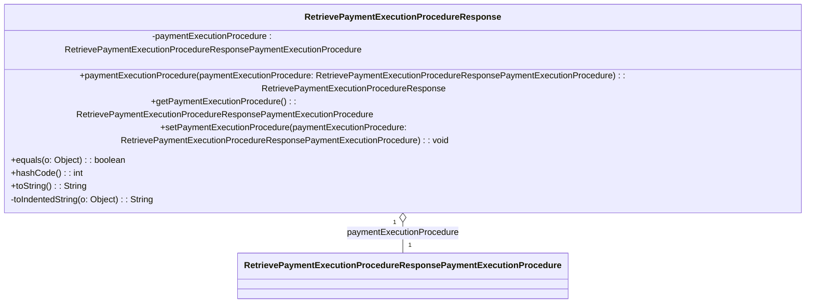

### Functional Requirements for `RetrievePaymentExecutionProcedureResponse` Class
#### Overview

The `RetrievePaymentExecutionProcedureResponse` class represents a response object for retrieving details about a payment execution instruction. It encapsulates a single attribute related to the payment execution procedure.

#### Key Features

*   Represents a response object with a single attribute.
*   Provides getter and setter methods for its attribute.
*   Supports serialization and deserialization using Jackson's `@JsonProperty` annotations.
*   Includes validation and documentation using Swagger/OpenAPI annotations.

#### Functional Requirements

1.  **Attribute Representation**:
    *   Represents 1 attribute:
        *   `paymentExecutionProcedure` of type `RetrievePaymentExecutionProcedureResponsePaymentExecutionProcedure`
    *   This attribute conveys detailed information about the payment execution procedure.

2.  **Getter and Setter Methods**:
    *   Provides a getter method `getPaymentExecutionProcedure()` to access the `paymentExecutionProcedure` attribute value.
    *   Provides a setter method `setPaymentExecutionProcedure(RetrievePaymentExecutionProcedureResponsePaymentExecutionProcedure)` to modify the `paymentExecutionProcedure` attribute value.
    *   Includes a fluent setter method `paymentExecutionProcedure(RetrievePaymentExecutionProcedureResponsePaymentExecutionProcedure)` that returns the `RetrievePaymentExecutionProcedureResponse` instance for method chaining.

3.  **Serialization and Deserialization**:
    *   Uses Jackson's `@JsonProperty` annotation to specify the JSON property name (`"PaymentExecutionProcedure"`) for serialization and deserialization of the `paymentExecutionProcedure` attribute.

4.  **Validation and Documentation**:
    *   Utilizes Swagger/OpenAPI `@Schema` annotations to document the class and its attribute.
    *   Specifies the required mode for the attribute using `@Schema(requiredMode = Schema.RequiredMode.NOT_REQUIRED)`, indicating that it is an optional attribute.
    *   Uses `@Valid` annotation to enable validation for the `paymentExecutionProcedure` attribute.

5.  **Equality and Hash Code**:
    *   Overrides the `equals` method to compare `RetrievePaymentExecutionProcedureResponse` instances based on their `paymentExecutionProcedure` attribute value.
    *   Overrides the `hashCode` method to generate a hash code based on the `paymentExecutionProcedure` attribute value.

6.  **String Representation**:
    *   Overrides the `toString` method to provide a string representation of the `RetrievePaymentExecutionProcedureResponse` instance.
    *   Uses a `StringBuilder` to construct the string representation, including an indented representation of the `paymentExecutionProcedure` attribute value using the `toIndentedString` method.

#### Example Usage

```java
RetrievePaymentExecutionProcedureResponse response = new RetrievePaymentExecutionProcedureResponse();
RetrievePaymentExecutionProcedureResponsePaymentExecutionProcedure procedure = new RetrievePaymentExecutionProcedureResponsePaymentExecutionProcedure();
// Initialize procedure object as needed
response.paymentExecutionProcedure(procedure);

System.out.println(response.toString());
```

### Notes

*   The `RetrievePaymentExecutionProcedureResponse` class is generated using OpenAPI code generation tools, as indicated by the `@Generated` annotation.
*   It is designed to work with Spring-based applications and Swagger/OpenAPI documentation.
*   The class is part of a larger API or web application framework, likely used for handling payment execution procedure responses.


## Core Business Entities
### List of Entities
* Payment Execution Procedure Response
* Payment Execution Procedure

### Entity Descriptions and Relationships
#### Payment Execution Procedure Response
The `Payment Execution Procedure Response` represents a business entity that encapsulates the response details related to retrieving a payment execution instruction.

The key attributes of the `Payment Execution Procedure Response` include:
- `paymentExecutionProcedure`: an object of type `Payment Execution Procedure` representing the payment execution procedure.

The `Payment Execution Procedure Response` entity has methods to:
- Set and get the `paymentExecutionProcedure` attribute.
- Compare two `Payment Execution Procedure Response` objects for equality based on their attributes.
- Generate a hash code for the `Payment Execution Procedure Response` object.
- Convert the `Payment Execution Procedure Response` object to a string representation.

The `Payment Execution Procedure Response` entity is related to the `Payment Execution Procedure` entity, as it contains an instance of `Payment Execution Procedure`.

#### Payment Execution Procedure
The `Payment Execution Procedure` is a business entity representing the details of a payment execution procedure.

The `Payment Execution Procedure` entity is related to the `Payment Execution Procedure Response` entity, as it is contained within the `Payment Execution Procedure Response`. 

The `Payment Execution Procedure Response` has a composition relationship with `Payment Execution Procedure`.


## Business Logic Documentation

### Input & Output Data Structures

* Input: 
  - `RetrievePaymentExecutionProcedureResponsePaymentExecutionProcedure` object to be set for the `paymentExecutionProcedure` attribute.
  - An object to be compared with the `RetrievePaymentExecutionProcedureResponse` object for equality.
* Output: 
  - `RetrievePaymentExecutionProcedureResponse` object.
  - `String` representation of the `RetrievePaymentExecutionProcedureResponse` object.
  - Comparison result (boolean).
  - Hash code (integer).

### Logical Flow

1. The `RetrievePaymentExecutionProcedureResponse` class represents a response to retrieving a payment execution instruction.
2. It contains a `paymentExecutionProcedure` attribute of type `RetrievePaymentExecutionProcedureResponsePaymentExecutionProcedure`.
3. The class provides methods to set and get the `paymentExecutionProcedure` attribute.
4. The `equals` method compares two `RetrievePaymentExecutionProcedureResponse` objects based on their `paymentExecutionProcedure` attribute.
5. The `hashCode` method generates a hash code based on the `paymentExecutionProcedure` attribute.
6. The `toString` method converts the object to a string representation.

### Data Validation

- The `paymentExecutionProcedure` attribute is annotated with `@Valid`, indicating that it should be validated according to its own validation constraints.

### Business Rules

The business logic is centered around representing a response to retrieving a payment execution instruction and providing methods to:
- Set and get the `paymentExecutionProcedure` attribute.
- Compare two objects for equality based on the `paymentExecutionProcedure` attribute.
- Generate a hash code based on the `paymentExecutionProcedure` attribute.
- Convert the object to a string representation.

### Error Handling Approach

The class does not explicitly handle errors; it is assumed that exceptions will be handled by the calling code.

### Use of LE Services

- `Objects.equals` and `Objects.hash` methods for equality comparison and hash code generation.

### External Program Dependencies

- Jackson library for JSON serialization/deserialization (via `@JsonProperty` annotation).
- Swagger/OpenAPI for API documentation (via `@Schema` annotation).
- Jakarta validation for validation constraints (via `@Valid` annotation).
- Java Standard Library for utility methods (e.g., `Objects.equals`, `Objects.hash`).





