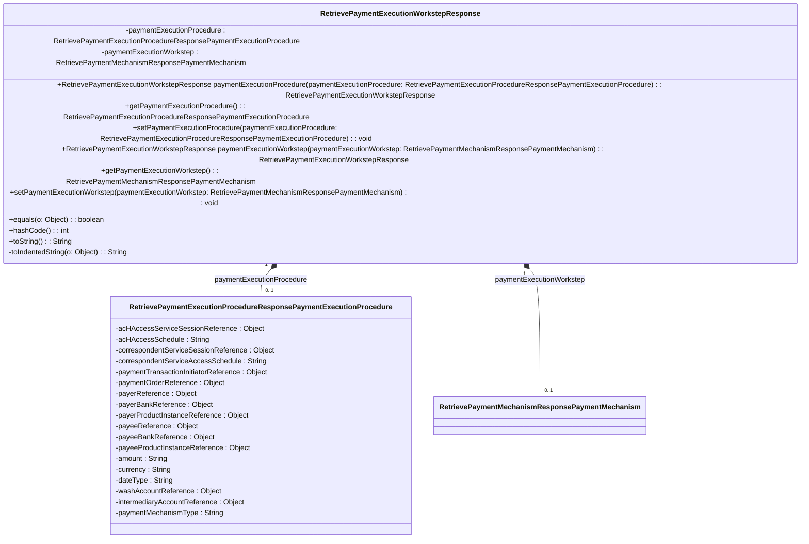

### Functional Requirements for `RetrievePaymentExecutionWorkstepResponse` Class
#### Overview

The `RetrievePaymentExecutionWorkstepResponse` class is a response object that contains details about a payment execution workstep, encapsulating `paymentExecutionProcedure` and `paymentExecutionWorkstep` attributes.

#### Key Features

*   Represents a response object with two attributes.
*   Provides getter and setter methods for its attributes.
*   Supports serialization and deserialization.
*   Includes validation and documentation.

#### Functional Requirements

1.  **Attribute Representation**:
    *   Represents 2 attributes:
        *   `paymentExecutionProcedure` of type `RetrievePaymentExecutionProcedureResponsePaymentExecutionProcedure`
        *   `paymentExecutionWorkstep` of type `RetrievePaymentMechanismResponsePaymentMechanism`
    *   These attributes convey detailed information about the payment execution workstep.

2.  **Getter and Setter Methods**:
    *   Provides getter methods to access the attribute values.
    *   Provides setter methods to modify the attribute values.
    *   Includes fluent setter methods that return the `RetrievePaymentExecutionWorkstepResponse` instance.

3.  **Serialization and Deserialization**:
    *   Uses `@JsonProperty` annotation to specify JSON property names.

4.  **Validation and Documentation**:
    *   Utilizes `@Schema` annotations to document the class and attributes.
    *   Specifies the required mode for attributes using `@Schema(requiredMode = Schema.RequiredMode.NOT_REQUIRED)`.
    *   Uses `@Valid` annotation to enable validation for attribute objects.

5.  **Equality and Hash Code**:
    *   Overrides the `equals` method to compare instances based on attribute values.
    *   Overrides the `hashCode` method to generate a hash code based on attribute values.

6.  **String Representation**:
    *   Overrides the `toString` method to provide a string representation.
    *   Uses a `StringBuilder` to construct the string representation.

#### Example Usage

```java
RetrievePaymentExecutionWorkstepResponse response = new RetrievePaymentExecutionWorkstepResponse();
RetrievePaymentExecutionProcedureResponsePaymentExecutionProcedure procedure = new RetrievePaymentExecutionProcedureResponsePaymentExecutionProcedure();
// Initialize procedure object
response.paymentExecutionProcedure(procedure);

RetrievePaymentMechanismResponsePaymentMechanism workstep = new RetrievePaymentMechanismResponsePaymentMechanism();
// Initialize workstep object
response.paymentExecutionWorkstep(workstep);

System.out.println(response.toString());
```

### Notes

*   The class is generated using OpenAPI code generation tools.
*   It is designed to work with Spring-based applications and Swagger/OpenAPI documentation.
*   The class is part of a larger API or web application framework for handling payment execution workstep responses.


## Core Business Entities
### List of Entities
* Payment Execution Workstep Response
* Retrieve Payment Execution Procedure Response Payment Execution Procedure
* Retrieve Payment Mechanism Response Payment Mechanism

### Entity Descriptions and Relationships
#### Payment Execution Workstep Response
The `Payment Execution Workstep Response` represents a business entity that encapsulates the response to a retrieve payment execution workstep request.

The key attributes of the `Payment Execution Workstep Response` include:
- `paymentExecutionProcedure`: an object representing the payment execution procedure of type `RetrievePaymentExecutionProcedureResponsePaymentExecutionProcedure`.
- `paymentExecutionWorkstep`: an object representing the payment execution workstep of type `RetrievePaymentMechanismResponsePaymentMechanism`.

The `Payment Execution Workstep Response` entity has methods to:
- Set and get the attributes listed above.
- Compare two `Payment Execution Workstep Response` objects for equality based on their attributes.
- Generate a hash code for the `Payment Execution Workstep Response` object.
- Convert the `Payment Execution Workstep Response` object to a string representation.

The `Payment Execution Workstep Response` is related to the `Retrieve Payment Execution Procedure Response Payment Execution Procedure` and `Retrieve Payment Mechanism Response Payment Mechanism` entities, as it contains or references them as part of its structure.

#### Retrieve Payment Execution Procedure Response Payment Execution Procedure
The `Retrieve Payment Execution Procedure Response Payment Execution Procedure` represents a business entity that encapsulates the details related to a payment execution procedure.

The relationship between `Payment Execution Workstep Response` and `Retrieve Payment Execution Procedure Response Payment Execution Procedure` is that the former contains or references the latter as part of its structure.

#### Retrieve Payment Mechanism Response Payment Mechanism
The `Retrieve Payment Mechanism Response Payment Mechanism` represents a business entity that encapsulates the details related to a payment mechanism.

The relationship between `Payment Execution Workstep Response` and `Retrieve Payment Mechanism Response Payment Mechanism` is that the former contains or references the latter as part of its structure.

The relationships between these entities are as follows:
- `Payment Execution Workstep Response` contains or references `Retrieve Payment Execution Procedure Response Payment Execution Procedure` and `Retrieve Payment Mechanism Response Payment Mechanism`.


## Business Logic Documentation

### Input & Output Data Structures

* Input: 
  - `RetrievePaymentExecutionProcedureResponsePaymentExecutionProcedure` object to be set for `paymentExecutionProcedure` attribute.
  - `RetrievePaymentMechanismResponsePaymentMechanism` object to be set for `paymentExecutionWorkstep` attribute.
  - An object to be compared with the `RetrievePaymentExecutionWorkstepResponse` object for equality.
* Output: 
  - `RetrievePaymentExecutionWorkstepResponse` object with `paymentExecutionProcedure` and `paymentExecutionWorkstep` attributes.
  - `String` representation of the `RetrievePaymentExecutionWorkstepResponse` object.
  - Comparison result (boolean).
  - Hash code (integer).

### Logical Flow

1. The `RetrievePaymentExecutionWorkstepResponse` class represents a response to a retrieve payment execution workstep request.
2. It contains two main attributes: `paymentExecutionProcedure` and `paymentExecutionWorkstep`, which are of types `RetrievePaymentExecutionProcedureResponsePaymentExecutionProcedure` and `RetrievePaymentMechanismResponsePaymentMechanism` respectively.
3. The class provides methods to set and get these attributes.
4. The `equals` method compares two `RetrievePaymentExecutionWorkstepResponse` objects based on their `paymentExecutionProcedure` and `paymentExecutionWorkstep` attributes.
5. The `hashCode` method generates a hash code based on the `paymentExecutionProcedure` and `paymentExecutionWorkstep` attributes.
6. The `toString` method converts the object to a string representation, including its attributes.

### Data Validation

- The `paymentExecutionProcedure` and `paymentExecutionWorkstep` attributes are annotated with `@Valid`, indicating that they should be validated according to their respective class validation constraints.

### Business Rules

The business logic is centered around representing a response to a retrieve payment execution workstep request and providing methods to:
- Set and get `paymentExecutionProcedure` and `paymentExecutionWorkstep` attributes.
- Compare two objects for equality based on their attributes.
- Generate a hash code based on the attributes.
- Convert the object to a string representation.

### Error Handling Approach

The class does not explicitly handle errors; it is assumed that exceptions will be handled by the calling code. The use of `@Valid` annotation suggests that validation constraints will be enforced, potentially throwing validation-related exceptions.

### Use of LE Services

- `Objects.equals` and `Objects.hash` methods for equality comparison and hash code generation.

### External Program Dependencies

- Jackson library for JSON serialization/deserialization (via `@JsonProperty` annotation).
- Swagger/OpenAPI for API documentation (via `@Schema` annotation).
- Jakarta validation for validation constraints (via `@Valid` annotation).
- Java Standard Library for utility methods (e.g., `Objects.equals`, `Objects.hash`).





