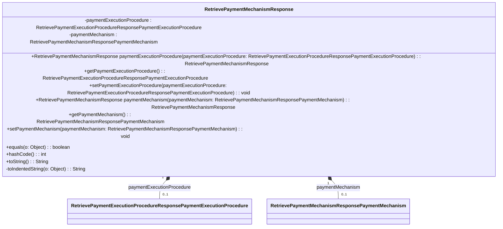

### Functional Requirements for `RetrievePaymentMechanismResponse` Class
#### Overview

The `RetrievePaymentMechanismResponse` class is a response object designed to encapsulate details about a payment mechanism selection. It comprises two primary attributes: `paymentExecutionProcedure` and `paymentMechanism`.

#### Key Features

*   Represents a response object containing two attributes.
*   Provides getter and setter methods for accessing and modifying its attributes.
*   Supports serialization and deserialization.
*   Includes validation and documentation.

#### Functional Requirements

1.  **Attribute Representation**:
    *   The class represents 2 attributes:
        *   `paymentExecutionProcedure` of type `RetrievePaymentExecutionProcedureResponsePaymentExecutionProcedure`
        *   `paymentMechanism` of type `RetrievePaymentMechanismResponsePaymentMechanism`
    *   These attributes are used to convey detailed information about the payment mechanism selection.

2.  **Getter and Setter Methods**:
    *   The class provides getter methods to access the values of its attributes.
    *   It includes setter methods to modify the attribute values.
    *   Fluent setter methods are available, allowing for method chaining and returning the `RetrievePaymentMechanismResponse` instance.

3.  **Serialization and Deserialization**:
    *   The `@JsonProperty` annotation is used to specify the names of JSON properties during serialization and deserialization.

4.  **Validation and Documentation**:
    *   `@Schema` annotations are utilized to document the class and its attributes.
    *   The required mode for attributes is specified using `@Schema(requiredMode = Schema.RequiredMode.NOT_REQUIRED)`, indicating that both attributes are not required.
    *   The `@Valid` annotation is applied to enable validation for the objects assigned to the attributes.

5.  **Equality and Hash Code**:
    *   The class overrides the `equals` method to compare instances based on the values of their attributes.
    *   It also overrides the `hashCode` method to generate a hash code based on the attribute values.

6.  **String Representation**:
    *   The `toString` method is overridden to provide a meaningful string representation of the object.
    *   A `StringBuilder` is used to construct the string representation, indenting attribute values for better readability.

#### Example Usage

```java
RetrievePaymentMechanismResponse response = new RetrievePaymentMechanismResponse();
RetrievePaymentExecutionProcedureResponsePaymentExecutionProcedure procedure = new RetrievePaymentExecutionProcedureResponsePaymentExecutionProcedure();
// Initialize procedure object
response.paymentExecutionProcedure(procedure);

RetrievePaymentMechanismResponsePaymentMechanism mechanism = new RetrievePaymentMechanismResponsePaymentMechanism();
// Initialize mechanism object
response.paymentMechanism(mechanism);

System.out.println(response.toString());
```

### Notes

*   The class is generated using OpenAPI code generation tools, indicating its origin and potential integration with OpenAPI or Swagger documentation.
*   It is designed to be used within Spring-based applications, aligning with the Spring framework's conventions and annotations.
*   As part of a larger API or web application framework, this class plays a role in handling responses related to payment mechanism selections.


## Core Business Entities
### List of Entities
* Retrieve Payment Mechanism Response
* Retrieve Payment Execution Procedure Response Payment Execution Procedure
* Retrieve Payment Mechanism Response Payment Mechanism

### Entity Descriptions and Relationships
#### Retrieve Payment Mechanism Response
The `Retrieve Payment Mechanism Response` represents a business entity that encapsulates the response to a retrieve payment mechanism request.

The key attributes of the `Retrieve Payment Mechanism Response` include:
- `paymentExecutionProcedure`: an object representing the payment execution procedure of type `RetrievePaymentExecutionProcedureResponsePaymentExecutionProcedure`.
- `paymentMechanism`: an object representing the payment mechanism of type `RetrievePaymentMechanismResponsePaymentMechanism`.

The `Retrieve Payment Mechanism Response` entity has methods to:
- Set and get the attributes listed above.
- Compare two `Retrieve Payment Mechanism Response` objects for equality based on their attributes.
- Generate a hash code for the `Retrieve Payment Mechanism Response` object.
- Convert the `Retrieve Payment Mechanism Response` object to a string representation.

The `Retrieve Payment Mechanism Response` is related to the `Retrieve Payment Execution Procedure Response Payment Execution Procedure` and `Retrieve Payment Mechanism Response Payment Mechanism` entities, as it contains or references them as part of its structure.

#### Retrieve Payment Execution Procedure Response Payment Execution Procedure
The `Retrieve Payment Execution Procedure Response Payment Execution Procedure` represents a business entity that encapsulates the details related to a payment execution procedure.

The relationship between `Retrieve Payment Mechanism Response` and `Retrieve Payment Execution Procedure Response Payment Execution Procedure` is that the former contains or references the latter as part of its structure.

#### Retrieve Payment Mechanism Response Payment Mechanism
The `Retrieve Payment Mechanism Response Payment Mechanism` represents a business entity that encapsulates the details related to a payment mechanism.

The relationship between `Retrieve Payment Mechanism Response` and `Retrieve Payment Mechanism Response Payment Mechanism` is that the former contains or references the latter as part of its structure.

The relationships between these entities are as follows:
- `Retrieve Payment Mechanism Response` contains or references `Retrieve Payment Execution Procedure Response Payment Execution Procedure` and `Retrieve Payment Mechanism Response Payment Mechanism`.


## Business Logic Documentation

### Input & Output Data Structures

* Input: 
  - `RetrievePaymentExecutionProcedureResponsePaymentExecutionProcedure` object to be set for `paymentExecutionProcedure` attribute.
  - `RetrievePaymentMechanismResponsePaymentMechanism` object to be set for `paymentMechanism` attribute.
  - An object to be compared with the `RetrievePaymentMechanismResponse` object for equality.
* Output: 
  - `RetrievePaymentMechanismResponse` object with `paymentExecutionProcedure` and `paymentMechanism` attributes.
  - `String` representation of the `RetrievePaymentMechanismResponse` object.
  - Comparison result (boolean).
  - Hash code (integer).

### Logical Flow

1. The `RetrievePaymentMechanismResponse` class represents a response to a retrieve payment mechanism request.
2. It contains two main attributes: `paymentExecutionProcedure` and `paymentMechanism`, which are of types `RetrievePaymentExecutionProcedureResponsePaymentExecutionProcedure` and `RetrievePaymentMechanismResponsePaymentMechanism` respectively.
3. The class provides methods to set and get these attributes.
4. The `equals` method compares two `RetrievePaymentMechanismResponse` objects based on their `paymentExecutionProcedure` and `paymentMechanism` attributes.
5. The `hashCode` method generates a hash code based on the `paymentExecutionProcedure` and `paymentMechanism` attributes.
6. The `toString` method converts the object to a string representation, including its attributes.

### Data Validation

- The `paymentExecutionProcedure` and `paymentMechanism` attributes are annotated with `@Valid`, indicating that they should be validated according to their respective class validation constraints.

### Business Rules

The business logic is centered around representing a response to a retrieve payment mechanism request and providing methods to:
- Set and get `paymentExecutionProcedure` and `paymentMechanism` attributes.
- Compare two objects for equality based on their attributes.
- Generate a hash code based on the attributes.
- Convert the object to a string representation.

### Error Handling Approach

The class does not explicitly handle errors; it is assumed that exceptions will be handled by the calling code. The use of `@Valid` annotation suggests that validation constraints will be enforced, potentially throwing validation-related exceptions.

### Use of LE Services

- `Objects.equals` and `Objects.hash` methods for equality comparison and hash code generation.

### External Program Dependencies

- Jackson library for JSON serialization/deserialization (via `@JsonProperty` annotation).
- Swagger/OpenAPI for API documentation (via `@Schema` annotation).
- Jakarta validation for validation constraints (via `@Valid` annotation).
- Java Standard Library for utility methods (e.g., `Objects.equals`, `Objects.hash`).





