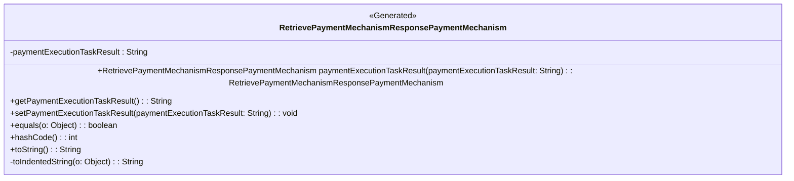

### Functional Requirements for `RetrievePaymentMechanismResponsePaymentMechanism` Class
#### Overview

The `RetrievePaymentMechanismResponsePaymentMechanism` class is a Java representation of a payment mechanism object. It encapsulates a single attribute: `paymentExecutionTaskResult`.

#### Key Features

*   Represents a payment mechanism object with one attribute.
*   Provides getter and setter methods for accessing and modifying its attribute.
*   Supports serialization and deserialization.
*   Includes documentation.

#### Functional Requirements

1.  **Attribute Representation**:
    *   The class represents 1 attribute:
        *   `paymentExecutionTaskResult` of type `String`
    *   This attribute is used to convey the result of a payment execution task.

2.  **Getter and Setter Methods**:
    *   The class provides a getter method `getPaymentExecutionTaskResult()` to access the value of its attribute.
    *   It includes a setter method `setPaymentExecutionTaskResult(String)` to modify the attribute value.
    *   A fluent setter method `paymentExecutionTaskResult(String)` is available, allowing for method chaining and returning the `RetrievePaymentMechanismResponsePaymentMechanism` instance.

3.  **Serialization and Deserialization**:
    *   The `@JsonProperty` annotation is used to specify the name of the JSON property during serialization and deserialization. The property name is "PaymentExecutionTaskResult".

4.  **Documentation**:
    *   `@Schema` annotations are utilized to document the class and its attribute. The attribute is described as "PaymentExecutionTaskResult" and is not required.

5.  **Equality and Hash Code**:
    *   The class overrides the `equals` method to compare instances based on the value of their `paymentExecutionTaskResult` attribute.
    *   It also overrides the `hashCode` method to generate a hash code based on the `paymentExecutionTaskResult` attribute value.

6.  **String Representation**:
    *   The `toString` method is overridden to provide a meaningful string representation of the object.
    *   A `StringBuilder` is used to construct the string representation, indenting attribute values for better readability.

#### Example Usage

```java
RetrievePaymentMechanismResponsePaymentMechanism paymentMechanism = new RetrievePaymentMechanismResponsePaymentMechanism();
paymentMechanism.paymentExecutionTaskResult("Success");

System.out.println(paymentMechanism.toString());
```

### Notes

*   The class is generated using OpenAPI code generation tools, as indicated by the `@Generated` annotation.
*   It is designed to be used within Spring-based applications, aligning with the Spring framework's conventions and annotations.
*   As part of a larger API or web application framework, this class plays a role in handling payment mechanism-related data.


## Core Business Entities
### List of Entities
* Payment Mechanism
* Retrieve Payment Mechanism Response

### Entity Descriptions and Relationships
#### Payment Mechanism
The `Payment Mechanism` represents a business entity that encapsulates the details related to a payment mechanism.

The key attributes of the `Payment Mechanism` include:
- `paymentExecutionTaskResult`: a string representing the result of the payment execution task.

The `Payment Mechanism` entity has methods to:
- Set and get the `paymentExecutionTaskResult` attribute.
- Compare two `Payment Mechanism` objects for equality based on their `paymentExecutionTaskResult` attribute.
- Generate a hash code for the `Payment Mechanism` object.
- Convert the `Payment Mechanism` object to a string representation.

#### Retrieve Payment Mechanism Response
The `Retrieve Payment Mechanism Response` is an entity related to the `Payment Mechanism`. It is inferred from the class name `RetrievePaymentMechanismResponsePaymentMechanism` that `Retrieve Payment Mechanism Response` contains or references `Payment Mechanism`.

### Relationships Between Entities
- The `Retrieve Payment Mechanism Response` is associated with the `Payment Mechanism`. The exact nature of this association (e.g., containment, reference) cannot be determined from the provided Java code but is inferred from the class name.

### Markdown Formatting for Better Readability
The above content is formatted using markdown for better readability.

### Additional Context or Classes
To generate a more detailed and connected business entity model, additional Java classes or context related to the `RetrievePaymentMechanismResponsePaymentMechanism` class would be beneficial. This would enable the identification of relationships between different entities and provide a more comprehensive overview of the business entities involved.


## Business Logic Documentation

### Input & Output Data Structures

* Input: 
  - `paymentExecutionTaskResult` (string) to be set for the `RetrievePaymentMechanismResponsePaymentMechanism` object.
  - An object to be compared with the `RetrievePaymentMechanismResponsePaymentMechanism` object for equality.
* Output: 
  - `RetrievePaymentMechanismResponsePaymentMechanism` object with `paymentExecutionTaskResult` attribute.
  - `String` representation of the `RetrievePaymentMechanismResponsePaymentMechanism` object.
  - Comparison result (boolean).
  - Hash code (integer).

### Logical Flow

1. The `RetrievePaymentMechanismResponsePaymentMechanism` class represents a payment mechanism entity related to the `Retrieve Payment Mechanism Response`.
2. It contains one main attribute: `paymentExecutionTaskResult`, which is a string representing the result of the payment execution task.
3. The class provides methods to set and get the `paymentExecutionTaskResult` attribute.
4. The `equals` method compares two `RetrievePaymentMechanismResponsePaymentMechanism` objects based on their `paymentExecutionTaskResult` attribute.
5. The `hashCode` method generates a hash code based on the `paymentExecutionTaskResult` attribute.
6. The `toString` method converts the object to a string representation, including its attribute.

### Data Validation

- The `paymentExecutionTaskResult` attribute is not explicitly validated in the provided code; however, it is annotated with `@Schema`, indicating potential validation or documentation constraints.

### Business Rules

The business logic is centered around representing a payment mechanism entity and providing methods to:
- Set and get the `paymentExecutionTaskResult` attribute.
- Compare two objects for equality based on their `paymentExecutionTaskResult` attribute.
- Generate a hash code based on the `paymentExecutionTaskResult` attribute.
- Convert the object to a string representation.

### Error Handling Approach

The class does not explicitly handle errors; it is assumed that exceptions will be handled by the calling code.

### Use of LE Services

- `Objects.equals` and `Objects.hash` methods for equality comparison and hash code generation.

### External Program Dependencies

- Jackson library for JSON serialization/deserialization (via `@JsonProperty` annotation).
- Swagger/OpenAPI for API documentation (via `@Schema` annotation).
- Java Standard Library for utility methods (e.g., `Objects.equals`, `Objects.hash`).





