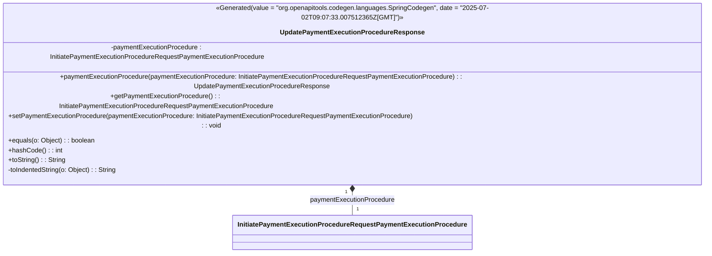

### Functional Requirements for `UpdatePaymentExecutionProcedureResponse` Class
#### Overview

The `UpdatePaymentExecutionProcedureResponse` class is a Java representation of a response containing the updated details of a payment execution instruction. It encapsulates a single attribute: `paymentExecutionProcedure`.

#### Key Features

*   Represents a response containing the updated details of a payment execution instruction with one attribute.
*   Provides getter and setter methods for accessing and modifying its attribute.
*   Supports serialization and deserialization.
*   Includes documentation and validation.

#### Functional Requirements

1.  **Attribute Representation**:
    *   The class represents 1 attribute:
        *   `paymentExecutionProcedure` of type `InitiatePaymentExecutionProcedureRequestPaymentExecutionProcedure`
    *   This attribute is used to convey the updated details of a payment execution procedure.

2.  **Getter and Setter Methods**:
    *   The class provides a getter method `getPaymentExecutionProcedure()` to access the value of its attribute.
    *   It includes a setter method `setPaymentExecutionProcedure(InitiatePaymentExecutionProcedureRequestPaymentExecutionProcedure)` to modify the attribute value.
    *   A fluent setter method `paymentExecutionProcedure(InitiatePaymentExecutionProcedureRequestPaymentExecutionProcedure)` is available, allowing for method chaining and returning the `UpdatePaymentExecutionProcedureResponse` instance.

3.  **Serialization and Deserialization**:
    *   The `@JsonProperty` annotation is used to specify the name of the JSON property during serialization and deserialization. The property name is "PaymentExecutionProcedure".

4.  **Documentation and Validation**:
    *   `@Schema` annotations are utilized to document the class and its attribute. The attribute is described as "PaymentExecutionProcedure" and is not required.
    *   The `@Valid` annotation is used to enable validation for the `paymentExecutionProcedure` attribute.

5.  **Equality and Hash Code**:
    *   The class overrides the `equals` method to compare instances based on the value of their `paymentExecutionProcedure` attribute.
    *   It also overrides the `hashCode` method to generate a hash code based on the `paymentExecutionProcedure` attribute value.

6.  **String Representation**:
    *   The `toString` method is overridden to provide a meaningful string representation of the object.
    *   A private helper method `toIndentedString(Object o)` is used to construct the string representation, indenting attribute values for better readability.

#### Example Usage

```java
UpdatePaymentExecutionProcedureResponse response = new UpdatePaymentExecutionProcedureResponse();
InitiatePaymentExecutionProcedureRequestPaymentExecutionProcedure procedure = new InitiatePaymentExecutionProcedureRequestPaymentExecutionProcedure();
// Initialize procedure details
response.paymentExecutionProcedure(procedure);

System.out.println(response.toString());
```

### Notes

*   The class is generated using OpenAPI code generation tools, as indicated by the `@Generated` annotation.
*   It is designed to be used within Spring-based applications, aligning with the Spring framework's conventions and annotations.
*   As part of a larger API or web application framework, this class plays a role in handling payment execution procedure-related data.


## Core Business Entities
### List of Entities
* Update Payment Execution Procedure Response
* Initiate Payment Execution Procedure Request Payment Execution Procedure

### Entity Descriptions and Relationships
#### Update Payment Execution Procedure Response
The `Update Payment Execution Procedure Response` represents a business entity that encapsulates the details of a payment execution instruction response.

The key attributes of the `Update Payment Execution Procedure Response` include:
- `paymentExecutionProcedure`: an object of type `InitiatePaymentExecutionProcedureRequestPaymentExecutionProcedure` representing the payment execution procedure.

The `Update Payment Execution Procedure Response` entity has methods to:
- Set and get the `paymentExecutionProcedure` attribute.
- Compare two `Update Payment Execution Procedure Response` objects for equality based on their `paymentExecutionProcedure` attribute.
- Generate a hash code for the `Update PaymentExecutionProcedureResponse` object.
- Convert the `Update Payment Execution Procedure Response` object to a string representation.

#### Initiate Payment Execution Procedure Request Payment Execution Procedure
The `Initiate Payment Execution Procedure Request Payment Execution Procedure` is an entity related to the `Update Payment Execution Procedure Response`. It is used as the type for the `paymentExecutionProcedure` attribute in `Update Payment Execution Procedure Response`.

### Relationships Between Entities
- The `Update Payment Execution Procedure Response` is associated with the `Initiate Payment Execution Procedure Request Payment Execution Procedure`. The `Update Payment Execution Procedure Response` contains or references a `Initiate Payment Execution Procedure Request Payment Execution Procedure`.


## Business Logic Documentation

### Input & Output Data Structures

* Input: 
  - `paymentExecutionProcedure` (object of type `InitiatePaymentExecutionProcedureRequestPaymentExecutionProcedure`) to be set for the `UpdatePaymentExecutionProcedureResponse` object.
  - An object to be compared with the `UpdatePaymentExecutionProcedureResponse` object for equality.
* Output: 
  - `UpdatePaymentExecutionProcedureResponse` object with `paymentExecutionProcedure` attribute.
  - `String` representation of the `UpdatePaymentExecutionProcedureResponse` object.
  - Comparison result (boolean).
  - Hash code (integer).

### Logical Flow

1. The `UpdatePaymentExecutionProcedureResponse` class represents a response containing the details of a payment execution instruction.
2. It contains one main attribute: `paymentExecutionProcedure`, which is an object of type `InitiatePaymentExecutionProcedureRequestPaymentExecutionProcedure`.
3. The class provides methods to set and get the `paymentExecutionProcedure` attribute.
4. The `equals` method compares two `UpdatePaymentExecutionProcedureResponse` objects based on their `paymentExecutionProcedure` attribute.
5. The `hashCode` method generates a hash code based on the `paymentExecutionProcedure` attribute.
6. The `toString` method converts the object to a string representation, including its attribute.

### Data Validation

- The `paymentExecutionProcedure` attribute is annotated with `@Valid`, indicating that it will be validated according to the constraints defined in the `InitiatePaymentExecutionProcedureRequestPaymentExecutionProcedure` class.

### Business Rules

The business logic is centered around representing a response containing the details of a payment execution instruction and providing methods to:
- Set and get the `paymentExecutionProcedure` attribute.
- Compare two objects for equality based on their `paymentExecutionProcedure` attribute.
- Generate a hash code based on the `paymentExecutionProcedure` attribute.
- Convert the object to a string representation.

### Error Handling Approach

The class does not explicitly handle errors; it is assumed that exceptions will be handled by the calling code. The `@Valid` annotation on `paymentExecutionProcedure` suggests that validation errors will be handled through the validation framework.

### Use of LE Services

- `Objects.equals` and `Objects.hash` methods for equality comparison and hash code generation.

### External Program Dependencies

- Jackson library for JSON serialization/deserialization (via `@JsonProperty` annotation).
- Swagger/OpenAPI for API documentation (via `@Schema` annotation).
- Java Standard Library for utility methods (e.g., `Objects.equals`, `Objects.hash`).
- Jakarta Validation API for validation (via `@Valid` annotation).





