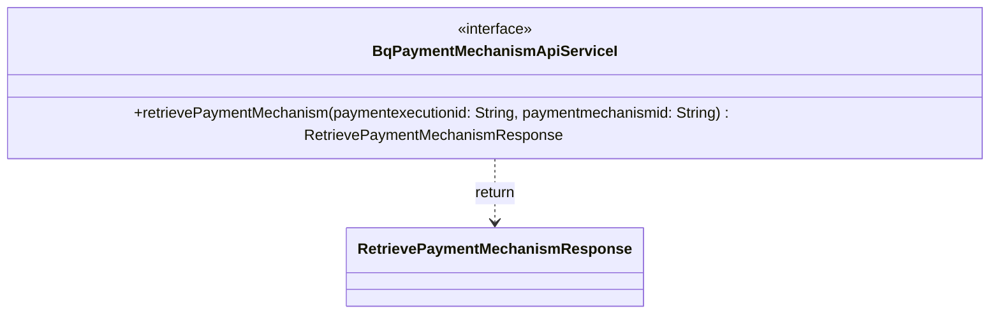

### Functional Requirements for `BqPaymentMechanismApiServiceI` Interface
#### Overview

The `BqPaymentMechanismApiServiceI` interface is a Java representation of a service contract for handling operations related to payment mechanisms. It defines a single method for retrieving details about a specific payment mechanism.

#### Key Features

*   Represents a service interface for payment mechanism-related operations.
*   Defines a method for retrieving payment mechanism details.

#### Functional Requirements

1.  **Method Definition**:
    *   The interface defines 1 method:
        *   `retrievePaymentMechanism(String paymentexecutionid, String paymentmechanismid)`
    *   This method is used to retrieve details about a specific payment mechanism based on the provided `paymentexecutionid` and `paymentmechanismid`.

2.  **Method Parameters**:
    *   The `retrievePaymentMechanism` method takes two parameters:
        *   `paymentexecutionid` of type `String`
        *   `paymentmechanismid` of type `String`
    *   These parameters are used to identify the specific payment mechanism to be retrieved.

3.  **Method Return Type**:
    *   The `retrievePaymentMechanism` method returns an object of type `RetrievePaymentMechanismResponse`.
    *   This return type represents the response containing the details of the retrieved payment mechanism.

4.  **Documentation**:
    *   The interface and its method are documented with comments providing a description of their purpose and functionality.

#### Example Usage

```java
// Assuming a class implementing BqPaymentMechanismApiServiceI
public class BqPaymentMechanismApiServiceImpl implements BqPaymentMechanismApiServiceI {
    @Override
    public RetrievePaymentMechanismResponse retrievePaymentMechanism(String paymentexecutionid, String paymentmechanismid) {
        // Implementation to retrieve payment mechanism details
        // For demonstration, a simple return is shown
        return new RetrievePaymentMechanismResponse();
    }
}

BqPaymentMechanismApiServiceI service = new BqPaymentMechanismApiServiceImpl();
String paymentExecutionId = "some-payment-execution-id";
String paymentMechanismId = "some-payment-mechanism-id";
RetrievePaymentMechanismResponse response = service.retrievePaymentMechanism(paymentExecutionId, paymentMechanismId);
// Process the response
```

### Notes

*   The interface is designed to be implemented by a class that will provide the actual implementation for the defined method.
*   It is part of a larger service-oriented architecture, likely within an enterprise application or a microservices-based system.
*   The specific implementation of the `retrievePaymentMechanism` method is expected to be provided by a class implementing this interface, which may involve database queries, API calls, or other necessary operations to retrieve the required payment mechanism details.


## Core Business Entities
### List of Entities
* Retrieve Payment Mechanism Response
* Payment Mechanism
* Payment Execution

### Entity Descriptions and Relationships
#### Retrieve Payment Mechanism Response
The `Retrieve Payment Mechanism Response` represents a business entity that encapsulates the details of a payment mechanism retrieval response.

The `Retrieve Payment Mechanism Response` is associated with or contains details about a `Payment Mechanism`.

#### Payment Mechanism
The `Payment Mechanism` represents a business entity associated with the mechanism used for payment. It is related to the `Retrieve Payment Mechanism Response` as the response contains details about a specific `Payment Mechanism` identified by `paymentexecutionid` and `paymentmechanismid`.

#### Payment Execution
The `Payment Execution` represents a business entity associated with the execution of a payment. It is related to the `Payment Mechanism` as a `Payment Mechanism` is identified by a `paymentexecutionid`, suggesting a connection between the execution of a payment and the mechanism used.

### Relationships Between Entities
The `Retrieve Payment Mechanism Response` is related to the `Payment Mechanism` as it is the response to retrieving a specific `Payment Mechanism`. The `Payment Mechanism` is identified by `paymentexecutionid` and `paymentmechanismid`, indicating that `Retrieve Payment Mechanism Response` indirectly relates to entities or concepts represented by these identifiers. The `Payment Execution` is related to the `Payment Mechanism` through the `paymentexecutionid`.


## Business Logic Documentation
### Input & Output Data Structures

* Input: 
  - `paymentexecutionid` (string)
  - `paymentmechanismid` (string)
* Output: 
  - `RetrievePaymentMechanismResponse` object containing details of the retrieved payment mechanism.

### Logical Flow

1. The `BqPaymentMechanismApiServiceI` interface defines a service for handling operations related to payment mechanism.
2. The `retrievePaymentMechanism` method takes two input parameters: `paymentexecutionid` and `paymentmechanismid`.
3. Based on these input parameters, the method retrieves the details of a specific `Payment Mechanism`.
4. The retrieved details are encapsulated in a `RetrievePaymentMechanismResponse` object.
5. The method returns the `RetrievePaymentMechanismResponse` object.

### Data Validation

- The input parameters `paymentexecutionid` and `paymentmechanismid` are expected to be valid strings; however, the specific validation rules (e.g., format, length) are not defined in the provided interface.
- The `RetrievePaymentMechanismResponse` object is expected to be a valid representation of the retrieved `Payment Mechanism` details.

### Business Rules

The business logic is centered around retrieving the details of a `Payment Mechanism` based on the provided `paymentexecutionid` and `paymentmechanismid`. The retrieved details are then encapsulated in a `RetrievePaymentMechanismResponse` object. The relationship between `Payment Execution`, `Payment Mechanism`, and `Retrieve Payment Mechanism Response` entities is maintained through the use of `paymentexecutionid` and `paymentmechanismid`.

### Error Handling Approach

The interface does not explicitly define an error handling approach. It is assumed that exceptions will be handled by the implementing class or the calling code.

### Use of LE Services

- None explicitly mentioned in the provided interface.

### External Program Dependencies

- The interface depends on the `RetrievePaymentMechanismResponse` class, which is part of the `com.ibm.model` package.
- The implementation of this interface may depend on other classes or services not defined in the provided interface, such as those related to `Payment Mechanism` and `Payment Execution` entities.





