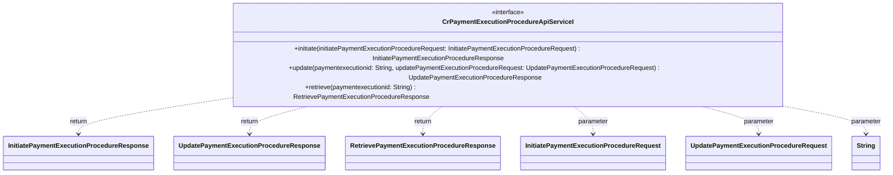

### Functional Requirements for `CrPaymentExecutionProcedureApiServiceI` Interface
#### Overview

The `CrPaymentExecutionProcedureApiServiceI` interface is a Java representation of a service contract for handling operations related to payment execution procedures. It defines three methods for initiating, updating, and retrieving payment execution procedures.

#### Key Features

*   Represents a service interface for payment execution procedure-related operations.
*   Defines methods for initiating, updating, and retrieving payment execution procedures.

#### Functional Requirements

1.  **Method Definitions**:
    *   The interface defines 3 methods:
        *   `initiate(InitiatePaymentExecutionProcedureRequest initiatePaymentExecutionProcedureRequest)`
        *   `update(String paymentexecutionid, UpdatePaymentExecutionProcedureRequest updatePaymentExecutionProcedureRequest)`
        *   `retrieve(String paymentexecutionid)`
    *   These methods are used to perform the following operations:
        *   Initiate a payment execution procedure.
        *   Update an existing payment execution procedure.
        *   Retrieve details about a specific payment execution procedure.

2.  **Method Parameters**:
    *   The `initiate` method takes one parameter:
        *   `initiatePaymentExecutionProcedureRequest` of type `InitiatePaymentExecutionProcedureRequest`
    *   The `update` method takes two parameters:
        *   `paymentexecutionid` of type `String`
        *   `updatePaymentExecutionProcedureRequest` of type `UpdatePaymentExecutionProcedureRequest`
    *   The `retrieve` method takes one parameter:
        *   `paymentexecutionid` of type `String`
    *   These parameters are used to identify or provide the necessary details for the respective operations.

3.  **Method Return Types**:
    *   The `initiate` method returns an object of type `InitiatePaymentExecutionProcedureResponse`.
    *   The `update` method returns an object of type `UpdatePaymentExecutionProcedureResponse`.
    *   The `retrieve` method returns an object of type `RetrievePaymentExecutionProcedureResponse`.
    *   These return types represent the responses containing the outcomes or details of the respective operations.

4.  **Documentation**:
    *   The interface and its methods are documented with comments providing a description of their purpose and functionality.

#### Example Usage

```java
// Assuming a class implementing CrPaymentExecutionProcedureApiServiceI
public class CrPaymentExecutionProcedureApiServiceImpl implements CrPaymentExecutionProcedureApiServiceI {
    @Override
    public InitiatePaymentExecutionProcedureResponse initiate(InitiatePaymentExecutionProcedureRequest initiatePaymentExecutionProcedureRequest) {
        // Implementation to initiate payment execution procedure
        // For demonstration, a simple return is shown
        return new InitiatePaymentExecutionProcedureResponse();
    }

    @Override
    public UpdatePaymentExecutionProcedureResponse update(String paymentexecutionid, UpdatePaymentExecutionProcedureRequest updatePaymentExecutionProcedureRequest) {
        // Implementation to update payment execution procedure
        // For demonstration, a simple return is shown
        return new UpdatePaymentExecutionProcedureResponse();
    }

    @Override
    public RetrievePaymentExecutionProcedureResponse retrieve(String paymentexecutionid) {
        // Implementation to retrieve payment execution procedure
        // For demonstration, a simple return is shown
        return new RetrievePaymentExecutionProcedureResponse();
    }
}

CrPaymentExecutionProcedureApiServiceI service = new CrPaymentExecutionProcedureApiServiceImpl();

// Initiate payment execution procedure
InitiatePaymentExecutionProcedureRequest initiateRequest = new InitiatePaymentExecutionProcedureRequest();
InitiatePaymentExecutionProcedureResponse initiateResponse = service.initiate(initiateRequest);
// Process the initiate response

// Update payment execution procedure
String paymentExecutionId = "some-payment-execution-id";
UpdatePaymentExecutionProcedureRequest updateRequest = new UpdatePaymentExecutionProcedureRequest();
UpdatePaymentExecutionProcedureResponse updateResponse = service.update(paymentExecutionId, updateRequest);
// Process the update response

// Retrieve payment execution procedure
RetrievePaymentExecutionProcedureResponse retrieveResponse = service.retrieve(paymentExecutionId);
// Process the retrieve response
```

### Notes

*   The interface is designed to be implemented by a class that will provide the actual implementation for the defined methods.
*   It is part of a larger service-oriented architecture, likely within an enterprise application or a microservices-based system.
*   The specific implementations of the `initiate`, `update`, and `retrieve` methods are expected to be provided by a class implementing this interface, which may involve database queries, API calls, or other necessary operations to perform the respective payment execution procedure operations.


## Core Business Entities
### List of Entities
* Payment Execution Procedure
* Initiate Payment Execution Procedure Request
* Initiate Payment Execution Procedure Response
* Update Payment Execution Procedure Request
* Update Payment Execution Procedure Response
* Retrieve Payment Execution Procedure Response

### Entity Descriptions and Relationships
#### Payment Execution Procedure
The `Payment Execution Procedure` represents a business entity associated with the execution of a payment. It is related to the `Retrieve Payment Execution Procedure Response` as the response contains details about a specific `Payment Execution Procedure` identified by `paymentexecutionid`. It is also related to the `Update Payment Execution Procedure Request` and `Update Payment Execution Procedure Response` as these are used to update a specific `Payment Execution Procedure`.

#### Initiate Payment Execution Procedure Request
The `Initiate Payment Execution Procedure Request` represents a business entity that encapsulates the details required to initiate a payment execution procedure. The `Initiate Payment Execution Procedure Request` is associated with the `Initiate Payment Execution Procedure Response` as the response is generated based on the request.

#### Initiate Payment Execution Procedure Response
The `Initiate Payment Execution Procedure Response` represents a business entity that encapsulates the details of the response to an initiate payment execution procedure request. The `Initiate Payment Execution Procedure Response` is associated with the `Initiate Payment Execution Procedure Request` as it is the response to the request.

#### Update Payment Execution Procedure Request
The `Update Payment Execution Procedure Request` represents a business entity that encapsulates the details required to update a payment execution procedure. The `Update Payment Execution Procedure Request` is associated with the `Update Payment Execution Procedure Response` as the response is generated based on the request. It is also related to the `Payment Execution Procedure` as it is used to update a specific `Payment Execution Procedure` identified by `paymentexecutionid`.

#### Update Payment Execution Procedure Response
The `Update Payment Execution Procedure Response` represents a business entity that encapsulates the details of the response to an update payment execution procedure request. The `Update Payment Execution Procedure Response` is associated with the `Update Payment Execution Procedure Request` as it is the response to the request. It is also related to the `Payment Execution Procedure` as it contains the updated details of a specific `Payment Execution Procedure`.

#### Retrieve Payment Execution Procedure Response
The `Retrieve Payment Execution Procedure Response` represents a business entity that encapsulates the details of a payment execution procedure retrieval response. The `Retrieve Payment Execution Procedure Response` is associated with the `Payment Execution Procedure` as it contains details about a specific `Payment Execution Procedure` identified by `paymentexecutionid`.

### Relationships Between Entities
The `Payment Execution Procedure` is related to the `Retrieve Payment Execution Procedure Response`, `Update Payment Execution Procedure Request`, and `Update Payment Execution Procedure Response` through the `paymentexecutionid`. The `Initiate Payment Execution Procedure Request` is related to the `Initiate Payment Execution Procedure Response`. The `Update Payment Execution Procedure Request` is related to the `Update Payment Execution Procedure Response`.


## Business Logic Documentation
### Input & Output Data Structures

* **Initiate Operation**
  - Input: `InitiatePaymentExecutionProcedureRequest` object
  - Output: `InitiatePaymentExecutionProcedureResponse` object
* **Update Operation**
  - Input: 
    - `paymentexecutionid` (string)
    - `UpdatePaymentExecutionProcedureRequest` object
  - Output: `UpdatePaymentExecutionProcedureResponse` object
* **Retrieve Operation**
  - Input: `paymentexecutionid` (string)
  - Output: `RetrievePaymentExecutionProcedureResponse` object

### Logical Flow

1. The `CrPaymentExecutionProcedureApiServiceI` interface defines a service for handling operations related to payment execution procedure.
2. The service includes three main operations: `initiate`, `update`, and `retrieve`.
3. **Initiate Operation**: 
   - The `initiate` method takes an `InitiatePaymentExecutionProcedureRequest` object as input.
   - It processes the request and returns an `InitiatePaymentExecutionProcedureResponse` object.
4. **Update Operation**:
   - The `update` method takes two input parameters: `paymentexecutionid` and an `UpdatePaymentExecutionProcedureRequest` object.
   - Based on these inputs, it updates the details of a specific `Payment Execution Procedure`.
   - The method returns an `UpdatePaymentExecutionProcedureResponse` object containing the updated details.
5. **Retrieve Operation**:
   - The `retrieve` method takes a `paymentexecutionid` as input.
   - It retrieves the details of a specific `Payment Execution Procedure` based on the `paymentexecutionid`.
   - The retrieved details are encapsulated in a `RetrievePaymentExecutionProcedureResponse` object.
   - The method returns the `RetrievePaymentExecutionProcedureResponse` object.

### Data Validation

- The input parameters and objects (`InitiatePaymentExecutionProcedureRequest`, `UpdatePaymentExecutionProcedureRequest`, `paymentexecutionid`) are expected to be valid.
- The response objects (`InitiatePaymentExecutionProcedureResponse`, `UpdatePaymentExecutionProcedureResponse`, `RetrievePaymentExecutionProcedureResponse`) are expected to be valid representations of the respective operation outcomes.

### Business Rules

The business logic is centered around three main operations related to `Payment Execution Procedure`:
1. **Initiation**: The `initiate` operation is used to start a payment execution procedure based on the details provided in the `InitiatePaymentExecutionProcedureRequest`.
2. **Update**: The `update` operation is used to modify an existing `Payment Execution Procedure` identified by `paymentexecutionid` based on the details provided in the `UpdatePaymentExecutionProcedureRequest`.
3. **Retrieval**: The `retrieve` operation is used to fetch the details of a `Payment Execution Procedure` identified by `paymentexecutionid`.

The relationships between `Payment Execution Procedure` and the request/response objects are maintained through the use of `paymentexecutionid` and the respective request/response objects.

### Error Handling Approach

The interface does not explicitly define an error handling approach. It is assumed that exceptions will be handled by the implementing class or the calling code.

### External Program Dependencies

- The interface depends on several classes from the `com.ibm.model` package, including `InitiatePaymentExecutionProcedureRequest`, `InitiatePaymentExecutionProcedureResponse`, `UpdatePaymentExecutionProcedureRequest`, `UpdatePaymentExecutionProcedureResponse`, and `RetrievePaymentExecutionProcedureResponse`.





