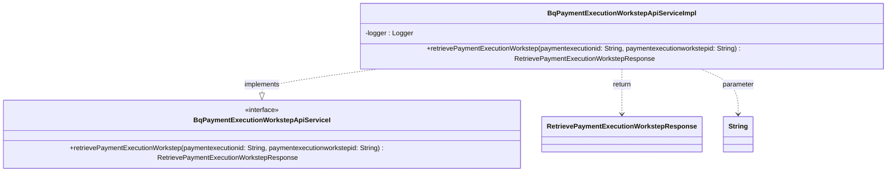

### Functional Requirements for `BqPaymentExecutionWorkstepApiServiceI` Interface
#### Overview

The `BqPaymentExecutionWorkstepApiServiceI` interface is a Java representation of a service contract for handling operations related to payment execution worksteps. It defines a method for retrieving payment execution workstep details.

#### Key Features

*   Represents a service interface for payment execution workstep-related operations.
*   Defines a method for retrieving payment execution workstep details.

#### Functional Requirements

1.  **Method Definitions**:
    *   The interface defines 1 method:
        *   `retrievePaymentExecutionWorkstep(String paymentexecutionid, String paymentexecutionworkstepid)`
    *   This method is used to perform the following operation:
        *   Retrieve details about a specific payment execution workstep.

2.  **Method Parameters**:
    *   The `retrievePaymentExecutionWorkstep` method takes two parameters:
        *   `paymentexecutionid` of type `String`
        *   `paymentexecutionworkstepid` of type `String`
    *   These parameters are used to identify the payment execution workstep for which details are to be retrieved.

3.  **Method Return Type**:
    *   The `retrievePaymentExecutionWorkstep` method returns an object of type `RetrievePaymentExecutionWorkstepResponse`.
    *   This return type represents the response containing the details of the retrieved payment execution workstep.

4.  **Logging**:
    *   The implementation logs debug messages at the start and completion of the `retrievePaymentExecutionWorkstep` method.
    *   The log messages include the input parameters and indicate the method's execution status.

#### Implementation Details

*   The `BqPaymentExecutionWorkstepApiServiceImpl` class is a placeholder implementation of the `BqPaymentExecutionWorkstepApiServiceI` interface.
*   The `retrievePaymentExecutionWorkstep` method currently returns `null` and logs debug messages indicating the start and completion of the method.

#### Example Usage

```java
// Assuming a class implementing BqPaymentExecutionWorkstepApiServiceI
BqPaymentExecutionWorkstepApiServiceI service = new BqPaymentExecutionWorkstepApiServiceImpl();

// Retrieve payment execution workstep
String paymentExecutionId = "some-payment-execution-id";
String paymentExecutionWorkstepId = "some-payment-execution-workstep-id";
RetrievePaymentExecutionWorkstepResponse response = service.retrievePaymentExecutionWorkstep(paymentExecutionId, paymentExecutionWorkstepId);
// Process the response
```

### Notes

*   The interface is designed to be implemented by a class that will provide the actual implementation for the defined method.
*   The current implementation (`BqPaymentExecutionWorkstepApiServiceImpl`) is a placeholder and does not contain the actual business logic for retrieving payment execution workstep details.
*   It is part of a larger service-oriented architecture, likely within an enterprise application or a microservices-based system.

### To-Do

*   Implement the business logic for the `retrievePaymentExecutionWorkstep` method in the `BqPaymentExecutionWorkstepApiServiceImpl` class.
*   Ensure the method returns a valid `RetrievePaymentExecutionWorkstepResponse` object based on the input parameters.


## Core Business Entities
### List of Entities
* Payment Execution
* Payment Execution Workstep
* Retrieve Payment Execution Workstep Response

### Entity Descriptions and Relationships
#### Payment Execution
The `Payment Execution` represents a business entity associated with the execution of a payment.

#### Payment Execution Workstep
The `Payment Execution Workstep` represents a business entity associated with a specific step in the execution of a payment. It is related to the `Retrieve Payment Execution Workstep Response` as the response contains details about a specific `Payment Execution Workstep` identified by `paymentexecutionworkstepid` and associated with a `paymentexecutionid`.

#### Retrieve Payment Execution Workstep Response
The `Retrieve Payment Execution Workstep Response` represents a business entity that encapsulates the details of a payment execution workstep retrieval response. The `Retrieve Payment Execution Workstep Response` is associated with the `Payment Execution Workstep` as it contains details about a specific `Payment Execution Workstep`.

### Relationships Between Entities
The `Payment Execution` is related to the `Payment Execution Workstep` through the `paymentexecutionid`.
The `Payment Execution Workstep` is related to the `Retrieve Payment Execution Workstep Response` through the `paymentexecutionworkstepid` and `paymentexecutionid`.


## Business Logic Documentation
### Input & Output Data Structures

* **Retrieve Operation**
  - Input: 
    - `paymentexecutionid` (string)
    - `paymentexecutionworkstepid` (string)
  - Output: `RetrievePaymentExecutionWorkstepResponse` object

### Logical Flow

1. The `BqPaymentExecutionWorkstepApiServiceI` interface defines a service for handling operations related to payment execution workstep.
2. The service includes one main operation: `retrievePaymentExecutionWorkstep`.
3. **Retrieve Operation**:
   - The `retrievePaymentExecutionWorkstep` method takes two input parameters: `paymentexecutionid` and `paymentexecutionworkstepid`.
   - It is expected to retrieve the details of a specific `Payment Execution Workstep` based on the `paymentexecutionid` and `paymentexecutionworkstepid`.
   - The retrieved details are expected to be encapsulated in a `RetrievePaymentExecutionWorkstepResponse` object.
   - The method returns the `RetrievePaymentExecutionWorkstepResponse` object.

### Data Validation

- The input parameters (`paymentexecutionid`, `paymentexecutionworkstepid`) are expected to be valid.
- The response object (`RetrievePaymentExecutionWorkstepResponse`) is expected to be a valid representation of the operation outcome.

### Business Rules

The business logic is centered around one main operation related to `Payment Execution Workstep`:
1. **Retrieval**: The `retrievePaymentExecutionWorkstep` operation is used to fetch the details of a `Payment Execution Workstep` identified by `paymentexecutionid` and `paymentexecutionworkstepid`.

The relationships between `Payment Execution`, `Payment Execution Workstep`, and `Retrieve Payment Execution Workstep Response` are maintained through the use of `paymentexecutionid` and `paymentexecutionworkstepid`.

### Error Handling Approach

The implementation logs the start and completion of the `retrievePaymentExecutionWorkstep` method. Currently, it returns `null` and does not explicitly handle exceptions. It is assumed that exceptions will be handled by the implementing class or the calling code.

### Use of LE(Logic Extraction) Services

No LE services are used in the provided Java code.

### External Program Dependencies

- The implementation depends on several classes from the `com.ibm.model` package, including `RetrievePaymentExecutionWorkstepResponse`.
- It also depends on `org.springframework.stereotype.Service` for annotation and `org.slf4j.Logger` and `org.slf4j.LoggerFactory` for logging purposes.
- The interface `BqPaymentExecutionWorkstepApiServiceI` is also a dependency.





