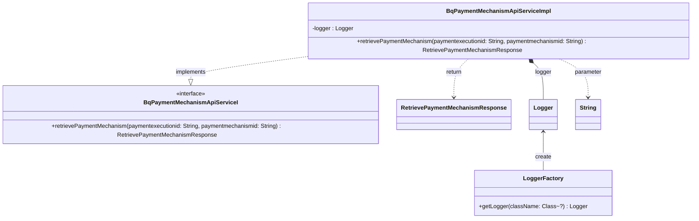

### Functional Requirements for `BqPaymentMechanismApiServiceI` Interface

#### Overview

The `BqPaymentMechanismApiServiceI` interface is a Java representation of a service contract for handling operations related to payment mechanisms. It defines a method for retrieving payment mechanism details.

#### Key Features

*   Represents a service interface for payment mechanism-related operations.
*   Defines a method for retrieving payment mechanism details.

#### Functional Requirements

1.  **Method Definitions**:
    *   The interface defines 1 method:
        *   `retrievePaymentMechanism(String paymentexecutionid, String paymentmechanismid)`
    *   This method is used to perform the following operation:
        *   Retrieve details about a specific payment mechanism.

2.  **Method Parameters**:
    *   The `retrievePaymentMechanism` method takes two parameters:
        *   `paymentexecutionid` of type `String`
        *   `paymentmechanismid` of type `String`
    *   These parameters are used to identify the payment mechanism for which details are to be retrieved.

3.  **Method Return Type**:
    *   The `retrievePaymentMechanism` method returns an object of type `RetrievePaymentMechanismResponse`.
    *   This return type represents the response containing the details of the retrieved payment mechanism.

4.  **Logging**:
    *   The implementation logs debug messages at the start and completion of the `retrievePaymentMechanism` method.
    *   The log messages include the input parameters and indicate the method's execution status.

#### Implementation Details

*   The `BqPaymentMechanismApiServiceImpl` class is an implementation of the `BqPaymentMechanismApiServiceI` interface.
*   The `retrievePaymentMechanism` method logs debug messages indicating the start and completion of the method.

#### Example Usage

```java
// Assuming a class implementing BqPaymentMechanismApiServiceI
BqPaymentMechanismApiServiceI service = new BqPaymentMechanismApiServiceImpl();

// Retrieve payment mechanism
String paymentExecutionId = "some-payment-execution-id";
String paymentMechanismId = "some-payment-mechanism-id";
RetrievePaymentMechanismResponse response = service.retrievePaymentMechanism(paymentExecutionId, paymentMechanismId);
// Process the response
```

### Notes

*   The interface is designed to be implemented by a class that will provide the actual implementation for the defined method.
*   The current implementation (`BqPaymentMechanismApiServiceImpl`) is a placeholder and does not contain the actual business logic for retrieving payment mechanism details, as indicated by the TODO comment.
*   It is part of a larger service-oriented architecture, likely within an enterprise application or a microservices-based system.

### To-Do

*   Implement the business logic for the `retrievePaymentMechanism` method in the `BqPaymentMechanismApiServiceImpl` class.
*   Ensure the method returns a valid `RetrievePaymentMechanismResponse` object based on the input parameters.


## Core Business Entities
### List of Entities
* Payment Mechanism
* Retrieve Payment Mechanism Response
* Payment Execution

### Entity Descriptions and Relationships
#### Payment Execution
The `Payment Execution` represents a business entity associated with the execution of a payment. It is related to the `Payment Mechanism` as a `paymentexecutionid` is used as a parameter to retrieve a specific `Payment Mechanism`.

#### Payment Mechanism
The `Payment Mechanism` represents a business entity associated with a specific payment mechanism. It is related to the `Payment Execution` through the `paymentexecutionid` and to the `Retrieve Payment Mechanism Response` as the response contains details about a specific `Payment Mechanism` identified by `paymentmechanismid` and associated with a `paymentexecutionid`.

#### Retrieve Payment Mechanism Response
The `Retrieve Payment Mechanism Response` represents a business entity that encapsulates the details of a payment mechanism retrieval response. The `Retrieve Payment Mechanism Response` is associated with the `Payment Mechanism` as it contains details about a specific `Payment Mechanism`.

### Relationships Between Entities
The `Payment Execution` is related to the `Payment Mechanism` through the `paymentexecutionid`.
The `Payment Mechanism` is related to the `Retrieve Payment Mechanism Response` through the `paymentmechanismid` and `paymentexecutionid`.


## Business Logic Documentation
### Input & Output Data Structures

* **Retrieve Operation**
  - Input: 
    - `paymentexecutionid` (string)
    - `paymentmechanismid` (string)
  - Output: `RetrievePaymentMechanismResponse` object

### Logical Flow

1. The `BqPaymentMechanismApiServiceI` interface defines a service for handling operations related to payment mechanism.
2. The service includes one main operation: `retrievePaymentMechanism`.
3. **Retrieve Operation**:
   - The `retrievePaymentMechanism` method takes two input parameters: `paymentexecutionid` and `paymentmechanismid`.
   - It is expected to retrieve the details of a specific `Payment Mechanism` based on the `paymentexecutionid` and `paymentmechanismid`.
   - The retrieved details are expected to be encapsulated in a `RetrievePaymentMechanismResponse` object.
   - The method returns the `RetrievePaymentMechanismResponse` object.

### Data Validation

- The input parameters (`paymentexecutionid`, `paymentmechanismid`) are expected to be valid.
- The response object (`RetrievePaymentMechanismResponse`) is expected to be a valid representation of the operation outcome.

### Business Rules

The business logic is centered around one main operation related to `Payment Mechanism`:
1. **Retrieval**: The `retrievePaymentMechanism` operation is used to fetch the details of a `Payment Mechanism` identified by `paymentexecutionid` and `paymentmechanismid`.

The relationships between `Payment Execution`, `Payment Mechanism`, and `Retrieve Payment Mechanism Response` are maintained through the use of `paymentexecutionid` and `paymentmechanismid`.

### Error Handling Approach

The implementation logs the start and completion of the `retrievePaymentMechanism` method. It returns `null` and does not explicitly handle exceptions or implement the business logic for retrieving the payment mechanism.

### Use of LE(Logic Extraction) Services

No LE services are used in the provided Java code.

### External Program Dependencies

- The implementation depends on several classes from the `com.ibm.model` package, including `RetrievePaymentMechanismResponse`.
- It also depends on `org.springframework.stereotype.Service` for annotation and `org.slf4j.Logger` and `org.slf4j.LoggerFactory` for logging purposes.
- The interface `BqPaymentMechanismApiServiceI` is also a dependency.





