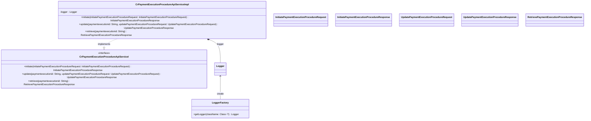

### Functional Requirements for `CrPaymentExecutionProcedureApiServiceI` Interface

#### Overview

The `CrPaymentExecutionProcedureApiServiceI` interface is a Java representation of a service contract for handling operations related to payment execution procedures. It defines methods for initiating, updating, and retrieving payment execution procedures.

#### Key Features

*   Represents a service interface for payment execution procedure-related operations.
*   Defines methods for initiating, updating, and retrieving payment execution procedures.

#### Functional Requirements

1.  **Method Definitions**:
    *   The interface defines 3 methods:
        *   `initiate(InitiatePaymentExecutionProcedureRequest initiatePaymentExecutionProcedureRequest)`
        *   `update(String paymentexecutionid, UpdatePaymentExecutionProcedureRequest updatePaymentExecutionProcedureRequest)`
        *   `retrieve(String paymentexecutionid)`
    *   These methods are used to perform the following operations:
        *   Initiate a payment execution procedure.
        *   Update a payment execution procedure.
        *   Retrieve details about a payment execution procedure.

2.  **Method Parameters**:
    *   The `initiate` method takes one parameter:
        *   `initiatePaymentExecutionProcedureRequest` of type `InitiatePaymentExecutionProcedureRequest`
    *   The `update` method takes two parameters:
        *   `paymentexecutionid` of type `String`
        *   `updatePaymentExecutionProcedureRequest` of type `UpdatePaymentExecutionProcedureRequest`
    *   The `retrieve` method takes one parameter:
        *   `paymentexecutionid` of type `String`
    *   These parameters are used to identify or provide the necessary information for the respective operations.

3.  **Method Return Types**:
    *   The `initiate` method returns an object of type `InitiatePaymentExecutionProcedureResponse`.
    *   The `update` method returns an object of type `UpdatePaymentExecutionProcedureResponse`.
    *   The `retrieve` method returns an object of type `RetrievePaymentExecutionProcedureResponse`.
    *   These return types represent the responses containing the results or details of the respective operations.

4.  **Logging**:
    *   The implementation logs debug messages at the start and completion of each method (`initiate`, `update`, `retrieve`).
    *   The log messages include the input parameters and indicate the method's execution status.

#### Implementation Details

*   The `CrPaymentExecutionProcedureApiServiceImpl` class is an implementation of the `CrPaymentExecutionProcedureApiServiceI` interface.
*   The methods (`initiate`, `update`, `retrieve`) log debug messages indicating the start and completion of the methods.
*   The implementation currently returns `null` for all methods, indicating that the actual business logic and response generation for these methods are yet to be implemented.

#### Example Usage

```java
// Assuming a class implementing CrPaymentExecutionProcedureApiServiceI
CrPaymentExecutionProcedureApiServiceI service = new CrPaymentExecutionProcedureApiServiceImpl();

// Initiate payment execution procedure
InitiatePaymentExecutionProcedureRequest initiateRequest = new InitiatePaymentExecutionProcedureRequest();
// Populate initiateRequest
InitiatePaymentExecutionProcedureResponse initiateResponse = service.initiate(initiateRequest);
// Process the initiateResponse

// Update payment execution procedure
String paymentExecutionId = "some-payment-execution-id";
UpdatePaymentExecutionProcedureRequest updateRequest = new UpdatePaymentExecutionProcedureRequest();
// Populate updateRequest
UpdatePaymentExecutionProcedureResponse updateResponse = service.update(paymentExecutionId, updateRequest);
// Process the updateResponse

// Retrieve payment execution procedure
RetrievePaymentExecutionProcedureResponse retrieveResponse = service.retrieve(paymentExecutionId);
// Process the retrieveResponse
```

### Notes

*   The interface is designed to be implemented by a class that will provide the actual implementation for the defined methods.
*   The current implementation (`CrPaymentExecutionProcedureApiServiceImpl`) is a placeholder and does not contain the actual business logic for the methods.
*   It is part of a larger service-oriented architecture, likely within an enterprise application or a microservices-based system.

### To-Do

*   Implement the business logic for the `initiate`, `update`, and `retrieve` methods in the `CrPaymentExecutionProcedureApiServiceImpl` class.
*   Ensure the methods return valid response objects (`InitiatePaymentExecutionProcedureResponse`, `UpdatePaymentExecutionProcedureResponse`, `RetrievePaymentExecutionProcedureResponse`) based on the input parameters and the outcome of the operations.


## Core Business Entities
### List of Entities
* Payment Execution Procedure
* Initiate Payment Execution Procedure Request
* Initiate Payment Execution Procedure Response
* Update Payment Execution Procedure Request
* Update Payment Execution Procedure Response
* Retrieve Payment Execution Procedure Response

### Entity Descriptions and Relationships
#### Payment Execution Procedure
The `Payment Execution Procedure` represents a business entity associated with the execution of a payment. It is related to the `Initiate Payment Execution Procedure Request`, `Update Payment Execution Procedure Request`, and `Retrieve Payment Execution Procedure Response` as these entities are used in the operations related to the `Payment Execution Procedure`. The `paymentexecutionid` is used to identify a specific `Payment Execution Procedure` for update and retrieve operations.

#### Initiate Payment Execution Procedure Request
The `Initiate Payment Execution Procedure Request` represents a business entity that encapsulates the details required to initiate a payment execution procedure. It is related to the `Payment Execution Procedure` as it is used to initiate the procedure.

#### Initiate Payment Execution Procedure Response
The `Initiate Payment Execution Procedure Response` represents a business entity that encapsulates the details of the response after initiating a payment execution procedure. It is related to the `Payment Execution Procedure` as it contains the result of the initiation.

#### Update Payment Execution Procedure Request
The `Update Payment Execution Procedure Request` represents a business entity that encapsulates the details required to update a payment execution procedure. It is related to the `Payment Execution Procedure` as it is used to update the procedure.

#### Update Payment Execution Procedure Response
The `Update Payment Execution Procedure Response` represents a business entity that encapsulates the details of the response after updating a payment execution procedure. It is related to the `Payment Execution Procedure` as it contains the result of the update.

#### Retrieve Payment Execution Procedure Response
The `Retrieve Payment Execution Procedure Response` represents a business entity that encapsulates the details of a payment execution procedure retrieval response. It is related to the `Payment Execution Procedure` as it contains details about a specific `Payment Execution Procedure` identified by `paymentexecutionid`.

### Relationships Between Entities
The `Payment Execution Procedure` is related to the `Initiate Payment Execution Procedure Request` and `Initiate Payment Execution Procedure Response` through the initiate operation.
The `Payment Execution Procedure` is related to the `Update Payment Execution Procedure Request` and `Update Payment Execution Procedure Response` through the update operation, using `paymentexecutionid`.
The `Payment Execution Procedure` is related to the `Retrieve Payment Execution Procedure Response` through the retrieve operation, using `paymentexecutionid`.


## Business Logic Documentation
### Input & Output Data Structures

* **Initiate Operation**
  - Input: `InitiatePaymentExecutionProcedureRequest` object
  - Output: `InitiatePaymentExecutionProcedureResponse` object

* **Update Operation**
  - Input: 
    - `paymentexecutionid` (string)
    - `UpdatePaymentExecutionProcedureRequest` object
  - Output: `UpdatePaymentExecutionProcedureResponse` object

* **Retrieve Operation**
  - Input: `paymentexecutionid` (string)
  - Output: `RetrievePaymentExecutionProcedureResponse` object

### Logical Flow

1. The `CrPaymentExecutionProcedureApiServiceI` interface defines a service for handling operations related to `Payment Execution Procedure`.
2. The service includes three main operations: `initiate`, `update`, and `retrieve`.
3. **Initiate Operation**:
   - The `initiate` method takes an `InitiatePaymentExecutionProcedureRequest` object as input.
   - It is expected to initiate a `Payment Execution Procedure` based on the input request.
   - The result of the initiation is expected to be encapsulated in an `InitiatePaymentExecutionProcedureResponse` object.
   - The method returns the `InitiatePaymentExecutionProcedureResponse` object.
4. **Update Operation**:
   - The `update` method takes two input parameters: `paymentexecutionid` and an `UpdatePaymentExecutionProcedureRequest` object.
   - It is expected to update a specific `Payment Execution Procedure` identified by `paymentexecutionid` based on the update request.
   - The result of the update is expected to be encapsulated in an `UpdatePaymentExecutionProcedureResponse` object.
   - The method returns the `UpdatePaymentExecutionProcedureResponse` object.
5. **Retrieve Operation**:
   - The `retrieve` method takes a `paymentexecutionid` as input.
   - It is expected to retrieve the details of a specific `Payment Execution Procedure` based on the `paymentexecutionid`.
   - The retrieved details are expected to be encapsulated in a `RetrievePaymentExecutionProcedureResponse` object.
   - The method returns the `RetrievePaymentExecutionProcedureResponse` object.

### Data Validation

- The input parameters and objects (`InitiatePaymentExecutionProcedureRequest`, `paymentexecutionid`, `UpdatePaymentExecutionProcedureRequest`) are expected to be valid.
- The response objects (`InitiatePaymentExecutionProcedureResponse`, `UpdatePaymentExecutionProcedureResponse`, `RetrievePaymentExecutionProcedureResponse`) are expected to be valid representations of the operation outcomes.

### Business Rules

The business logic is centered around three main operations related to `Payment Execution Procedure`:
1. **Initiation**: The `initiate` operation is used to start a `Payment Execution Procedure` based on the details provided in the `InitiatePaymentExecutionProcedureRequest`.
2. **Update**: The `update` operation is used to modify a `Payment Execution Procedure` identified by `paymentexecutionid` based on the details provided in the `UpdatePaymentExecutionProcedureRequest`.
3. **Retrieval**: The `retrieve` operation is used to fetch the details of a `Payment Execution Procedure` identified by `paymentexecutionid`.

The relationships between `Payment Execution Procedure` and other entities are maintained through the use of `paymentexecutionid` and the respective request and response objects.

### Error Handling Approach

The implementation logs the start and completion of each method (`initiate`, `update`, `retrieve`). However, it currently returns `null` for all operations. A proper error handling mechanism should be implemented to handle potential exceptions and errors during the execution of these operations.

### Use of LE(Logic Extraction) Services

No LE services are used in the provided Java code.

### External Program Dependencies

- The implementation depends on several classes from the `com.ibm.model` package, including `InitiatePaymentExecutionProcedureRequest`, `InitiatePaymentExecutionProcedureResponse`, `UpdatePaymentExecutionProcedureRequest`, `UpdatePaymentExecutionProcedureResponse`, and `RetrievePaymentExecutionProcedureResponse`.
- It also depends on `org.springframework.stereotype.Service` for annotation and `org.slf4j.Logger` and `org.slf4j.LoggerFactory` for logging purposes.
- The interface `CrPaymentExecutionProcedureApiServiceI` is also a dependency.





