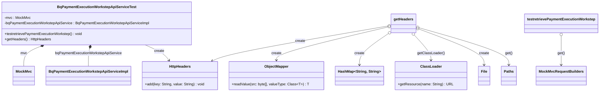

### Functional Requirements for `BqPaymentExecutionWorkstepApiService`

#### Overview

The `BqPaymentExecutionWorkstepApiService` API is responsible for managing payment execution workstep details. The provided Java test class (`BqPaymentExecutionWorkstepApiServiceTest`) focuses on testing the retrieval of these details.

#### Key Features

*   Retrieves payment execution workstep details via an API endpoint.
*   Utilizes path variables for `paymentexecutionid` and `paymentexecutionworkstepid`.
*   Includes HTTP headers in the request, generated from a JSON file.

#### Functional Requirements

1.  **Retrieve Payment Execution Workstep Details**:
    *   The API endpoint `/PaymentExecution/{paymentexecutionid}/PaymentExecutionWorkstep/{paymentexecutionworkstepid}/Retrieve` is used to retrieve payment execution workstep details.
    *   The endpoint accepts two path variables: `paymentexecutionid` and `paymentexecutionworkstepid`.

2.  **Request Parameters**:
    *   The API endpoint requires two path variables:
        *   `paymentexecutionid`: The ID of the payment execution.
        *   `paymentexecutionworkstepid`: The ID of the payment execution workstep.

3.  **HTTP Headers**:
    *   The API request includes HTTP headers, which are generated from a JSON file (`header.json`).

4.  **Expected Response**:
    *   The API returns a successful response (HTTP status 200 OK) when retrieving payment execution workstep details successfully.

#### Implementation Details

*   The API endpoint is tested using Spring's `MockMvc` to simulate HTTP requests.
*   The `BqPaymentExecutionWorkstepApiServiceImpl` service is mocked for testing purposes.

#### Example Usage

To use this API in a real application:

1.  Ensure a valid `header.json` file is available in the classpath with the required HTTP headers.
2.  Implement the necessary business logic in `BqPaymentExecutionWorkstepApiServiceImpl` to handle the retrieval of payment execution workstep details.

### Notes

*   The test class verifies the API's behavior under certain conditions.
*   The actual implementation of `BqPaymentExecutionWorkstepApiServiceImpl` is not provided in the given code snippet and should be implemented separately.

## Core Business Entities

### List of Entities
* Payment Execution
* Payment Execution Workstep
* BqPaymentExecutionWorkstepApiService

### Entity Descriptions and Relationships

#### Payment Execution
The `Payment Execution` represents a business entity associated with the execution of a payment. It is identified by `paymentexecutionid`.

#### Payment Execution Workstep
The `Payment Execution Workstep` represents a business entity associated with a specific step in the payment execution process. It is identified by `paymentexecutionworkstepid` and is related to a `Payment Execution` identified by `paymentexecutionid`.

#### BqPaymentExecutionWorkstepApiService
The `BqPaymentExecutionWorkstepApiService` represents a business entity that provides API services for managing payment execution worksteps. It is related to the `Payment Execution Workstep` as it provides operations to retrieve details about a specific `Payment Execution Workstep`.

### Relationships Between Entities
The `Payment Execution Workstep` is related to the `Payment Execution` as it is a part of the payment execution process identified by `paymentexecutionid`. 
The `BqPaymentExecutionWorkstepApiService` is related to the `Payment Execution Workstep` through the retrieve operation, which uses `paymentexecutionid` and `paymentexecutionworkstepid` to identify the specific workstep.

## Business Logic Documentation
### Input & Output Data Structures

* **Retrieve Operation**
  - Input: 
    - `paymentexecutionid` (string)
    - `paymentexecutionworkstepid` (string)
  - Output: Expected HTTP status is `isOk()` (200), implying a successful retrieval. The actual response structure is not defined in the provided Java code.

### Logical Flow

1. The `BqPaymentExecutionWorkstepApiServiceTest` class is a test class for `BqPaymentExecutionWorkstepApiServiceImpl`.
2. It tests the `retrievePaymentExecutionWorkstep` operation.
3. **Retrieve Operation**:
   - The `testretrievePaymentExecutionWorkstep` method simulates a GET request to the `/PaymentExecution/{paymentexecutionid}/PaymentExecutionWorkstep/{paymentexecutionworkstepid}/Retrieve` endpoint.
   - It uses `MockMvc` to perform the request with `paymentexecutionid` and `paymentexecutionworkstepid` as path variables and additional parameters.
   - The request includes headers obtained from a `header.json` file.
   - The operation expects a successful response (HTTP status 200).

### Data Validation

- The input parameters (`paymentexecutionid` and `paymentexecutionworkstepid`) are passed as both path variables and request parameters. 
- The headers for the request are loaded from a `header.json` file, implying that the headers are expected to be valid according to some predefined structure or content.

### Business Rules

The business logic revolves around the retrieval of a `Payment Execution Workstep` based on `paymentexecutionid` and `paymentexecutionworkstepid`. The operation is expected to return a successful response when the retrieval is successful.

### Error Handling Approach

The test case expects a successful HTTP response (status 200). The actual error handling mechanism should be implemented in the `BqPaymentExecutionWorkstepApiServiceImpl` class.

### Use of LE(Logic Extraction) Services

No LE services are used in the provided Java code.

### External Program Dependencies

- The implementation depends on several Spring Boot test annotations (`@AutoConfigureMockMvc`, `@WebMvcTest`).
- It uses `MockMvc` for simulating HTTP requests and `ObjectMapper` from `com.fasterxml.jackson.databind` for handling JSON data.
- The test class relies on a `header.json` file for constructing HTTP headers.
- The `BqPaymentExecutionWorkstepApiServiceImpl` class is a dependency.

