### Functional Requirements for `BqPaymentMechanismApiService`

#### Overview

The `BqPaymentMechanismApiService` API manages payment mechanism details. The provided Java test class (`BqPaymentMechanismApiServiceTest`) focuses on testing the retrieval of these details.

#### Key Features

*   Retrieves payment mechanism details via an API endpoint.
*   Utilizes path variables for `paymentexecutionid` and `paymentmechanismid`.
*   Includes HTTP headers in the request, generated from a JSON file (`header.json`).

#### Functional Requirements

1.  **Retrieve Payment Mechanism Details**:
    *   The API endpoint `/PaymentExecution/{paymentexecutionid}/PaymentMechanism/{paymentmechanismid}/Retrieve` retrieves payment mechanism details.
    *   The endpoint accepts two path variables: `paymentexecutionid` and `paymentmechanismid`.

2.  **Request Parameters**:
    *   The API endpoint requires two path variables:
        *   `paymentexecutionid`: The ID of the payment execution.
        *   `paymentmechanismid`: The ID of the payment mechanism.

3.  **HTTP Headers**:
    *   The API request includes HTTP headers generated from a JSON file (`header.json`).

4.  **Expected Response**:
    *   The API returns a successful response (HTTP status 200 OK) when retrieving payment mechanism details successfully.

#### Implementation Details

*   The API endpoint is tested using Spring's `MockMvc` to simulate HTTP requests.
*   The `BqPaymentMechanismApiServiceImpl` service is mocked for testing purposes.

#### Example Usage

To use this API:

1.  Ensure a valid `header.json` file is available in the classpath with the required HTTP headers.
2.  Implement the necessary business logic in `BqPaymentMechanismApiServiceImpl` to handle the retrieval of payment mechanism details.

### Notes

*   The test class verifies the API's behavior.
*   The actual implementation of `BqPaymentMechanismApiServiceImpl` should be implemented separately.
*   The `@WebMvcTest` annotation should reference the actual controller or service class being tested.

## Core Business Entities

### List of Entities
* Payment Execution
* Payment Mechanism
* Header

### Entity Descriptions and Relationships

#### Payment Execution
The `Payment Execution` represents a business entity associated with the execution of a payment. It is identified by `paymentexecutionid`.

#### Payment Mechanism
The `Payment Mechanism` represents a business entity associated with the mechanism used for a payment. It is identified by `paymentmechanismid` and is related to a `Payment Execution` identified by `paymentexecutionid`.

#### Header
The `Header` represents a business entity associated with HTTP headers. It contains key-value pairs used for API requests.

### Relationships Between Entities
The `Payment Mechanism` is related to the `Payment Execution` as it is used within the context of a specific payment execution identified by `paymentexecutionid`. 
The `Header` is used in the API request to retrieve a `Payment Mechanism` associated with a `Payment Execution`.

## Business Logic Documentation
### Input & Output Data Structures

* **Retrieve Operation**
  - Input: 
    - `paymentexecutionid` (integer)
    - `paymentmechanismid` (integer)
    - HTTP headers loaded from a `header.json` file
  - Output: Expected HTTP status is `isOk()` (200), implying a successful retrieval. The actual response structure is not defined in the provided Java code.

### Logical Flow

1. The `BqPaymentMechanismApiServiceTest` class is a test class for `BqPaymentMechanismApiServiceImpl`.
2. It tests the `retrievePaymentMechanism` operation.
3. **Retrieve Operation**:
   - The `testretrievePaymentMechanism` method simulates a GET request to the `/PaymentExecution/{paymentexecutionid}/PaymentMechanism/{paymentmechanismid}/Retrieve` endpoint.
   - It uses `MockMvc` to perform the request with `paymentexecutionid` and `paymentmechanismid` as path variables.
   - The request includes headers obtained from a `header.json` file using the `getHeaders` method.
   - The operation expects a successful response (HTTP status 200).

### Data Validation

- The input parameters (`paymentexecutionid` and `paymentmechanismid`) are passed as path variables with values 1 and 1 respectively.
- The headers for the request are loaded from a `header.json` file, implying that the headers are expected to be valid according to some predefined structure or content.
- The input parameters are also passed as request parameters with value "text", but this is not used in the actual endpoint.

### Business Rules

The business logic revolves around the retrieval of a `Payment Mechanism` based on `paymentexecutionid` and `paymentmechanismid`. The operation is expected to return a successful response when the retrieval is successful.

### Error Handling Approach

The test case expects a successful HTTP response (status 200). The actual error handling mechanism should be implemented in the `BqPaymentMechanismApiServiceImpl` class.

### Use of LE(Logic Extraction) Services

No LE services are used in the provided Java code.

### External Program Dependencies

- The implementation depends on several Spring Boot test annotations (`@AutoConfigureMockMvc`, `@WebMvcTest`).
- It uses `MockMvc` for simulating HTTP requests and `ObjectMapper` from `com.fasterxml.jackson.databind` for handling JSON data.
- The test class relies on a `header.json` file for constructing HTTP headers.
- The `BqPaymentMechanismApiServiceImpl` class is a dependency.

```mermaid
classDiagram
class BqPaymentMechanismApiServiceTest {
  -mvc : MockMvc
  -bqPaymentMechanismApiService : BqPaymentMechanismApiServiceImpl
  +testretrievePaymentMechanism() void
  +getHeaders() HttpHeaders
}
class MockMvc {
  +perform(requestBuilder: RequestBuilder) ResultActions
}
class BqPaymentMechanismApiServiceImpl {
}
class HttpHeaders {
  +add(key: String, value: String) void
}
class ObjectMapper {
  +readValue(src: byte[], valueType: Class~T~) T
}
class HashMap~String, String~ {
}
class ClassLoader {
  +getResource(name: String) URL
}
class File {
  +getAbsolutePath() String
}
class Paths {
  +get(first: String, more: String*) Path
}
class MockMvcRequestBuilders {
  +get(urlTemplate: String, uriVars: Object*) MockHttpServletRequestBuilder
}
class Files {
  +readAllBytes(path: Path) byte[]
}
class ResultActions {
  +andExpect(matcher: ResultMatcher) ResultActions
}
BqPaymentMechanismApiServiceTest *-- MockMvc : mvc
BqPaymentMechanismApiServiceTest *-- BqPaymentMechanismApiServiceImpl : bqPaymentMechanismApiService
getHeaders() --> ObjectMapper : create
getHeaders() --> HashMap~String, String~ : create
getHeaders() --> ClassLoader : getClassLoader()
getHeaders() --> File : create
getHeaders() --> HttpHeaders : create
getHeaders() --> Paths : get()
getHeaders() --> Files : readAllBytes()
testretrievePaymentMechanism() --> MockMvcRequestBuilders : get()
testretrievePaymentMechanism() --> HttpHeaders : use
testretrievePaymentMechanism() --> MockMvc : perform()
testretrievePaymentMechanism() --> ResultActions : andExpect()
```

