### Functional Requirements for `CrPaymentExecutionProcedureApiService`

#### Overview

The `CrPaymentExecutionProcedureApiService` API manages payment execution procedure details. The provided Java test class (`CrPaymentExecutionProcedureApiServiceTest`) focuses on testing the initiation, update, and retrieval of these details.

#### Key Features

*   Initiates a payment execution procedure via a POST API endpoint.
*   Updates a payment execution procedure via a PUT API endpoint.
*   Retrieves a payment execution procedure via a GET API endpoint.
*   Utilizes path variables for `paymentexecutionid`.
*   Includes HTTP headers in the request, generated from a JSON file (`header.json`).

#### Functional Requirements

1.  **Initiate Payment Execution Procedure**:
    *   The API endpoint `/PaymentExecution/Initiate` initiates a payment execution procedure.
    *   The endpoint accepts a JSON payload of type `InitiatePaymentExecutionProcedureRequest`.

2.  **Update Payment Execution Procedure**:
    *   The API endpoint `/PaymentExecution/{paymentexecutionid}/Update` updates a payment execution procedure.
    *   The endpoint accepts a path variable: `paymentexecutionid`.
    *   The endpoint accepts a JSON payload of type `UpdatePaymentExecutionProcedureRequest`.

3.  **Retrieve Payment Execution Procedure**:
    *   The API endpoint `/PaymentExecution/{paymentexecutionid}/Retrieve` retrieves a payment execution procedure.
    *   The endpoint accepts a path variable: `paymentexecutionid`.

4.  **Request Parameters**:
    *   The API endpoints require the following parameters:
        *   `paymentexecutionid`: The ID of the payment execution (for update and retrieve operations).
        *   JSON payload for initiate and update operations.

5.  **HTTP Headers**:
    *   The API requests include HTTP headers generated from a JSON file (`header.json`).

6.  **Expected Response**:
    *   The API returns a successful response (HTTP status 200 OK) for initiate, update, and retrieve operations when executed successfully.

#### Implementation Details

*   The API endpoints are tested using Spring's `MockMvc` to simulate HTTP requests.
*   The `CrPaymentExecutionProcedureApiServiceImpl` service is mocked for testing purposes.

#### Example Usage

To use this API:

1.  Ensure a valid `header.json` file is available in the classpath with the required HTTP headers.
2.  Implement the necessary business logic in `CrPaymentExecutionProcedureApiServiceImpl` to handle the initiation, update, and retrieval of payment execution procedures.

### Notes

*   The test class verifies the API's behavior for initiate, update, and retrieve operations.
*   The actual implementation of `CrPaymentExecutionProcedureApiServiceImpl` should be implemented separately.
*   The `@WebMvcTest` annotation should reference the actual controller class being tested, for example, `CrPaymentExecutionProcedureApiController`. 
*   The `testupdate` and `testretrieve` methods should be updated to remove the redundant `.param("paymentexecutionid", "text")` to avoid any potential confusion or incorrect parameter passing. 

The corrected functional requirements are as above.

## Core Business Entities

### List of Entities
* Initiate Payment Execution Procedure Request
* Update Payment Execution Procedure Request
* Payment Execution
* Header

### Entity Descriptions and Relationships

#### Initiate Payment Execution Procedure Request
The `Initiate Payment Execution Procedure Request` represents a business entity associated with initiating a payment execution procedure. It is used in the context of starting a payment execution process.

#### Update Payment Execution Procedure Request
The `Update Payment Execution Procedure Request` represents a business entity associated with updating a payment execution procedure. It is used to modify an existing payment execution process.

#### Payment Execution
The `Payment Execution` represents a business entity associated with the execution of a payment. It is identified by `paymentexecutionid` and is related to both `Initiate Payment Execution Procedure Request` and `Update Payment Execution Procedure Request` as it is the subject of these requests.

#### Header
The `Header` represents a business entity associated with HTTP headers. It contains key-value pairs used for API requests, such as those used in initiating, updating, or retrieving a `Payment Execution`. The `Header` is populated from a JSON file named `header.json`.

### Relationships Between Entities
- The `Initiate Payment Execution Procedure Request` is related to the `Payment Execution` as it is used to initiate a payment execution process.
- The `Update Payment Execution Procedure Request` is related to the `Payment Execution` as it is used to update an existing payment execution process.
- The `Payment Execution` is related to both `Initiate Payment Execution Procedure Request` and `Update Payment Execution Procedure Request` as it is the entity being initiated or updated.
- The `Header` is used in API requests to initiate, update, or retrieve a `Payment Execution`, thus relating it to `Payment Execution` and the requests associated with it.

## Business Logic Documentation
### Input & Output Data Structures

* **Initiate Operation**
  - Input: `InitiatePaymentExecutionProcedureRequest` object, HTTP headers loaded from a `header.json` file
  - Output: Expected HTTP status is `isOk()` (200), implying a successful initiation.

* **Update Operation**
  - Input: `UpdatePaymentExecutionProcedureRequest` object, `paymentexecutionid` (integer), HTTP headers loaded from a `header.json` file
  - Output: Expected HTTP status is `isOk()` (200), implying a successful update.

* **Retrieve Operation**
  - Input: `paymentexecutionid` (integer), HTTP headers loaded from a `header.json` file
  - Output: Expected HTTP status is `isOk()` (200), implying a successful retrieval.

### Logical Flow

1. The `CrPaymentExecutionProcedureApiServiceTest` class is a test class for `CrPaymentExecutionProcedureApiServiceImpl`.
2. It tests three operations: `initiate`, `update`, and `retrieve`.
3. **Initiate Operation**:
   - The `testinitiate` method simulates a POST request to the `/PaymentExecution/Initiate` endpoint.
   - It generates a random `InitiatePaymentExecutionProcedureRequest` object and converts it to JSON.
   - The request includes headers obtained from a `header.json` file using the `getHeaders` method.
   - The operation expects a successful response (HTTP status 200).

4. **Update Operation**:
   - The `testupdate` method simulates a PUT request to the `/PaymentExecution/{paymentexecutionid}/Update` endpoint.
   - It generates a random `UpdatePaymentExecutionProcedureRequest` object and converts it to JSON.
   - The request includes headers obtained from a `header.json` file and uses the path variable `paymentexecutionid` with value 1.
   - The operation expects a successful response (HTTP status 200).

5. **Retrieve Operation**:
   - The `testretrieve` method simulates a GET request to the `/PaymentExecution/{paymentexecutionid}/Retrieve` endpoint.
   - The request includes headers obtained from a `header.json` file and uses the path variable `paymentexecutionid` with value 1.
   - The operation expects a successful response (HTTP status 200).

### Data Validation

- The input parameters for `update` and `retrieve` operations include `paymentexecutionid` with a value of 1.
- The headers for the requests are loaded from a `header.json` file, implying that the headers are expected to be valid according to some predefined structure or content.
- The `InitiatePaymentExecutionProcedureRequest` and `UpdatePaymentExecutionProcedureRequest` objects are generated randomly, implying that their properties should adhere to the expected structure and validation rules defined in their respective classes.

### Business Rules

The business logic revolves around the initiation, update, and retrieval of a `Payment Execution Procedure`. The operations are expected to return successful responses when the respective actions are successful.

### Error Handling Approach

The test cases expect successful HTTP responses (status 200) for all operations. The actual error handling mechanism should be implemented in the `CrPaymentExecutionProcedureApiServiceImpl` class.

### Use of LE(Logic Extraction) Services

No LE services are used in the provided Java code.

### External Program Dependencies

- The implementation depends on several Spring Boot test annotations (`@AutoConfigureMockMvc`, `@WebMvcTest`).
- It uses `MockMvc` for simulating HTTP requests and `ObjectMapper` from `com.fasterxml.jackson.databind` for handling JSON data.
- The test class relies on a `header.json` file for constructing HTTP headers.
- The `CrPaymentExecutionProcedureApiServiceImpl` class is a dependency.

```mermaid
classDiagram
class CrPaymentExecutionProcedureApiServiceTest {
  -mvc : MockMvc
  -crPaymentExecutionProcedureApiService : CrPaymentExecutionProcedureApiServiceImpl
  +testinitiate() void
  +testupdate() void
  +testretrieve() void
  +getHeaders() HttpHeaders
}
class MockMvc {
  +perform(requestBuilder: MockHttpServletRequestBuilder) ResultActions
}
class CrPaymentExecutionProcedureApiServiceImpl {
}
class HttpHeaders {
  +add(key: String, value: String) void
}
class ObjectMapper {
  +registerModule(module: Module) ObjectMapper
  +configure(f: SerializationFeature, state: boolean) ObjectMapper
  +writer() ObjectWriter
  +readValue(src: byte[], valueType: Class~T~) T
}
class ObjectWriter {
  +withDefaultPrettyPrinter() ObjectWriter
  +writeValueAsString(value: Object) String
}
class JodaModule {
}
class InitiatePaymentExecutionProcedureRequest {
}
class UpdatePaymentExecutionProcedureRequest {
}
class MockMvcRequestBuilders {
  +post(urlTemplate: String, uriVars: Object*) MockHttpServletRequestBuilder
  +put(urlTemplate: String, uriVars: Object*) MockHttpServletRequestBuilder
  +get(urlTemplate: String, uriVars: Object*) MockHttpServletRequestBuilder
}
class Files {
  +readAllBytes(path: Path) byte[]
}
class Paths {
  +get(first: String, more: String*) Path
}
class File {
  +getAbsolutePath() String
  +getFile() String
}
class ClassLoader {
  +getResource(name: String) URL
}
class HashMap~String, String~ {
}
class EnhancedRandom {
  +random(type: Class~T~) T
}
class SerializationFeature {
}
class MockHttpServletRequestBuilder {
}
CrPaymentExecutionProcedureApiServiceTest *-- MockMvc : mvc
CrPaymentExecutionProcedureApiServiceTest *-- CrPaymentExecutionProcedureApiServiceImpl : crPaymentExecutionProcedureApiService
testinitiate() --> ObjectMapper : create
testinitiate() --> InitiatePaymentExecutionProcedureRequest : create
testinitiate() --> MockMvcRequestBuilders : post()
testinitiate() --> HttpHeaders : use
testinitiate() --> MockMvc : perform()
testinitiate() --> ObjectWriter : create
testupdate() --> ObjectMapper : create
testupdate() --> UpdatePaymentExecutionProcedureRequest : create
testupdate() --> MockMvcRequestBuilders : put()
testupdate() --> HttpHeaders : use
testupdate() --> MockMvc : perform()
testupdate() --> ObjectWriter : create
testretrieve() --> MockMvcRequestBuilders : get()
testretrieve() --> HttpHeaders : use
testretrieve() --> MockMvc : perform()
getHeaders() --> ObjectMapper : create
getHeaders() --> HashMap~String, String~ : create
getHeaders() --> ClassLoader : getClassLoader()
getHeaders() --> File : create
getHeaders() --> Paths : get()
getHeaders() --> Files : readAllBytes()
getHeaders() --> HttpHeaders : create
```

